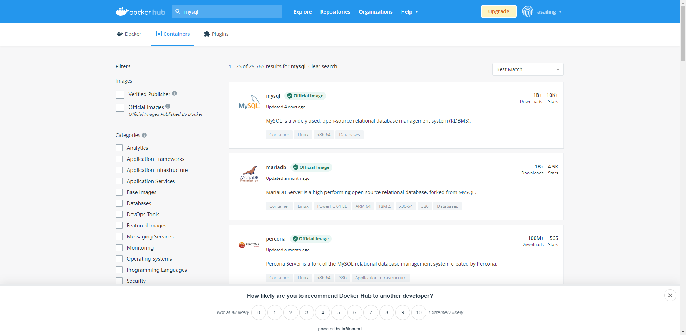
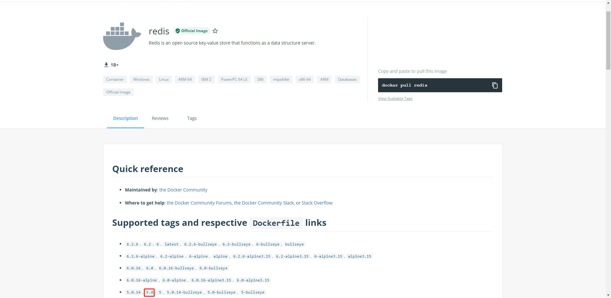

https://www.kuangstudy.com/bbs/1476365292346421249

> 参考源

https://www.bilibili.com/video/BV1og4y1q7M4?spm_id_from=333.999.0.0

https://www.bilibili.com/video/BV1kv411q7Qc?spm_id_from=333.999.0.0

> 版本

本文章基于 **Docker 20.10.11**

------

# 查看所有镜像

## **docker images -aq**

可以使用 `docker images` 命令查看所有本地主机上的镜像。

> 该命令等价于 `docker image ls`。
>
> 语法

```shell
docker images [参数] [镜像[:标签]]
```

命令后加上 [镜像[:标签]] 可以对镜像进行过滤。

> 参数

- `-a`：显示所有镜像。
- `-q`：只显示 ID。

> 显示所有镜像

```shell
[root@sail ~]# docker images
REPOSITORY    TAG       IMAGE ID       CREATED        SIZE
hello-world   latest    feb5d9fea6a5   2 months ago   13.3kB
[root@sail ~]# docker image ls
REPOSITORY    TAG       IMAGE ID       CREATED        SIZE
hello-world   latest    feb5d9fea6a5   2 months ago   13.3kB
[root@sail ~]# docker images -a
REPOSITORY    TAG       IMAGE ID       CREATED        SIZE
hello-world   latest    feb5d9fea6a5   2 months ago   13.3kB
```

> 只显示镜像的 ID

```shell
[root@sail ~]# docker images -q
feb5d9fea6a5
```

> 显示所有镜像的 ID

```shell
[root@sail ~]# docker images -aq
feb5d9fea6a5
```

> 对镜像进行过滤

```shell
[root@sail ~]# docker images java
REPOSITORY   TAG       IMAGE ID   CREATED   SIZE
[root@sail ~]# docker images hello-world
REPOSITORY    TAG       IMAGE ID       CREATED        SIZE
hello-world   latest    feb5d9fea6a5   2 months ago   13.3kB
[root@sail ~]# docker images hello-world:latest
REPOSITORY    TAG       IMAGE ID       CREATED        SIZE
hello-world   latest    feb5d9fea6a5   2 months ago   13.3kB
```

> 结果分析

- **REPOSITORY**：镜像名（镜像仓库源）。
- **TAG**：镜像的标签。
- **IMAGE ID**：镜像的 ID。
- **CREATED**：镜像的创建时间。
- **SIZE**：镜像的大小。

# 搜索镜像

## **docker search**

> 语法

```shell
docker search [参数]
```

> 参数

- `-f` / `--filter`：根据过滤条件搜索。

> 搜索仓库中的镜像，等价于网页搜索。



```shell
[root@sail ~]# docker search mysql
NAME                              DESCRIPTION                                     STARS     OFFICIAL   AUTOMATED
mysql                             MySQL is a widely used, open-source relation…   11789     [OK]       
mariadb                           MariaDB Server is a high performing open sou…   4488      [OK]       
mysql/mysql-server                Optimized MySQL Server Docker images. Create…   882                  [OK]
centos/mysql-57-centos7           MySQL 5.7 SQL database server                   92                   
mysql/mysql-cluster               Experimental MySQL Cluster Docker images. Cr…   89                   
centurylink/mysql                 Image containing mysql. Optimized to be link…   59                   [OK]
databack/mysql-backup             Back up mysql databases to... anywhere!         53                   
prom/mysqld-exporter                                                              44                   [OK]
deitch/mysql-backup               REPLACED! Please use http://hub.docker.com/r…   41                   [OK]
tutum/mysql                       Base docker image to run a MySQL database se…   35                   
linuxserver/mysql                 A Mysql container, brought to you by LinuxSe…   34                   
schickling/mysql-backup-s3        Backup MySQL to S3 (supports periodic backup…   31                   [OK]
mysql/mysql-router                MySQL Router provides transparent routing be…   23                   
centos/mysql-56-centos7           MySQL 5.6 SQL database server                   21                   
arey/mysql-client                 Run a MySQL client from a docker container      19                   [OK]
fradelg/mysql-cron-backup         MySQL/MariaDB database backup using cron tas…   17                   [OK]
genschsa/mysql-employees          MySQL Employee Sample Database                  8                    [OK]
yloeffler/mysql-backup            This image runs mysqldump to backup data usi…   7                    [OK]
openshift/mysql-55-centos7        DEPRECATED: A Centos7 based MySQL v5.5 image…   6                    
devilbox/mysql                    Retagged MySQL, MariaDB and PerconaDB offici…   3                    
ansibleplaybookbundle/mysql-apb   An APB which deploys RHSCL MySQL                3                    [OK]
jelastic/mysql                    An image of the MySQL database server mainta…   2                    
centos/mysql-80-centos7           MySQL 8.0 SQL database server                   2                    
widdpim/mysql-client              Dockerized MySQL Client (5.7) including Curl…   1                    [OK]
vitess/mysqlctld                  vitess/mysqlctld                                1                    [OK]
```

> 搜索出 Stars 大于 3000 的

```shell
[root@sail ~]# docker search mysql -f=STARS=3000
NAME      DESCRIPTION                                     STARS     OFFICIAL   AUTOMATED
mysql     MySQL is a widely used, open-source relation…   11789     [OK]       
mariadb   MariaDB Server is a high performing open sou…   4488      [OK]
```

# 拉取镜像

## **docker pull 镜像名[:tag]**

> 语法

```shell
docker pull [参数] 镜像名[:标签]
```

> 如果不输入标签，默认拉取最新版镜像。
>
> 参数

- `-a`：拉取镜像的所有标签。
- `-q`：抑制详细输出。

> 默认下载最新版

```shell
[root@sail ~]# docker pull redis
Using default tag: latest # 默认最新版标签
latest: Pulling from library/redis
e5ae68f74026: Pull complete # 分层下载，docker image的核心：联合文件系统
37c4354629da: Pull complete 
b065b1b1fa0f: Pull complete 
6954d19bb2e5: Pull complete 
6333f8baaf7c: Pull complete 
f9772c8a44e7: Pull complete 
Digest: sha256:2f502d27c3e9b54295f1c591b3970340d02f8a5824402c8179dcd20d4076b796 #防伪签名
Status: Downloaded newer image for redis:latest
docker.io/library/redis:latest # 真实地址，docker pull redis 等价于 docker pull docker.io/library/redis:latest
```

> 指定版本下载 

```shell
[root@sail ~]# docker pull redis:5.0
5.0: Pulling from library/redis
e5ae68f74026: Already exists # 分层镜像的好处，与之前的版本共用一部分，不用再重复下载
37c4354629da: Already exists 
b065b1b1fa0f: Already exists 
99ab464ba8bb: Pull complete 
eb5bbe3179d2: Pull complete 
2067794f93b6: Pull complete 
Digest: sha256:310f81701011175dc868e833d73f539282dd18510ca35d6f7b63c4d33ab4f54e
Status: Downloaded newer image for redis:5.0
docker.io/library/redis:5.0
```

版本来自于官网，版本库 https://hub.docker.com/_/redis



> 这里输入的标签必须是官网版本库存在的标签，否则无法拉取镜像。

# 删除镜像

## **docker rmi id/name**

> 语法

```shell
docker rmi [参数] 镜像 [镜像...]
```

> 参数

- `-f`：强制删除。

> 查看现存镜像

```shell
[root@sail ~]# docker images
REPOSITORY    TAG       IMAGE ID       CREATED        SIZE
redis         5.0       071510791e92   5 days ago     110MB
redis         latest    aea9b698d7d1   6 days ago     113MB
mysql         5.7       738e7101490b   6 days ago     448MB
mysql         latest    bbf6571db497   6 days ago     516MB
hello-world   latest    feb5d9fea6a5   2 months ago   13.3kB
```

> 删除一个。可以通过名称，也可以指定 ID，`-f` 表示强制删除。

```shell
[root@sail ~]# docker rmi -f feb5d9fea6a5
Untagged: hello-world:latest
Untagged: hello-world@sha256:cc15c5b292d8525effc0f89cb299f1804f3a725c8d05e158653a563f15e4f685
Deleted: sha256:feb5d9fea6a5e9606aa995e879d862b825965ba48de054caab5ef356dc6b3412

[root@sail ~]# docker images
REPOSITORY   TAG       IMAGE ID       CREATED      SIZE
redis        5.0       071510791e92   6 days ago   110MB
redis        latest    aea9b698d7d1   6 days ago   113MB
mysql        5.7       738e7101490b   6 days ago   448MB
mysql        latest    bbf6571db497   6 days ago   516MB
```

> 删除多个。用空格分隔 ID。

```shell
[root@sail ~]# docker rmi -f 738e7101490b bbf6571db497
Untagged: mysql:5.7
Untagged: mysql@sha256:d1cc87a3bd5dc07defc837bc9084f748a130606ff41923f46dec1986e0dc828d
Deleted: sha256:738e7101490b45decf606211a5437ed87aa6a82f1ff03c354564bf9375ce20f9
Deleted: sha256:addad8cfeac97b96eb6652a576269346ac96def9a6709ed2388e24fff4345837
Deleted: sha256:e288c3439a7e2f423f50bf22979a759371c51a70bbbaa450993c336978460b1a
Deleted: sha256:33ece15accaa3bb20e3dee84e2e4501469b917c3abba3d5475cd1fec8bb3e82c
Deleted: sha256:6b15390bceeca8424d82e75f5c9aca5eb4693f96849d6382168a99747877693d
Untagged: mysql:latest
Untagged: mysql@sha256:ff9a288d1ecf4397967989b5d1ec269f7d9042a46fc8bc2c3ae35458c1a26727
Deleted: sha256:bbf6571db4977fe13c3f4e6289c1409fc6f98c2899eabad39bfe07cad8f64f67
Deleted: sha256:a72da99dce60d6f8d4c4cffa4173153c990537fcdfaa27c35324c3348d55dd5c
Deleted: sha256:8b535d432ef2fbd45d93958347b2587c5cbe334f07d6909ad9d2d480ebbafb65
Deleted: sha256:14d13a3b33fc76839f156cd24b4636dab121e6d3d026cefa2985a4b89e9d4df8
Deleted: sha256:77c21a5a897a1ba752f3d742d6c94ee7c6b0e373fd0aeecc4bf88b9a3982007e
Deleted: sha256:189162becec8bb4588c54fb4ea7e62d20121812e68aeb0291fb4bb5df9ec0985
Deleted: sha256:34980dadfd6a5bb9d7f9e8d4e408000e0a8f4840cc7d3092dc94357ebe7a89b6
Deleted: sha256:15b2beb64a91785c8f3709ecd2410d13577b3174faad164524434ce6a7633506
Deleted: sha256:e38dd14d47b61171927ea4b928f7296123b65a81ad1cfde8f5d00cadf1e81bbb
Deleted: sha256:865abdfd8444741f581ce582e4ac5746c4a00c282febf65aa808a235ec7abf78
Deleted: sha256:b1e35233e1ac953bd06fc8fa83afb3a88c39c1aeae0c89a46cb1b652d6821b38
Deleted: sha256:3bcfdf6641227ff63e3ddf9e38e45cf317b178a50a664e45c6ae596107d5bc46
Deleted: sha256:f11bbd657c82c45cc25b0533ce72f193880b630352cc763ed0c045c808ff9ae1

[root@sail ~]# docker images
REPOSITORY   TAG       IMAGE ID       CREATED      SIZE
redis        5.0       071510791e92   6 days ago   110MB
redis        latest    aea9b698d7d1   6 days ago   113MB
```

### **docker rmi $(docker images -aq)** 删除所有

> 先用 `docker images -aq` 查询出所有镜像，再使用 `docker rmi -f` 递归删除。

```shell
[root@sail ~]# docker rmi -f $(docker images -aq)
Untagged: redis:5.0
Untagged: redis@sha256:310f81701011175dc868e833d73f539282dd18510ca35d6f7b63c4d33ab4f54e
Deleted: sha256:071510791e929570d7dde405f10b19d47115db05e46901b36b7d91ff978444bf
Deleted: sha256:8c023aca07f849d976f91ff85da1a90d39add83d8d50d358e1ec5177e1371907
Deleted: sha256:4dbec1fb2051b365aa3e6a805a052f2c7b4e9087c46847722f9ea5f12b1be308
Deleted: sha256:c6b1ae6dca0b2730bc0d78727b3a7078fce525bfa37dbb750e31b7a976ca1d99
Untagged: redis:latest
Untagged: redis@sha256:2f502d27c3e9b54295f1c591b3970340d02f8a5824402c8179dcd20d4076b796
Deleted: sha256:aea9b698d7d1d2fb22fe74868e27e767334b2cc629a8c6f9db8cc1747ba299fd
Deleted: sha256:beb6c508926e807f60b6a3816068ee3e2cece7654abaff731e4a26bcfebe04d8
Deleted: sha256:a5b5ed3d7c997ffd7c58cd52569d8095a7a3729412746569cdbda0dfdd228d1f
Deleted: sha256:ee76d3703ec1ab8abc11858117233a3ac8c7c5e37682f21a0c298ad0dc09a9fe
Deleted: sha256:60abc26bc7704070b2977b748ac0fd4ca94b818ed4ba1ef59ca8803e95920161
Deleted: sha256:6a2f1dcfa7455f60a810bb7c4786d62029348f64c4fcff81c48f8625cf0d995a
Deleted: sha256:9321ff862abbe8e1532076e5fdc932371eff562334ac86984a836d77dfb717f5

[root@sail ~]# docker images
REPOSITORY   TAG       IMAGE ID   CREATED   SIZE
```

# 运行镜像

## **docker run --name="名字" --rm -d -it -p 主机端口:容器端口 -v 主机目录:容器目录 --net=netname image**

> 语法

```shell
docker run [参数] 镜像名
```

> 参数

- `--name`：指定容器的名称，如果正在运行该名称的容器，会报错。

- `--rm`：用完即删除，通常用来测试。

- `-d`：后台方式运行。

- `-it`：使用交互方式运行，可以进入容器查看内容。

- `-e`：指定运行环境。

- `-p`：指定端口 主机端口:容器端口。

    ：指定容器的端口，如：

    ```shell
    -p 8080:8080
    ```

    。还可以有以下写法：

    - `-p ip:主机端口:容器端口`
    - `-p 主机端口:容器端口`
    - `-p 容器端口`

- `-v`：指定数据卷,详情查看Docker 12 数据卷

   ```shell
   -v 主机目录:容器目录
   ```

- `--net`: 指定网络名字,详情查看 Docker 14 网络

> 运行 centos 镜像

```shell
[root@sail ~]# docker run -it centos /bin/bash
Unable to find image 'centos:latest' locally # 检索本地镜像，发现没有该镜像，则去仓库中搜索。
latest: Pulling from library/centos # 开始从仓库中拉取
a1d0c7532777: Pull complete 
Digest: sha256:a27fd8080b517143cbbbab9dfb7c8571c40d67d534bbdee55bd6c473f432b177
Status: Downloaded newer image for centos:latest
[root@81c83ea42dc0 /]# ls # 由于是以交互方式运行，且进入 /bin/bash 中，此时的路径即为 centos 容器中的 /bin/bash
bin  dev  etc  home  lib  lib64  lost+found  media  mnt  opt  proc  root  run  sbin  srv  sys  tmp  usr  var
```

> 由此可以看出，容器就是一个微型的 Linux 系统。它只保留了最核心的功能和最基本的命令，方便进行操作。

# 保存提取

## 保存镜像

### **docker save -o 输出路径 id/name**

- `-o` 指定输出文件

```shell
PS D:\docker\DockerNotebook\test\tomcat> docker save --help

Usage:  docker save [OPTIONS] IMAGE [IMAGE...]

Save one or more images to a tar archive (streamed to STDOUT by default)

Options:
  -o, --output string   Write to a file, instead of STDOUT
```

> test

```shell
PS D:\docker\DockerNotebook\test\tomcat> docker save -o archlinux.tar archlinux
PS D:\docker\DockerNotebook\test\tomcat> ls | findstr arch
-a----     2022/6/11/???     16:31      379761664 archlinux.tar
```

## 载入镜像

### **docker load -i 输入路径 id/name**

```shell
PS D:\docker\DockerNotebook\test\tomcat> docker load --help

Usage:  docker load [OPTIONS]

Load an image from a tar archive or STDIN

Options:
  -i, --input string   Read from tar archive file, instead of STDIN
  -q, --quiet          Suppress the load output
```

> test

```shell
PS D:\docker\DockerNotebook\test\tomcat> docker load -i .\archlinux.tar
Loaded image: archlinux:latest
```

## 清理Docker系统

```shell
docker system prune -a
```
