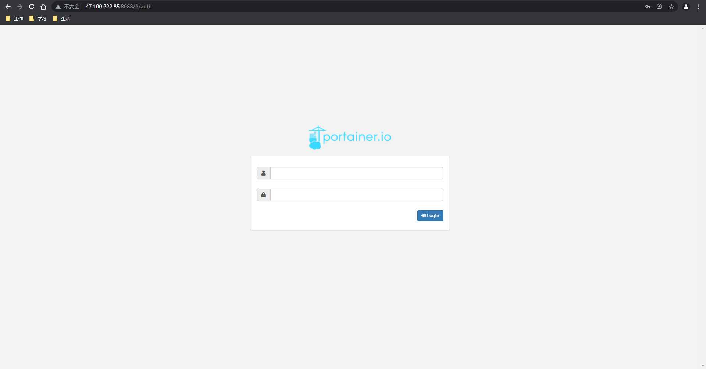
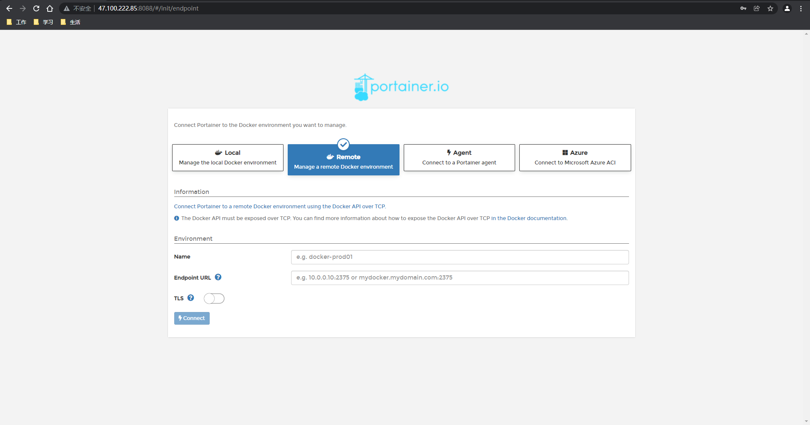

https://www.kuangstudy.com/bbs/1482891291670298625

> 参考源

https://www.bilibili.com/video/BV1og4y1q7M4?spm_id_from=333.999.0.0

https://www.bilibili.com/video/BV1kv411q7Qc?spm_id_from=333.999.0.0

> 版本

本文章基于 **Docker 20.10.11**

------

这里使用 portainer 实现 Docker 可视化

> 集成部署的时候更推荐使用 **Rancher**。

# 启动

> 启动 portainer

```shell
[root@sail sail]# docker run -d -p 8088:9000 --restart=always -v /var/run/docker.sock:/var/run/docker --privileged=true portainer/portainer
Unable to find image 'portainer/portainer:latest' locally
latest: Pulling from portainer/portainer
94cfa856b2b1: Pull complete 
49d59ee0881a: Pull complete 
a2300fd28637: Pull complete 
Digest: sha256:fb45b43738646048a0a0cc74fcee2865b69efde857e710126084ee5de9be0f3f
Status: Downloaded newer image for portainer/portainer:latest
c5cbb816f99aea8a6437489e9eda493d4432b0ddc7ae10721847f1f2068f32d1
```

# 访问测试





> 虽然可视化工具能够更直观，但操作起来还是不如命令方便，还是更推荐使用命令操作。