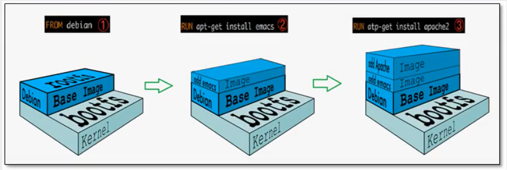
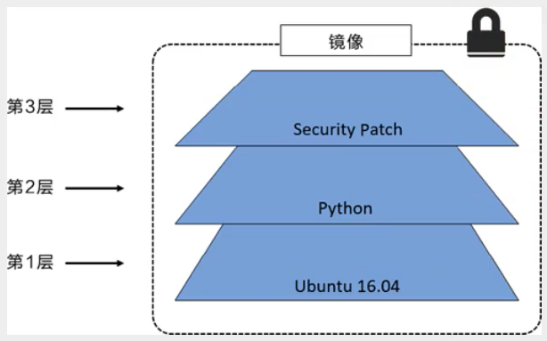

https://www.kuangstudy.com/bbs/1483721047118610434

> 参考源

https://www.bilibili.com/video/BV1og4y1q7M4?spm_id_from=333.999.0.0

https://www.bilibili.com/video/BV1kv411q7Qc?spm_id_from=333.999.0.0

> 版本

本文章基于 **Docker 20.10.11**

------


# 联合文件系统

**联合文件系统**（UnionFS）是 Docker 的核心，也是 Docker 得以极致精简的保证。

以拉取 redis 镜像为例

> 先拉取最新版镜像

```shell
[root@sail ~]# docker pull redis
Using default tag: latest # 默认最新版标签
latest: Pulling from library/redis
e5ae68f74026: Pull complete # 分层下载，docker image的核心：联合文件系统
37c4354629da: Pull complete 
b065b1b1fa0f: Pull complete 
6954d19bb2e5: Pull complete 
6333f8baaf7c: Pull complete 
f9772c8a44e7: Pull complete 
Digest: sha256:2f502d27c3e9b54295f1c591b3970340d02f8a5824402c8179dcd20d4076b796 #防伪签名
Status: Downloaded newer image for redis:latest
docker.io/library/redis:latest # 真实地址，docker pull redis 等价于 docker pull docker.io/library/redis:latest
```

> 再拉取指定版镜像

```shell
[root@sail ~]# docker pull redis:5.0
5.0: Pulling from library/redis
e5ae68f74026: Already exists # 分层镜像的好处，与之前的版本共用一部分，不用再重复下载
37c4354629da: Already exists 
b065b1b1fa0f: Already exists 
99ab464ba8bb: Pull complete 
eb5bbe3179d2: Pull complete 
2067794f93b6: Pull complete 
Digest: sha256:310f81701011175dc868e833d73f539282dd18510ca35d6f7b63c4d33ab4f54e
Status: Downloaded newer image for redis:5.0
docker.io/library/redis:5.0
```

由此可见，redis 镜像一共 6 层，由于之前拉取了默认的最新版 **redis** 镜像，再拉取 **redis:5.0** 时，有 3 层是可以复用的，所以只下载了不能复用的 3 层。

> 这样既能提高下载速度，也能极大节省磁盘占用和资源消耗。

# 分层镜像

Docker 使用联合文件系统对镜像做了分层，如下图所示：



- **bootfs**（boot file system）：启动文件系统。
- **rootfs**：root file system：基础文件系统。




Docker 镜像都是**只读**的，当容器启动时，一个新的可写层被加到镜像的顶部。

这一层就是我们通常说的**容器层**，容器层之下的都叫**镜像层**。


​                