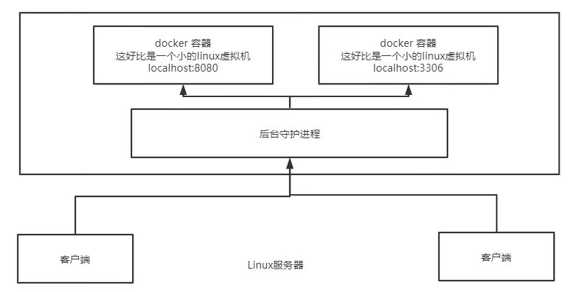

https://www.kuangstudy.com/bbs/1475025315423465474

> 参考源

https://www.bilibili.com/video/BV1og4y1q7M4?spm_id_from=333.999.0.0

https://www.bilibili.com/video/BV1kv411q7Qc?spm_id_from=333.999.0.0

> 版本

本文章基于 **Docker 20.10.11**

------

# 工作中的困扰

> 在研发工作中，想必都有这样的场景

**测试**：生产环境发版后又出问题了。

**运维**：我是按照开发给的包部署的。

**开发**：我本地没问题呀。

一款产品，**开发**和**生产**两套环境，运维人员环境配置费时费力，且很容易出现问题。

出现问题后，开发人员和运维人员排查问题都是十分痛苦的，因为一个产品往往涉及到诸多环境，可能产生影响的因素实在太多。

> 寻求解决

要是能够把**代码**和**环境**一块提供，运维人员拿来就直接运行，这个问题就迎刃而解了。

这就是所谓**开发即运维**，既能保证系统稳定性，也能提高部署效率。

为解决这一问题，[Docker](https://baike.baidu.com/item/Docker) 横空出世。

# 历史

2010 年，几个搞 IT 的人，在美国成立一家公司 **dotCloud**。

一开始他们是做一些 [PaaS](https://baike.baidu.com/item/PaaS) 的云计算服务。

他们将自己的容器化技术命名为 **Docker**。

> Docker 基于 **Go** 语言开发。

Docker 刚诞生的时候，并没有引起行业的注意，这也导致 **dotCloud** 快要经营不下去。

为了公司能生存，他们决定**开源**，以寻求更多的关注。

2013 年，Docker 开源，一下子爆火。

刚开源的时候，每个月都会更新一个版本。

2014 年 4 月 9 日，**Docker 1.0** 发布。

# 简介

官网：https://www.docker.com/

文档：https://docs.docker.com/docker-for-windows/

命令：https://docs.docker.com/engine/reference/run/

仓库：https://hub.docker.com/

Docker 是一个开源的应用容器引擎。

Docker 的思想来自于集装箱，彼此之间隔离。

Docker 通过隔离机制，可以将服务器利用到极致。

Docker 容器完全使用沙箱机制，相互之间不会有任何接口。

# 结构

- **镜像**（image）：Docker 镜像好比一个模板，可以用来创建**容器**（container），一个镜像可以创建多个容器。
- **容器**（container）：容器可以理解为一个微型的系统。
- **仓库**（repository）：存放镜像的地方。

# 底层原理

Docker 是一个 **Client-Server** 结构的系统。

Docker 的守护进程运行在主机上，通过 Socket 从客户端访问。

Docker Server 接受 **Docker-Client** 的指令。

# 和虚拟机的区别

Docker所使用的**容器化技术**本质上属于**虚拟化技术**。

提到虚拟化技术，最有名的就是**虚拟机技术**。

> 虚拟机原理示意图

它有以下明显的缺点：

- **资源占用多**。启动虚拟机非常占内存，对电脑资源有不小的占用。
- **冗余步骤多**。启动虚拟机后，还需要进行一些步骤才能进入系统，效率比较低。
- **启动很慢**。由于虚拟机是虚拟化一整个系统，其启动时间会比较缓慢，一般都需要几分钟。

> 容器化原理示意图

它不是模拟的完整操作系统，而是基于操作系统封装成了一个个小的运行环境。

> 区别

|          | 传统虚拟机                   | Docker           |
| -------- | ---------------------------- | ---------------- |
| 虚拟内容 | 硬件 + 完整的操作系统 + 软件 | APP + LIB        |
| 大小     | 笨重，通常几个 G             | 轻便几个 M 或 KB |
| 启动速度 | 慢，分钟级                   | 快，秒级         |

> Docker 为什么比 VM 快

Docker 有着比 VM 更少的抽象层。

Docker 主要用的是宿主机的内核，而 VM 需要 **Guest OS**。

新建容器的时候，Docker 不需要像 VM 一样重新加载一个操作系统内核，避免了引导的过程。

# 安装

## win要先更新wsl 

https://learn.microsoft.com/zh-cn/windows/wsl/install-manual#step-4---download-the-linux-kernel-update-package

关于 Docker 的安装在我之前的博文：[Linux 12 yum方式安装Docker](https://www.kuangstudy.com/bbs/1474218745416605698) 已经介绍得很清楚，可以跳转查看。

# 命令

