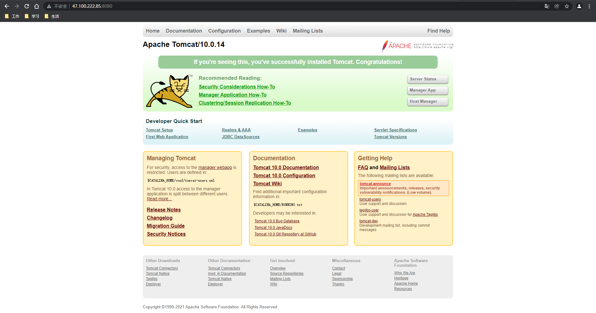

https://www.kuangstudy.com/bbs/1481078575083266050

> 参考源

https://www.bilibili.com/video/BV1og4y1q7M4?spm_id_from=333.999.0.0

https://www.bilibili.com/video/BV1kv411q7Qc?spm_id_from=333.999.0.0

> 版本

本文章基于 **Docker 20.10.11**

------

部署 Tomcat 可以参考 Docker Hub 官方文档：https://hub.docker.com/_/tomcat

# 启动Tomcat

```shell
[root@sail bin]# docker run -d -p 8080:8080 --name=tomcat01 tomcat
Unable to find image 'tomcat:latest' locally
latest: Pulling from library/tomcat
5e0b432e8ba9: Pull complete 
a84cfd68b5ce: Pull complete 
e8b8f2315954: Pull complete 
0598fa43a7e7: Pull complete 
e0d35e3be804: Pull complete 
8fc448a0c88b: Pull complete 
dbdff6e5955b: Pull complete 
5daf3771e3d8: Pull complete 
e4265b3badfc: Pull complete 
126f233cb97a: Pull complete 
Digest: sha256:429d5c140820d5eba38042823501d5f4e0f03b282133513e29c22d6358daa7c7
Status: Downloaded newer image for tomcat:latest
fe247e0ef80de961df2f73216b3c604d97094b9a35064f9bef421243e610e487

[root@sail bin]# docker ps
CONTAINER ID   IMAGE     COMMAND             CREATED              STATUS              PORTS                    NAMES
fe247e0ef80d   tomcat    "catalina.sh run"   About a minute ago   Up About a minute   0.0.0.0:8080->8080/tcp   tomcat01
```

这里选择直接启动的方式，若本地没有该镜像，则先从官方库拉取。

# 进入容器

```shell
[root@sail sail]# docker exec -it tomcat01 /bin/bash
root@fe247e0ef80d:/usr/local/tomcat# ls
BUILDING.txt  CONTRIBUTING.md  LICENSE    NOTICE    README.md  RELEASE-NOTES  RUNNING.txt  bin  conf  lib  logs  native-jni-lib  temp  webapps  webapps.dist  work

root@fe247e0ef80d:/usr/local/tomcat# cd webapps
root@fe247e0ef80d:/usr/local/tomcat/webapps# ls
root@fe247e0ef80d:/usr/local/tomcat/webapps#
```

这里发现一个问题，Tomcat 下的 **webapps** 没有文件，所以 Tomcat 的初始页面是不能显示的。

> 这也是 Docker 的精髓，**只保留最核心的东西，剔除所有不必要的内容**。

这也并非不可解决，**webapps** 的默认内容是存放在 **webapps.dist** 中的

```shell
root@fe247e0ef80d:/usr/local/tomcat# cd webapps.dist
root@fe247e0ef80d:/usr/local/tomcat/webapps.dist# ls
ROOT  docs  examples  host-manager  manager
```

> 将 **webapps.dist** 中的内容复制到 **webapps** 下

```shell
root@fe247e0ef80d:/usr/local/tomcat# cp -r webapps.dist/* webapps
root@fe247e0ef80d:/usr/local/tomcat# cd webapps
root@fe247e0ef80d:/usr/local/tomcat/webapps# ls
ROOT  docs  examples  host-manager  manager
```

# 外网访问测试



> 命令测试

```shell
root@fe247e0ef80d:/usr/local/tomcat/webapps# ll
bash: ll: command not found
```

> 这里又发现一个问题，`ll` 这种相对基础的命令也是没有的，如此也可以看出 Docker 极致的精简。