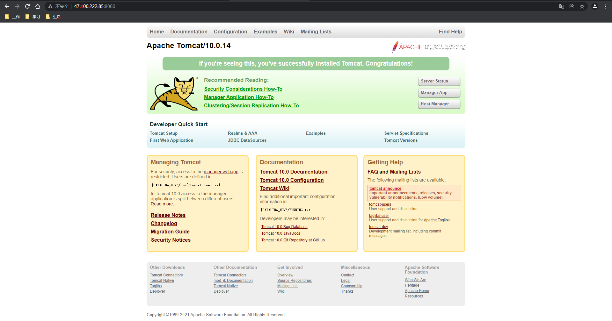

https://www.kuangstudy.com/bbs/1484411251160694786

> 参考源

https://www.bilibili.com/video/BV1og4y1q7M4?spm_id_from=333.999.0.0

https://www.bilibili.com/video/BV1kv411q7Qc?spm_id_from=333.999.0.0

> 版本

本文章基于 **Docker 20.10.11**

------

我们日常拉取的镜像是由别人制作再提交到仓库的。

我们自己也是可以制作镜像并提交的，使用 `docker commit` 命令。

# 提交镜像

## **docker commit**

> 语法

```shell
docker commit [参数] 容器 [仓库[:标签]]
```

> 参数

- `-a`：作者信息。一般为 **作者名字<邮箱>**。
- `-c`：将 **Dockerfile** 指令应用于创建的映像。
- `-m`：注释信息。
- `-p`：提交期间暂停容器（默认）。

> 提交自定义镜像

在 [Docker 07 部署Tomcat](https://www.kuangstudy.com/bbs/1481078575083266050) 中，我们将 **webapps.dist** 中的内容复制到 **webapps** 下，这样的容器就是我们自定义的了。

> 将这个容器创建为一个自定义的镜像并提交到仓库中。

```shell
PS D:\docker\test> docker commit -a='天才' -m='我的archlinux' arch1 myarchlinux:1.0
sha256:f2884c0e9c3dd2fdeca1980982b4afc6dea57d3c2f96faa554f576044759a528
PS D:\docker\test> docker images
REPOSITORY    TAG       IMAGE ID       CREATED         SIZE
myarchlinux   1.0       f2884c0e9c3d   4 seconds ago   518MB
archlinux     latest    0a6134a84991   6 days ago      370MB
nginx         latest    605c77e624dd   5 months ago    141MB

PS D:\docker\test> docker run -it --name arch2 myarchlinux /bin/bash
Unable to find image 'myarchlinux:latest' locally

PS D:\docker\test> docker run -it --name arch2 myarchlinux:1.0 /bin/bash

[root@134909f8fbc0 /]# cd yuki

[root@134909f8fbc0 yuki]# ls	# 这里可以看到以前
1.txt  2.txt  3.txt  4.txt

[root@134909f8fbc0 yuki]# neofetch
                   -`                    root@134909f8fbc0
                  .o+`                   -----------------
                 `ooo/                   OS: Arch Linux on Windows 10 x86_64
                `+oooo:                  Kernel: 5.10.16.3-microsoft-standard-WSL2
               `+oooooo:                 Uptime: 2 hours, 15 mins
               -+oooooo+:                Packages: 115 (pacman)
             `/:-:++oooo+:               Shell: bash 5.1.16
            `/++++/+++++++:              CPU: Intel i7-9700KF (8) @ 3.600GHz
           `/++++++++++++++:             GPU: c747:00:00.0 Microsoft Corporation Device 008e
          `/+++ooooooooooooo/`           Memory: 711MiB / 12738MiB
         ./ooosssso++osssssso+`
        .oossssso-````/ossssss+`
       -osssssso.      :ssssssso.
      :osssssss/        osssso+++.
     /ossssssss/        +ssssooo/-
   `/ossssso+/:-        -:/+osssso+-
  `+sso+:-`                 `.-/+oso:
 `++:.                           `-/+/
 .`                                 `/

[root@134909f8fbc0 yuki]# exit
exit

PS D:\docker\test> docker ps -a
CONTAINER ID   IMAGE             COMMAND                  CREATED          STATUS                           PORTS     NAMES
134909f8fbc0   myarchlinux:1.0   "/bin/bash"              30 seconds ago   Exited (0) 4 seconds ago                   arch2
74efad86ea12   nginx             "/docker-entrypoint.…"   24 hours ago     Exited (0) 10 minutes ago                  nginx1
d24b504b2947   archlinux         "/bin/bash"              25 hours ago     Exited (127) About an hour ago             arch1
```

可以看到，我们自定义的镜像已经在本地镜像库中了。

# 测试

> 停止原有容器。

```shell
[root@sail ~]# docker stop fe247e0ef80d
fe247e0ef80d
```

> 启动自定义镜像。

```shell
[root@sail ~]# docker run -d -p 8080:8080 --name="tomcat4sail" 187a99503046
602c3c576c1b6d13aa0d2508490220d479eaf8c52c9cfe116029c67437fac61b
```

由于自定义的镜像还没有提交到远程库，所以这里只能使用镜像 ID 启动。

如果使用镜像名启动，会从远程库中进行搜索，由于我们还没有提交，会因为搜索不到报错。

> 访问测试



这里我们并没有改变容器中 **webapps** 下的内容，但依然可以直接访问，说明我们自定义的镜像是生效了的。