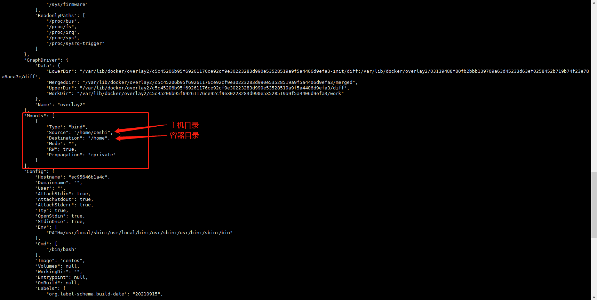
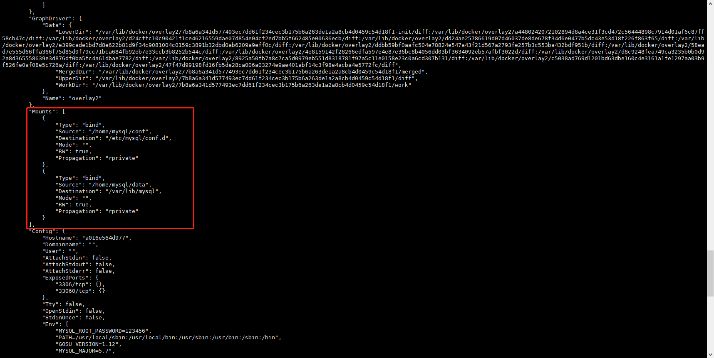
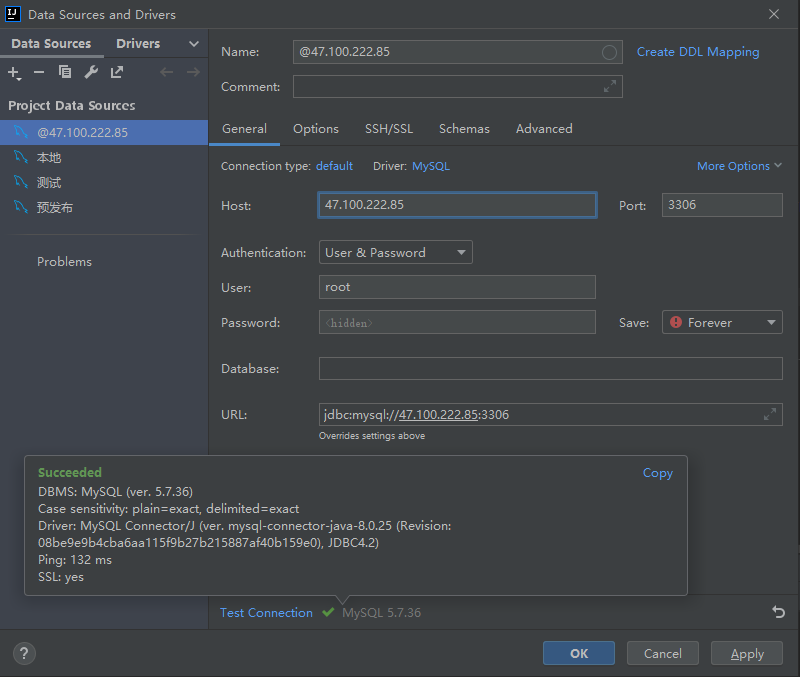

https://www.kuangstudy.com/bbs/1484782140666593282

> 参考源

https://www.bilibili.com/video/BV1og4y1q7M4?spm_id_from=333.999.0.0

https://www.bilibili.com/video/BV1kv411q7Qc?spm_id_from=333.999.0.0

> 版本

本文章基于 **Docker 20.10.11**

------

# 由来

Docker 是将应用和环境打包成一个镜像。

这样，数据就不应该保存在容器中，否则容器删除，数据就会丢失，有着非常大的风险。

为此，容器和主机之间需要有一个数据共享技术，使得在 Docker 容器中产生的数据能够同步到本地。

这就是**数据卷**技术。其本质上是一个**目录挂载**，将容器内的目录挂载到主机上。

# 使用

## **docker run -v 主机目录:容器目录** 命令方式

> 语法

```shell
docker run -v 主机目录:容器目录
```

类似 `-p`

```shell
docker run -p 主机端口:容器端口
```

> 查看主机 `/home` 目录。

```shell
[root@sail ~]# ls /home
admin  f2  f3  sail  test.java
```

> 以交互模式启动 centos 镜像。
>
> `主机目录:容器目录`
>
> `/home:/home`

```shell
[root@sail ~]# docker run -it -v /home/ceshi:/home centos /bin/bash
[root@ec95646b1a4c /]#
```

> 新开一个窗口查看容器详情。



**Mounts** 下的 **Source** 即为设置的主机目录、**Destination** 即为设置的容器目录，他们已经绑定在了一起。 

> 在主机中查看 `/home`。

```shell
[root@ec95646b1a4c /]# cd /home
[root@ec95646b1a4c home]# ls
[root@ec95646b1a4c home]# touch test.java
[root@ec95646b1a4c home]# ls
test.java
```

主机上的 `/home` 下已经有了 `ceshi` 目录。说明容器一经启动，就会在主机生成对应的挂载目录。

> 在容器中的 `/home` 下新建一个文件。

```shell
[root@sail /]# cd /home
[root@sail home]# ls
admin  ceshi  f2  f3  sail  test.java
```

> 查看主机的 `ceshi` 目录。

```shell
[root@sail home]# cd ceshi
[root@sail ceshi]# ls
test.java		# 同步到外面
```

此时主机中的 `ceshi`  目录下也有了这个文件。

> 关闭容器。

```shell
[root@ec95646b1a4c home]# exit
exit
```

> 修改主机中 `/home/ceshi/test.java` 文件的内容。

```shell
[root@sail ceshi]# vim test.java
# 此处编辑文件过程省略
[root@sail ceshi]# cat test.java
hello sail
```

> 重启容器。

```shell
[root@sail ~]# docker start ec95646b1a4c
ec95646b1a4c
[root@sail ~]# docker ps
CONTAINER ID   IMAGE          COMMAND             CREATED          STATUS         PORTS                    NAMES
ec95646b1a4c   centos         "/bin/bash"         19 minutes ago   Up 5 seconds                            charming_cartwright
```

> 查看 `/home` 下的文件。

```shell
[root@sail ~]# docker exec -it ec95646b1a4c /bin/bash
[root@ec95646b1a4c /]# cd /home
[root@ec95646b1a4c home]# ls
test.java
[root@ec95646b1a4c home]# cat test.java
hello sail
```

此时容器中的文件也更改了。

> 由此可见，数据卷技术实现的是双向同步。

## **--volume-from** 数据卷容器同步

> `--volume-from` 多个volume同步

````shell
docker run -it --name docker01 centos
Ctrl+Q+P

docker run -it --name docker02 --volume-from docker01 centos
````

> 两个container的数据是同步的,一个更改另一个也更改

> 继续继承

```shell
docker run -it --name docker03 --volume-from docker01 centos
```

> **删除docker01不会影响继承的容器,只要有一个容器在使用就不会删除数据**

## 权限设置

在使用命令方式设置卷时，还可以指定权限，以此保证数据安全(容器删除,文件还在)。

> 参数

- `ro`(readonly)：只读。
- `rw`(readwrite)：可读可写。

> 以数据卷只读权限启动镜像。

```shell
[root@sail mysql]# docker run -it -v /home/sail:/home:ro centos /bin/bash
```

> 新建文件测试。

```shell
[root@02ef70c94920 home]# touch test.java
touch: cannot touch 'test.java': Read-only file system
```

容器内部该目录是没有写入权限的。

> 以数据卷可读可写的权限启动镜像。

```shell
[root@sail mysql]# docker run -it -v /home/sail:/home:rw centos /bin/bash
[root@48678e08f868 /]# cd /home
[root@48678e08f868 home]# touch test.java
[root@48678e08f868 home]# ls
apache-tomcat-9.0.55.tar.gz  jdk-8u301-linux-x64.rpm  test.java
```

> 新建文件测试。

```shell
[root@sail mysql]# docker run -it -v /home/sail:/home:rw centos /bin/bash
[root@48678e08f868 /]# cd /home
[root@48678e08f868 home]# touch test.java
[root@48678e08f868 home]# ls
apache-tomcat-9.0.55.tar.gz  jdk-8u301-linux-x64.rpm  test.java
```

容器内部该目录写入是没有问题的。

> 前面我们没有指定权限也可以写入，由此可见，数据卷默认是具有读写权限的。

# docker volume 查看卷

```shell
PS D:\Docker\test> docker volume --help

Usage:  docker volume COMMAND

Manage volumes

Commands:
  create      Create a volume
  inspect     Display detailed information on one or more volumes
  ls          List volumes
  prune       Remove all unused local volumes
  rm          Remove one or more volumes

Run 'docker volume COMMAND --help' for more information on a command.
```

```shell
PS D:\docker\test> docker volume ls
DRIVER    VOLUME NAME
local     210d98b2f65c1bea7495cce4059e27514fdf7c7f90e5b1e599e1a2bdfe732c18	# 匿名挂卷
local     d3eee2d69e0e128d417d11398cb2ba2f0d075dffa443c71064d342b50d5f669c
local     home	# 具名挂载
local     test
```

> 查看volume文件位置，都在`/var/lib/docker/volumes/`目录下面，windows的在哪?(ó﹏ò｡)
>
> 就是不指定具体的位置，都会在这个位置，文件夹名字就是设定的名字（不设定就是随机的）

```shell
PS D:\docker\test> docker volume inspect home
[
    {
        "CreatedAt": "2022-06-08T13:01:10Z",
        "Driver": "local",
        "Labels": null,
        "Mountpoint": "/var/lib/docker/volumes/home/_data",
        "Name": "home",
        "Options": null,
        "Scope": "local"
    }
]

PS D:\docker\test> docker volume inspect test
[
    {
        "CreatedAt": "2022-06-08T12:58:48Z",
        "Driver": "local",
        "Labels": null,
        "Mountpoint": "/var/lib/docker/volumes/test/_data",
        "Name": "test",
        "Options": null,
        "Scope": "local"
    }
]

PS D:\docker\test> docker volume inspect 210d98b2f65c1bea7495cce4059e27514fdf7c7f90e5b1e599e1a2bdfe732c18
[
    {
        "CreatedAt": "2022-06-08T10:39:08Z",
        "Driver": "local",
        "Labels": null,
        "Mountpoint": "/var/lib/docker/volumes/210d98b2f65c1bea7495cce4059e27514fdf7c7f90e5b1e599e1a2bdfe732c18/_data",
        "Name": "210d98b2f65c1bea7495cce4059e27514fdf7c7f90e5b1e599e1a2bdfe732c18",
        "Options": null,
        "Scope": "local"
    }
]
```

# 具名挂载

> 启动镜像时只定义主机卷名称，不指定挂载目录。

`ocker run -it -v 名字:容器内路径 ...`

`my-centos:/home` **前面没有绝对路径就是名字**

```shell
[root@sail mysql]# docker run -it -v my-centos:/home centos /bin/bash
[root@3cf74e9e6973 /]#
```

> 查看目前挂载的卷。

```shell
# 使用 Ctrl + P + Q 不退出容器的情况下回到主机目录。
[root@sail mysql]# docker volume ls
DRIVER    VOLUME NAME
local     my-centos
```

> 查看卷的详情。

```shell
[root@sail mysql]# docker volume inspect my-centos
[
    {
        "CreatedAt": "2021-12-20T16:55:35+08:00",
        "Driver": "local",
        "Labels": null,
        "Mountpoint": "/var/lib/docker/volumes/my-centos/_data",	# 挂载目录地址
        "Name": "my-centos",										 # 这就是指定的名字	
        "Options": null,
        "Scope": "local"
    }
]
```

**卷挂载在 `/var/lib/docker/volumes/卷名/_data` 目录下。**

在没有指定主机挂载目录的情况下，会默认挂载到该目录。

> 由于指定了卷名，所以这种方式称为具名挂载。

# 匿名挂载

> `ocker run -it -v 容器内路径 ...`
>
> `/home`**启动镜像时只指定容器内目录。**

```shell
[root@sail mysql]# docker run -it -v /home centos /bin/bash
```

> 查看目前挂载的卷。

```shell
[root@sail mysql]# docker volume ls
DRIVER    VOLUME NAME
local     159830cf55550c9a39e845c1d96aa04cc762005bc0c64d15d5066834b47df940
```

> 查看卷的详情。

```shell
[root@sail mysql]# docker volume inspect 159830cf55550c9a39e845c1d96aa04cc762005bc0c64d15d5066834b47df940
[
    {
        "CreatedAt": "2021-12-20T17:05:23+08:00",
        "Driver": "local",
        "Labels": null,
        "Mountpoint": "/var/lib/docker/volumes/159830cf55550c9a39e845c1d96aa04cc762005bc0c64d15d5066834b47df940/_data",	# 挂载目录地址
        "Name": "159830cf55550c9a39e845c1d96aa04cc762005bc0c64d15d5066834b47df940",									     # 名字是路径名
        "Options": null,
        "Scope": "local"
    }
]
```

**卷也是挂载在 `/var/lib/docker/volumes/xxx/_data` 目录下。**

在没有指定主机挂载目录的情况下，会默认挂载到该目录。

> 由于没有指定卷名，所以这种方式称为匿名挂载。

**只有指定主机目录的情况下会挂载到指定目录，否则都会挂载到默认目录。**

## ro rw 权限

```shell
# 通过 -v 容器内路径:ro rw 改变读写权限
# 一旦设置这个权限,容器对挂载出来的内容就有读写限定了
# ro read-only	只能通过宿主机来操作,容器没法xi'er
# rw read-write

docker run -d -p 7777:80 --name nginx2 -v juming-nginx:/etc/nginx:ro nginx	
docker run -d -p 7777:80 --name nginx2 -v juming-nginx:/etc/nginx:rw nginx
```

# 实战

## mysql数据同步

https://hub.docker.com/_/mysql

数据库中的数据极为重要，必须同步到主机，否则将会有非常大的数据丢失风险。

这里以 mysql 镜像为例演示数据同步的过程。

> 启动 mysql 镜像。

```shell
docker run
-d 
-p 3307:3306 
-v /home/mysql/conf.d:/etc/mysql/conf.d # 可以映射多个目录
-v /home/mysql/data:/var/lib/mysql		# 可以映射多个目录
-e MYSQL_ROOT_PASSWORD=root 			# -e 配置环境 密码
--name mysql1 
mysql

docker run -d -p 3307:3306 `
-v /home/mysql/conf.d:/etc/mysql/conf.d `
-v /home/mysql/data:/var/lib/mysql `
-e MYSQL_ROOT_PASSWORD=root `
--name mysql1 `
mysql
```


```shell
PS D:\Docker\test> docker pull mysql
Using default tag: latest
latest: Pulling from library/mysql
72a69066d2fe: Pull complete
93619dbc5b36: Pull complete
99da31dd6142: Pull complete
626033c43d70: Pull complete
37d5d7efb64e: Pull complete
ac563158d721: Pull complete
d2ba16033dad: Pull complete
688ba7d5c01a: Pull complete
00e060b6d11d: Pull complete
1c04857f594f: Pull complete
4d7cfa90e6ea: Pull complete
e0431212d27d: Pull complete
Digest: sha256:e9027fe4d91c0153429607251656806cc784e914937271037f7738bd5b8e7709
Status: Downloaded newer image for mysql:latest

PS D:\Docker\test> docker run -d -p 3307:3306 `
>> -v /home/mysql/conf.d:/etc/mysql/conf.d `
>> -v /home/mysql/data:/var/lib/mysql `
>> -e MYSQL_ROOT_PASSWORD=root `
>> --name mysql1 `
>> mysql
29bd9896ae7e59dfaf01a61ca0823c5a5a2b7c769b199e951453c1638489c7ed
PS D:\Docker\test> docker ps
CONTAINER ID   IMAGE     COMMAND                  CREATED         STATUS         PORTS                               NAMES
29bd9896ae7e   mysql     "docker-entrypoint.s…"   5 seconds ago   Up 4 seconds   33060/tcp, 0.0.0.0:3307->3306/tcp   mysql1
```

其中 `-e` 为环境配置。安装启动 mysql 需要配置密码。

> 使用`docker inspect`查看挂载情况。

```shell
PS D:\Docker\test> docker inspect mysql1
		...
        "Mounts": [
            {
                "Type": "bind",
                "Source": "/home/mysql/conf.d",			# 挂载
                "Destination": "/etc/mysql/conf.d",
                "Mode": "",
                "RW": true,
                "Propagation": "rprivate"
            },
            {
                "Type": "bind",
                "Source": "/home/mysql/data",			# g
                "Destination": "/var/lib/mysql",
                "Mode": "",
                "RW": true,
                "Propagation": "rprivate"
            }
        ],
        "NetworkSettings": {
            "Bridge": "",
            "SandboxID": "d71b88f87058d4d11111be30f34a155d63330b5c4221611bbc9c874c5777f487",
            "HairpinMode": false,
            "LinkLocalIPv6Address": "",
            "LinkLocalIPv6PrefixLen": 0,
            "Ports": {
                "3306/tcp": [
                    {
                        "HostIp": "0.0.0.0",
                        "HostPort": "3307"
                    }
                ],
                "33060/tcp": null
            },
        }
    }
]
```



已经生成了两个目录的挂载。

> 查看主机同步的目录。

```shell
[root@sail ~]# cd /home
[root@sail home]# ls
admin  ceshi  f2  f3  mysql  sail  test.java
[root@sail home]# cd mysql
[root@sail mysql]# ls
conf  data
```

主机已经同步了容器挂载的目录。

> 使用数据库管理工具连接测试（这里使用 IDEA 自带的数据库工具）。



