https://www.kuangstudy.com/bbs/1485174981762945026

> 参考源

https://www.bilibili.com/video/BV1og4y1q7M4?spm_id_from=333.999.0.0

https://www.bilibili.com/video/BV1kv411q7Qc?spm_id_from=333.999.0.0

> 版本

本文章基于 **Docker 20.10.11**

------

# 简介

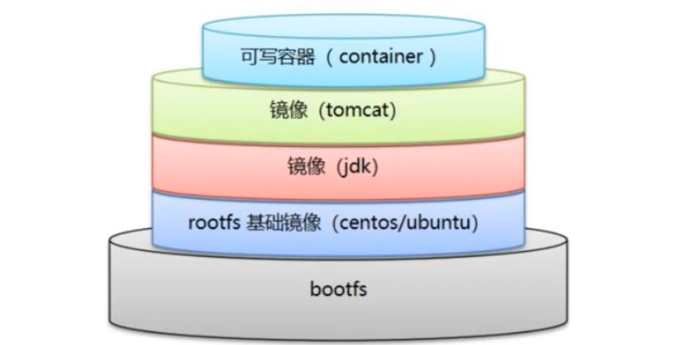

Dockerfile 是用来构建 Docker 镜像的文件，可以理解为**命令参数脚本**。

Dockerfile 是面向开发的，想要打包项目，就要编写 Dockerfile 文件。

> 由于 Docker 的流行，Docker 镜像逐渐替代 **jar** 或者 **war** 成为企业的交付标准。

# 官方 Dockerfile

构建步骤

1. 编写Dockerfile文件
2. docker build 构建镜像
3. docker run 运行镜像
4. docker push 发布镜像

> 首先看一下官方的 Dockerfile。

这里以 centos 的镜像为例。

> 在 [Docker Hub](https://hub.docker.com/) 搜索 centos 镜像，选择官方镜像。

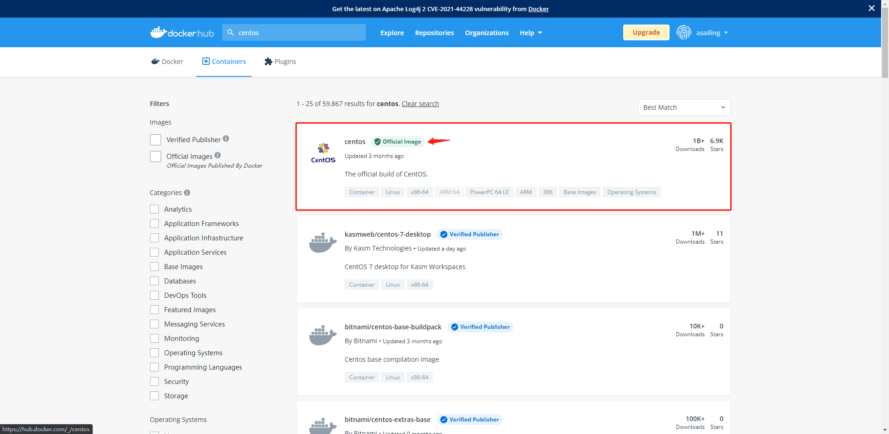

> 点击 **The CentOS Project** 。

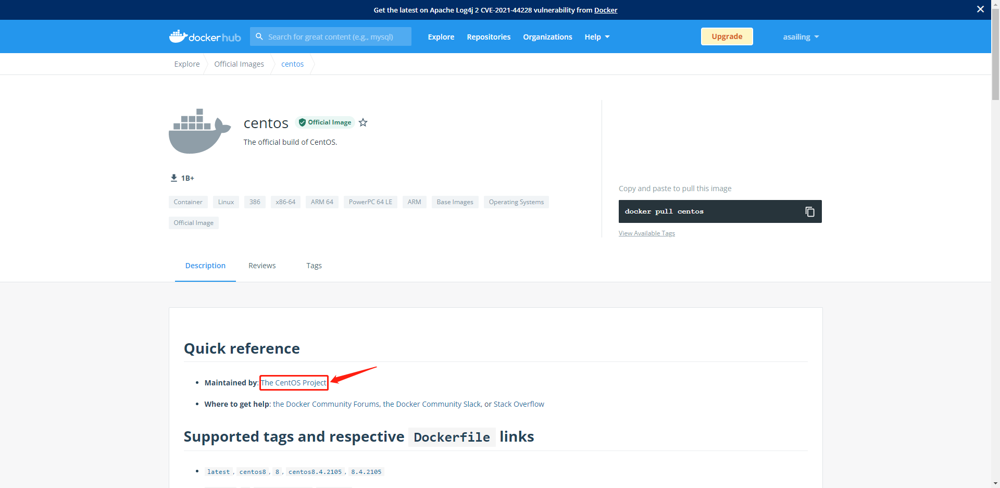

> 选择版本分支。这里以 **CentOS-7.6.1810** 为例。

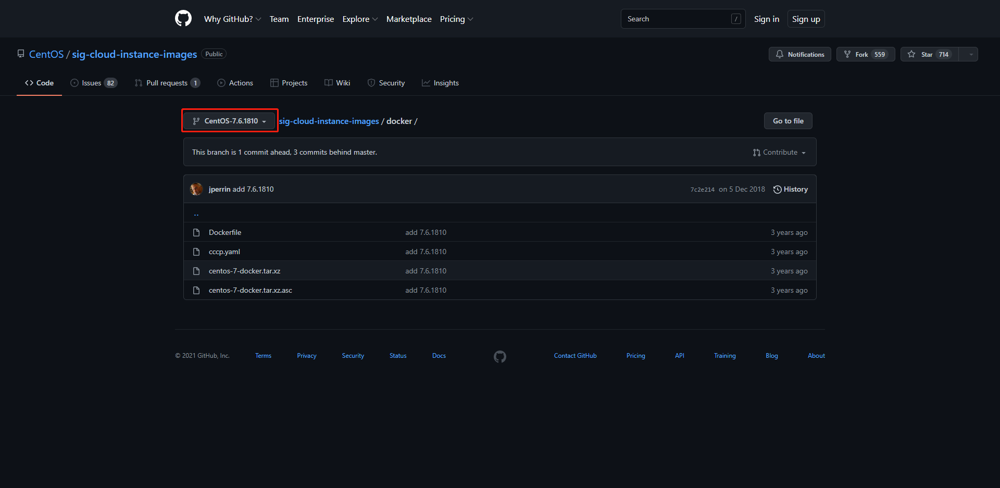

> 查看 Dockerfile。

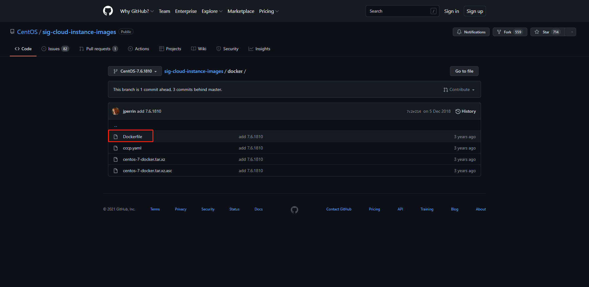

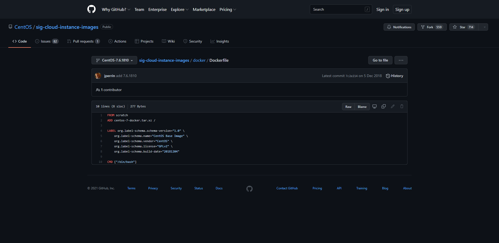

> 可以看出官方的 Dockerfile 是很简洁的，这就是 Docker 极致精简的原因。

不过，官方镜像都是基础包，很多功能是没有的，比如 centos 的官方镜像是没有 `vim` 命令的。

像这种基础命令比较常用，如果想要使用可以在容器内安装，但这样很不方便，因为每个新启动的容器都要安装。

我们通常会选择自己搭建镜像，这就要用到 Dockerfile 了。

# 命令

以上面的 centos 官方镜像的 Dockerfile 为例。

```shell
FROM scratch
ADD centos-7-docker.tar.xz /

LABEL org.label-schema.schema-version="1.0" \
    org.label-schema.name="CentOS Base Image" \
    org.label-schema.vendor="CentOS" \
    org.label-schema.license="GPLv2" \
    org.label-schema.build-date="20181204"
   
CMD ["/bin/bash"]
```

Docker Hub 中 99% 的镜像都是从`FROM scratch` 开始的。

> 规则

- 每个指令都必须是大写字母。
- 按照从上到下顺序执行。
- **#** 表示注释。
- 每一条指令都会创建一个新的镜像层（都是一层）。

> 解释

- `FROM`：基础镜像，比如 centos。
- `MAINTAINER`：镜像是谁写的。建议以此格式：`姓名<邮箱>`。
- `RUN`：镜像构建时需要运行的命令。
- `ADD`：添加，比如添加一个 tomcat 压缩包。**会自动解压文件**
- `WORKDIR`：镜像的工作目录。
- `VOLUME`：挂载的目录。
- `EXPOSE`：指定暴露端口，跟 -p 一个道理。
- `RUN`：最终要运行的。
- `CMD`：指定这个容器启动的时候要运行的命令，**只有最后一个会生效，而且可被替代**。
- `ENTRYPOINT`：指定这个容器启动的时候要运行的命令，**可以追加命令**。
- `ONBUILD`：当构建一个被继承Dockerfile 这个时候运行ONBUILD指定，触发指令。
- `COPY`：将文件拷贝到镜像中。
- `ENV`：构建的时候设置环境变量。

> [archlinux](https://gitlab.archlinux.org/archlinux/archlinux-docker/-/blob/7c4a9dcb0588507fc9c23dbb07162124dad7d5ef/Dockerfile.base)

```dockerfile
FROM alpine:3.12 AS verify
RUN apk add --no-cache curl tar zstd

# https://gitlab.archlinux.org/archlinux/archlinux-docker/-/releases/v20220529.0.58327
RUN ROOTFS="$(curl -sOJL -w "%{filename_effective}" "https://gitlab.archlinux.org/archlinux/archlinux-docker/-/package_files/2550/download")" && \
    echo "e430fa6daa6c6b864ded94eb245753d898ce6e986e7b4d2c9f8a8d284cbc79ed  base-20220529.0.58327.tar.zst" > /tmp/rootfs.tar.sha256 && \
    cat /tmp/rootfs.tar.sha256 && \
    sha256sum -c /tmp/rootfs.tar.sha256 && \
    mkdir /rootfs && \
    tar -C /rootfs --extract --file "${ROOTFS}"

FROM scratch AS root
COPY --from=verify /rootfs/ /

RUN ldconfig

ENV LANG=en_US.UTF-8
CMD ["/usr/bin/bash"]
```


## 构建镜像

### **docker build**

Dockerfile 编写好后，需要使用 `docker build` 命令运行。

> 语法

```shell
docker build [参数] 路径 | 网络地址 | -
```

> 参数

- `-f`：`file` 指定要使用的Dockerfile路径。
- `-t`：`target` 镜像的名字及标签，通常 **name:tag** 或者 **name** 格式；可以在一次构建中为一个镜像设置多个标签。
- `-m`：设置内存最大值。

```shell
PS D:\docker\test> docker build --help

Usage:  docker build [OPTIONS] PATH | URL | -

Build an image from a Dockerfile

Options:
      --add-host list           Add a custom host-to-IP mapping (host:ip)
      --build-arg list          Set build-time variables
      --cache-from strings      Images to consider as cache sources
      --disable-content-trust   Skip image verification (default true)
  -f, --file string             Name of the Dockerfile (Default is
                                'PATH/Dockerfile')
      --iidfile string          Write the image ID to the file
      --isolation string        Container isolation technology
      --label list              Set metadata for an image
      --network string          Set the networking mode for the RUN
                                instructions during build (default "default")
      --no-cache                Do not use cache when building the image
  -o, --output stringArray      Output destination (format:
                                type=local,dest=path)
      --platform string         Set platform if server is multi-platform
                                capable
      --progress string         Set type of progress output (auto, plain,
                                tty). Use plain to show container output
                                (default "auto")
      --pull                    Always attempt to pull a newer version of
                                the image
  -q, --quiet                   Suppress the build output and print image
                                ID on success
      --secret stringArray      Secret file to expose to the build (only
                                if BuildKit enabled):
                                id=mysecret,src=/local/secret
      --ssh stringArray         SSH agent socket or keys to expose to the
                                build (only if BuildKit enabled) (format:
                                default|<id>[=<socket>|<key>[,<key>]])
  -t, --tag list                Name and optionally a tag in the
                                'name:tag' format
      --target string           Set the target build stage to build.
```

> Docker 守护进程执行 Dockerfile 中的指令前，首先会对 Dockerfile 进行语法检查，有语法错误时会返回报错信息。

```shell
Error response from daemon: Unknown instruction: RUNCMD
```

#### test

> 编写Dockerfile

```dockerfile
FROM archlinux

VOLUME ["volume01", "volume02"]

CMD ["/bin/bash"]
```

> 运行Dockerfile

```shell
PS D:\docker\test> docker build -f ./Dockerfile -t myarchlinux1 .
[+] Building 0.1s (5/5) FINISHED
 => [internal] load build definition from Dockerfile                                                                                                                              0.0s
 => => transferring dockerfile: 131B                                                                                                                                              0.0s
 => [internal] load .dockerignore                                                                                                                                                 0.0s
 => => transferring context: 2B                                                                                                                                                   0.0s
 => [internal] load metadata for docker.io/library/archlinux:latest                                                                                                               0.0s
 => CACHED [1/1] FROM docker.io/library/archlinux                                                                                                                                 0.0s
 => exporting to image                                                                                                                                                            0.0s
 => => exporting layers                                                                                                                                                           0.0s
 => => writing image sha256:ecb585d72c033f20ac9347af819faf9ae0cbd8de5c38a0b55915ddf5ff44043f                                                                                      0.0s
 => => naming to docker.io/my/myarchlinux                                                                                                                                         0.0s
PS D:\docker\test> docker images
REPOSITORY       TAG       IMAGE ID       CREATED        SIZE
myarchlinux      1.0       f2884c0e9c3d   23 hours ago   518MB
archlinux        latest    0a6134a84991   7 days ago     370MB
<none>           <none>    f5c86a160d65   7 days ago     370MB
myarchlinux1     latest    ecb585d72c03   7 days ago     370MB
nginx            latest    605c77e624dd   5 months ago   141MB

D:\docker\test>docker run -it --name arch2 myarchlinux1
[root@8003e8787ee8 /]# ls -alhF
total 60K
drwxr-xr-x   1 root root 4.0K Jun  9 11:31 ./
drwxr-xr-x   1 root root 4.0K Jun  9 11:31 ../
lrwxrwxrwx   1 root root    7 Dec  7  2021 bin -> usr/bin/
drwxr-xr-x   2 root root 4.0K Dec  7  2021 boot/
drwxr-xr-x   5 root root  360 Jun  9 11:34 dev/
-rwxr-xr-x   1 root root    0 Jun  9 11:31 .dockerenv*
drwxr-xr-x   1 root root 4.0K Jun  9 11:31 etc/
drwxr-xr-x   2 root root 4.0K Dec  7  2021 home/
lrwxrwxrwx   1 root root    7 Dec  7  2021 lib -> usr/lib/
lrwxrwxrwx   1 root root    7 Dec  7  2021 lib64 -> usr/lib/
drwxr-xr-x   2 root root 4.0K Dec  7  2021 mnt/
drwxr-xr-x   2 root root 4.0K Dec  7  2021 opt/
dr-xr-xr-x 251 root root    0 Jun  9 11:34 proc/
drwxr-x---   1 root root 4.0K Jun  9 11:31 root/
drwxr-xr-x   2 root root 4.0K Dec  7  2021 run/
lrwxrwxrwx   1 root root    7 Dec  7  2021 sbin -> usr/bin/
drwxr-xr-x   4 root root 4.0K May 29 00:04 srv/
dr-xr-xr-x  11 root root    0 Jun  9 11:34 sys/
drwxrwxrwt   2 root root 4.0K Dec  7  2021 tmp/
drwxr-xr-x   8 root root 4.0K May 29 00:04 usr/
drwxr-xr-x   1 root root 4.0K May 29 00:04 var/
drwxr-xr-x   2 root root 4.0K Jun  9 11:31 volume01/
drwxr-xr-x   2 root root 4.0K Jun  9 11:31 volume02/	# volume01  volume02就是Dockerfile挂载的，是匿名挂载，下面的就是
[root@8003e8787ee8 /]# exit
exit

D:\docker\test>docker inspect arch2
		...
        "Mounts": [
            {
                "Type": "volume",
                "Name": "b648386b35ebba2aaa0a6d56df05ab7a52b329d9829cceaad3af4a16fc2fd8ba",
                "Source": "/var/lib/docker/volumes/b648386b35ebba2aaa0a6d56df05ab7a52b329d9829cceaad3af4a16fc2fd8ba/_data",
                "Destination": "volume01",
                "Driver": "local",
                "Mode": "",
                "RW": true,
                "Propagation": ""
            },
            {
                "Type": "volume",
                "Name": "2b8ba03468e1557249b5735e2c2cac7bd6b3f5618f4bb50ee1617c3cb429d1ca",
                "Source": "/var/lib/docker/volumes/2b8ba03468e1557249b5735e2c2cac7bd6b3f5618f4bb50ee1617c3cb429d1ca/_data",
                "Destination": "volume02",
                "Driver": "local",
                "Mode": "",
                "RW": true,
                "Propagation": ""
            }
        ],
		...

D:\docker\test>docker volume ls
DRIVER    VOLUME NAME
local     2b8ba03468e1557249b5735e2c2cac7bd6b3f5618f4bb50ee1617c3cb429d1ca
local     210d98b2f65c1bea7495cce4059e27514fdf7c7f90e5b1e599e1a2bdfe732c18
local     00375691012fb92ebebcf0c43815aca97630d83702a51abe9a0b5a9f68d60010
local     b648386b35ebba2aaa0a6d56df05ab7a52b329d9829cceaad3af4a16fc2fd8ba
local     d3eee2d69e0e128d417d11398cb2ba2f0d075dffa443c71064d342b50d5f669c
local     e1e83ba3d76358abcd4905d44614a33a098aafb60a177a364fe0c5cadaf61827
local     home
local     test
```

## 查看构建记录

### **docker history imagename**

> 语法

```shell
docker history 镜像
```

```shell
D:\docker\test>docker history archlinux-test
IMAGE          CREATED          CREATED BY                                      SIZE      COMMENT
36cc160a2371   12 minutes ago   CMD ["/bin/bash"]                               0B        buildkit.dockerfile.v0
<missing>      12 minutes ago   EXPOSE map[81/tcp:{}]                           0B        buildkit.dockerfile.v0
<missing>      12 minutes ago   RUN /bin/sh -c pacman -Sy # buildkit            8.91MB    buildkit.dockerfile.v0
<missing>      12 minutes ago   WORKDIR /usr/local                              0B        buildkit.dockerfile.v0
<missing>      12 minutes ago   ENV MYPATH=/usr/local                           0B        buildkit.dockerfile.v0
<missing>      12 minutes ago   LABEL author=yuki<2487575080@qq.com> build-d…   0B        buildkit.dockerfile.v0
<missing>      7 days ago       /bin/sh -c #(nop)  CMD ["/usr/bin/bash"]        0B
<missing>      7 days ago       /bin/sh -c #(nop)  ENV LANG=en_US.UTF-8         0B
<missing>      7 days ago       /bin/sh -c ldconfig                             30.6kB
<missing>      7 days ago       /bin/sh -c #(nop) COPY dir:ac665895ff5b6a4b4…   370MB
```

## CMD 与 ENTRYPOINT 区别

- `CMD`：指定这个容器启动的时候要运行的命令，**只有最后一个会生效，而且可被替代**。
- `ENTRYPOINT`：指定这个容器启动的时候要运行的命令，**可以追加命令**。

### CMD 命令演示

> 编写 Dockerfile

```docker
FROM archlinux

CMD ["ls", "-a"]
```

> 构建镜像

```shell
D:\docker\test>docker build -f Dockerfile1 -t cmdtest .
[+] Building 0.1s (5/5) FINISHED
 => [internal] load build definition from Dockerfile1                                                                                                                         0.0s
 => => transferring dockerfile: 72B                                                                                                                                           0.0s
 => [internal] load .dockerignore                                                                                                                                             0.0s
 => => transferring context: 2B                                                                                                                                               0.0s
 => [internal] load metadata for docker.io/library/archlinux:latest                                                                                                           0.0s
 => CACHED [1/1] FROM docker.io/library/archlinux                                                                                                                             0.0s
 => exporting to image                                                                                                                                                        0.0s
 => => exporting layers                                                                                                                                                       0.0s
 => => writing image sha256:e96eaae15aa1500cb7e0af5b7c2650ee1e4691c4fc7a00e2e2296cc6e9c4c20f                                                                                  0.0s
 => => naming to docker.io/library/cmdtest
```

```shell
D:\docker\test>docker images
REPOSITORY   TAG       IMAGE ID       CREATED        SIZE
archlinux    latest    0a6134a84991   7 days ago     370MB
cmdtest      latest    e96eaae15aa1   7 days ago     370MB
nginx        latest    605c77e624dd   5 months ago   141MB
```

> 运行镜像

```shell
D:\docker\test>docker run -it --name cmdtest1 cmdtest
.   bin   dev         etc   lib    mnt  proc  run   srv  tmp  var
..  boot  .dockerenv  home  lib64  opt  root  sbin  sys  usr

```

此时 Dockerfile 中编写的命令生效了。

> 追加 `-l` 命令
>
> 报错

```shell
D:\docker\test>docker run -it --name cmdtest1 cmdtest -l
docker: Error response from daemon: Conflict. The container name "/cmdtest1" is already in use by container "18f643b4d1389b3f323d0ba76d49232ec149f6f19448c66c20a32da767541240". You have to remove (or rename) that container to be able to reuse that name.
See 'docker run --help'.
```

没有达到预期的 `ls -al` 命令。

> `CMD` 是**替换**的方式， `-l` 不是命令，所以报错。

### ENTRYPOINT 命令演示

> 编写 Dockerfile

```dockerfile
FROM archlinux

ENTRYPOINT ["ls", "-a"]
```

> 构建镜像

```shell
D:\docker\test>docker build -f Dockerfile1 -t entrypointtest .
[+] Building 0.1s (5/5) FINISHED
 => [internal] load build definition from Dockerfile1                                                                                                                         0.0s
 => => transferring dockerfile: 79B                                                                                                                                           0.0s
 => [internal] load .dockerignore                                                                                                                                             0.0s
 => => transferring context: 2B                                                                                                                                               0.0s
 => [internal] load metadata for docker.io/library/archlinux:latest                                                                                                           0.0s
 => CACHED [1/1] FROM docker.io/library/archlinux                                                                                                                             0.0s
 => exporting to image                                                                                                                                                        0.0s
 => => exporting layers                                                                                                                                                       0.0s
 => => writing image sha256:821da1cd2b686739fc5527740370fe39acf60a0de2ff8c690c598fb418e9d029                                                                                  0.0s
 => => naming to docker.io/library/entrypointtest                                                                                                                             0.0s

D:\docker\test>docker images
REPOSITORY       TAG       IMAGE ID       CREATED        SIZE
cmdtest          latest    e96eaae15aa1   7 days ago     370MB
entrypointtest   latest    821da1cd2b68   7 days ago     370MB
archlinux        latest    0a6134a84991   7 days ago     370MB
nginx            latest    605c77e624dd   5 months ago   141MB
```

> 运行镜像

```shell
D:\docker\test>docker run entrypointtest
.
..
bin
boot
dev
.dockerenv
etc
home
lib
lib64
mnt
opt
proc
root
run
sbin
srv
sys
tmp
usr
var
```

此时 Dockerfile 中编写的命令也生效了。

> 追加 `-l` 命令

```shell
D:\docker\test>docker run -it --name entrypointtest1 entrypointtest -l
total 52
drwxr-xr-x   1 root root 4096 Jun  9 13:38 .
drwxr-xr-x   1 root root 4096 Jun  9 13:38 ..
lrwxrwxrwx   1 root root    7 Dec  7  2021 bin -> usr/bin
drwxr-xr-x   2 root root 4096 Dec  7  2021 boot
drwxr-xr-x   5 root root  340 Jun  9 13:38 dev
-rwxr-xr-x   1 root root    0 Jun  9 13:38 .dockerenv
drwxr-xr-x   1 root root 4096 Jun  9 13:38 etc
drwxr-xr-x   2 root root 4096 Dec  7  2021 home
lrwxrwxrwx   1 root root    7 Dec  7  2021 lib -> usr/lib
lrwxrwxrwx   1 root root    7 Dec  7  2021 lib64 -> usr/lib
drwxr-xr-x   2 root root 4096 Dec  7  2021 mnt
drwxr-xr-x   2 root root 4096 Dec  7  2021 opt
dr-xr-xr-x 252 root root    0 Jun  9 13:38 proc
drwxr-x---   2 root root 4096 Dec  7  2021 root
drwxr-xr-x   2 root root 4096 Dec  7  2021 run
lrwxrwxrwx   1 root root    7 Dec  7  2021 sbin -> usr/bin
drwxr-xr-x   4 root root 4096 May 29 00:04 srv
dr-xr-xr-x  11 root root    0 Jun  9 13:38 sys
drwxrwxrwt   2 root root 4096 Dec  7  2021 tmp
drwxr-xr-x   8 root root 4096 May 29 00:04 usr
drwxr-xr-x   1 root root 4096 May 29 00:04 var
```

运行了预期的 `ls -al` 命令。

> `ENTRYPOINT` 是**追加**的方式。

Docker 中许多命令都十分相似，我们需要了解他们的区别，最好的方式就是这样对比测试。

# 实战

## 创建包含vim命令的centos镜像

> https://github.com/CentOS/sig-cloud-instance-images/blob/b2d195220e1c5b181427c3172829c23ab9cd27eb/docker/Dockerfile

```dockerfile
FROM scratch
ADD centos-7-x86_64-docker.tar.xz /

LABEL \
    org.label-schema.schema-version="1.0" \
    org.label-schema.name="CentOS Base Image" \
    org.label-schema.vendor="CentOS" \
    org.label-schema.license="GPLv2" \
    org.label-schema.build-date="20201113" \
    org.opencontainers.image.title="CentOS Base Image" \
    org.opencontainers.image.vendor="CentOS" \
    org.opencontainers.image.licenses="GPL-2.0-only" \
    org.opencontainers.image.created="2020-11-13 00:00:00+00:00"

CMD ["/bin/bash"]
```

> 编写 Dockerfile

```dockerfile
FROM archlinux

LABEL \
    author="yuki<2487575080@qq.com>" \
    build-date="2022-06-09 21:05:03"

ENV MYPATH /usr/local	# 设置环境变量

WORKDIR $MYPATH			# 设置默认工作目录

RUN pacman -Sy

EXPOSE 81				# 暴露端口

CMD ["/bin/bash"]
```

> 构建镜像

```shell
D:\docker\test>docker build -f Dockerfile -t archlinux-test:latest .
[+] Building 0.1s (7/7) FINISHED
 => [internal] load build definition from Dockerfile                                                                                                                              0.0s
 => => transferring dockerfile: 238B                                                                                                                                              0.0s
 => [internal] load .dockerignore                                                                                                                                                 0.0s
 => => transferring context: 2B                                                                                                                                                   0.0s
 => [internal] load metadata for docker.io/library/archlinux:latest                                                                                                               0.0s
 => [1/3] FROM docker.io/library/archlinux                                                                                                                                        0.0s
 => CACHED [2/3] WORKDIR /usr/local                                                                                                                                               0.0s
 => CACHED [3/3] RUN pacman -Sy                                                                                                                                                   0.0s
 => exporting to image                                                                                                                                                            0.0s
 => => exporting layers                                                                                                                                                           0.0s
 => => writing image sha256:36cc160a2371296c798c4c9a9533f1e3e810c080ffed1f02edd7ae0303369bc2                                                                                      0.0s
 => => naming to docker.io/library/archlinux-test:latest
```

> 查看构建的镜像

```shell
D:\docker\test>docker images
REPOSITORY       TAG       IMAGE ID       CREATED         SIZE
archlinux-test   latest    36cc160a2371   4 minutes ago   379MB
archlinux        latest    0a6134a84991   7 days ago      370MB
nginx            latest    605c77e624dd   5 months ago    141MB
```

> 查看本地镜像的构建记录

```shell
D:\docker\test>docker images -a
REPOSITORY       TAG       IMAGE ID       CREATED         SIZE
archlinux-test   latest    36cc160a2371   4 minutes ago   379MB
archlinux        latest    0a6134a84991   7 days ago      370MB
nginx            latest    605c77e624dd   5 months ago    141MB
```

> 运行测试

```shell
D:\docker\test>docker run -it --name arch2 archlinux-test
[root@73b3c84e7e1c local]# ls
bin  etc  games  include  lib  man  sbin  share  src
[root@73b3c84e7e1c local]# pwd	# 默认目录
/usr/local
[root@73b3c84e7e1c local]# exit
exit
```

默认的工作目录正是 Dockerfile 中设置的 `/usr/local` ，且可以使用 `vim` 命令了。

## 自定义tomcat环境镜像

> 编写 Dockerfile

```shell
FROM ubuntu

LABEL \
    author="yuki<2487575080@qq.com>" \
    build-date="2022-06-10 21:05:03"

COPY readme.txt /usr/local/readme.txt

ENV MYPATH /usr/local/

WORKDIR $MYPATH

# 添加文件 ADD会自动解压文件
ADD jdk-8u301-linux-x64.tar.gz $MYPATH

ADD apache-tomcat-9.0.55.tar.gz $MYPATH

# RUN apt update

# RUN apt install vim

# 添加环境变量
ENV JAVA_HOME $MYPATH/jdk1.8.0_301

ENV CLASSPATH $JAVA_HOME/lib

ENV CATALINA_HOME $MYPATH/apache-tomcat-9.0.55

ENV CATALINA_BASH $MYPATH/apache-tomcat-9.0.55

# :拼接环境变量
ENV PATH $PATH:$JAVA_HOME/bin:$CATALINA_HOME/bin:$CATALINA_HOME/lib

EXPOSE 8080

CMD $CATALINA_HOME/bin/startup.sh && tail -F $CATALINA_HOME/logs/catalina.out
```

其中的 **readme.txt** 一般作为镜像说明文件，可以在里面编写镜像的信息。

> 构建镜像

```shell
PS D:\Docker\test\tomcat> docker build -t mytomcat .
[+] Building 1.3s (10/10) FINISHED
 => [internal] load build definition from Dockerfile                                                                                                                          0.0s
 => => transferring dockerfile: 785B                                                                                                                                          0.0s
 => [internal] load .dockerignore                                                                                                                                             0.0s
 => => transferring context: 2B                                                                                                                                               0.0s
 => [internal] load metadata for docker.io/library/ubuntu:latest                                                                                                              0.0s
 => [internal] load build context                                                                                                                                             0.0s
 => => transferring context: 128B                                                                                                                                             0.0s
 => [1/5] FROM docker.io/library/ubuntu                                                                                                                                       0.0s
 => CACHED [2/5] COPY readme.txt /usr/local/readme.txt                                                                                                                        0.0s
 => CACHED [3/5] WORKDIR /usr/local/                                                                                                                                          0.0s
 => CACHED [4/5] ADD jdk-8u301-linux-x64.tar.gz /usr/local/                                                                                                                   0.0s
 => CACHED [5/5] ADD apache-tomcat-9.0.55.tar.gz /usr/local/                                                                                                                  0.0s
 => exporting to image                                                                                                                                                        1.2s
 => => exporting layers                                                                                                                                                       1.2s
 => => writing image sha256:5548af20aa9bd1b9a4386b236d94576f719bdd4bef0874e152ce4dc906d92acc                                                                                  0.0s
 => => naming to docker.io/library/mytomcat                                                                                                                                   0.0s
```

> 查看镜像

```shell
PS D:\Docker\test\tomcat> docker images
REPOSITORY   TAG       IMAGE ID       CREATED         SIZE
mytomcat     latest    5548af20aa9b   5 minutes ago   450MB
```

> 启动镜像

```shell
PS D:\Docker\test\tomcat> docker run -d -p 8081:8080 --name mytomcat1 `
-v /home/sail/tomcat/webapps:/usr/local/apache-tomcat-9.0.55/webapps `
-v /home/sail/tomcat/logs:/usr/local/apache-tomcat-9.0.55/logs `
mytomcat

cf1c8c6e7c20c6d071a744757ff0e08cd7449afad7d04c69e1618d6b1c631c8e
```

启动时将 tomcat 的 **webapps** 和 **logs** 目录都挂载到了本机。

> 查看挂载目录

```shell
[root@sail tomcat]# ls /home/sail/tomcat
logs  webapps
```

这里找到了挂载到本机的两个目录，说明挂载成功了。

> 进入容器

```shell
PS D:\Docker\test\tomcat> docker ps
CONTAINER ID   IMAGE      COMMAND                  CREATED         STATUS         PORTS                    NAMES
cf1c8c6e7c20   mytomcat   "/bin/sh -c '$CATALI…"   13 seconds ago   Up 12 seconds   0.0.0.0:8081->8080/tcp   mytomcat1

PS D:\Docker\test\tomcat> docker exec -it mytomcat1 /bin/bash
root@17dfce19adab:/usr/local# ls
apache-tomcat-9.0.55  bin  etc  games  include  jdk1.8.0_301  lib  man  readme.txt  sbin  share  src

root@17dfce19adab:/usr/local# cd apache-tomcat-9.0.55/
root@17dfce19adab:/usr/local/apache-tomcat-9.0.55# ls
BUILDING.txt  CONTRIBUTING.md  LICENSE  NOTICE  README.md  RELEASE-NOTES  RUNNING.txt  bin  conf  lib  logs  temp  webapps  work
```

jdk 和 readme.txt 都是具备了的，且 tomcat 目录下的文件也是完整的。

> 查看挂载文件

这里以 logs 为例，我们先进入 tomcat 容器中的 logs 文件夹查看日志内容。

```shell
root@17dfce19adab:/usr/local/apache-tomcat-9.0.55# cd logs
root@17dfce19adab:/usr/local/apache-tomcat-9.0.55/logs# ls
catalina.out
root@17dfce19adab:/usr/local/apache-tomcat-9.0.55/logs# cat catalina.
cat: catalina.: No such file or directory
root@cf1c8c6e7c20:/usr/local/apache-tomcat-9.0.55/logs# ls
catalina.2022-06-10.log  catalina.out  host-manager.2022-06-10.log  localhost.2022-06-10.log  localhost_access_log.2022-06-10.txt  manager.2022-06-10.log
root@cf1c8c6e7c20:/usr/local/apache-tomcat-9.0.55/logs# cat catalina.out
/usr/local//apache-tomcat-9.0.55/bin/catalina.sh: 1: eval: /usr/local//jdk1.8.0_301-amd64/bin/java: not found
/usr/local//apache-tomcat-9.0.55/bin/catalina.sh: 1: eval: /usr/local//jdk1.8.0_301-amd64/bin/java: not found
10-Jun-2022 13:32:09.792 INFO [main] org.apache.catalina.startup.VersionLoggerListener.log Server version name:   Apache Tomcat/9.0.55
10-Jun-2022 13:32:09.793 INFO [main] org.apache.catalina.startup.VersionLoggerListener.log Server built:          Nov 10 2021 08:26:45 UTC
10-Jun-2022 13:32:09.793 INFO [main] org.apache.catalina.startup.VersionLoggerListener.log Server version number: 9.0.55.0
10-Jun-2022 13:32:09.794 INFO [main] org.apache.catalina.startup.VersionLoggerListener.log OS Name:               Linux
10-Jun-2022 13:32:09.794 INFO [main] org.apache.catalina.startup.VersionLoggerListener.log OS Version:            5.10.16.3-microsoft-standard-WSL2
10-Jun-2022 13:32:09.794 INFO [main] org.apache.catalina.startup.VersionLoggerListener.log Architecture:          amd64
10-Jun-2022 13:32:09.794 INFO [main] org.apache.catalina.startup.VersionLoggerListener.log Java Home:             /usr/local/jdk1.8.0_301/jre
10-Jun-2022 13:32:09.794 INFO [main] org.apache.catalina.startup.VersionLoggerListener.log JVM Version:           1.8.0_301-b09
10-Jun-2022 13:32:09.794 INFO [main] org.apache.catalina.startup.VersionLoggerListener.log JVM Vendor:            Oracle Corporation
10-Jun-2022 13:32:09.794 INFO [main] org.apache.catalina.startup.VersionLoggerListener.log CATALINA_BASE:         /usr/local/apache-tomcat-9.0.55
10-Jun-2022 13:32:09.794 INFO [main] org.apache.catalina.startup.VersionLoggerListener.log CATALINA_HOME:         /usr/local/apache-tomcat-9.0.55
10-Jun-2022 13:32:09.794 INFO [main] org.apache.catalina.startup.VersionLoggerListener.log Command line argument: -Djava.util.logging.config.file=/usr/local//apache-tomcat-9.0.55/conf/logging.properties
10-Jun-2022 13:32:09.794 INFO [main] org.apache.catalina.startup.VersionLoggerListener.log Command line argument: -Djava.util.logging.manager=org.apache.juli.ClassLoaderLogManager
10-Jun-2022 13:32:09.794 INFO [main] org.apache.catalina.startup.VersionLoggerListener.log Command line argument: -Djdk.tls.ephemeralDHKeySize=2048
10-Jun-2022 13:32:09.795 INFO [main] org.apache.catalina.startup.VersionLoggerListener.log Command line argument: -Djava.protocol.handler.pkgs=org.apache.catalina.webresources
10-Jun-2022 13:32:09.795 INFO [main] org.apache.catalina.startup.VersionLoggerListener.log Command line argument: -Dorg.apache.catalina.security.SecurityListener.UMASK=0027
10-Jun-2022 13:32:09.795 INFO [main] org.apache.catalina.startup.VersionLoggerListener.log Command line argument: -Dignore.endorsed.dirs=
10-Jun-2022 13:32:09.795 INFO [main] org.apache.catalina.startup.VersionLoggerListener.log Command line argument: -Dcatalina.base=/usr/local//apache-tomcat-9.0.55
10-Jun-2022 13:32:09.795 INFO [main] org.apache.catalina.startup.VersionLoggerListener.log Command line argument: -Dcatalina.home=/usr/local//apache-tomcat-9.0.55
10-Jun-2022 13:32:09.795 INFO [main] org.apache.catalina.startup.VersionLoggerListener.log Command line argument: -Djava.io.tmpdir=/usr/local//apache-tomcat-9.0.55/temp
10-Jun-2022 13:32:09.795 INFO [main] org.apache.catalina.core.AprLifecycleListener.lifecycleEvent The Apache Tomcat Native library which allows using OpenSSL was not found on the java.library.path: [/usr/java/packages/lib/amd64:/usr/lib64:/lib64:/lib:/usr/lib]
10-Jun-2022 13:32:10.012 INFO [main] org.apache.coyote.AbstractProtocol.init Initializing ProtocolHandler ["http-nio-8080"]
10-Jun-2022 13:32:10.032 INFO [main] org.apache.catalina.startup.Catalina.load Server initialization in [337] milliseconds
10-Jun-2022 13:32:10.053 INFO [main] org.apache.catalina.core.StandardService.startInternal Starting service [Catalina]
10-Jun-2022 13:32:10.053 INFO [main] org.apache.catalina.core.StandardEngine.startInternal Starting Servlet engine: [Apache Tomcat/9.0.55]
10-Jun-2022 13:32:10.059 INFO [main] org.apache.coyote.AbstractProtocol.start Starting ProtocolHandler ["http-nio-8080"]
10-Jun-2022 13:32:10.113 INFO [main] org.apache.catalina.startup.Catalina.start Server startup in [80] milliseconds
```

然后再退出查看主机上挂载的 logs 文件夹。

```shell
[root@sail tomcat]# cd /home/sail/tomcat/logs
[root@sail logs]# ls
catalina.out
[root@sail logs]# cat catalina.out 
/usr/local//apache-tomcat-9.0.55/bin/catalina.sh: line 504: /usr/local//jdk1.8.0_301-amd64/bin/java: No such file or directory
```

两个地方 logs 下的文件内容一致，说明挂载成功。

> 访问

```shell
PS D:\Docker\test\tomcat> curl http://127.0.0.1:8081
curl : HTTP Status 404 – Not Found
Type Status Report
Description The origin server did not find a current representation for the target resource or is not willing to disclose that one exists.
Apache Tomcat/9.0.55
所在位置 行:1 字符: 1
+ curl http://127.0.0.1:8081
+ ~~~~~~~~~~~~~~~~~~~~~~~~~~
    + CategoryInfo          : InvalidOperation: (System.Net.HttpWebRequest:HttpWebRequest) [Invoke-WebRequest]，WebException
    + FullyQualifiedErrorId : WebCmdletWebResponseException,Microsoft.PowerShell.Commands.InvokeWebRequestCommand
```


# 发布镜像到 Docker Hub

> 注册账号

如果没有 Docker Hub 账号，先注册账号：https://hub.docker.com/

> 登录 Docker Hub 账号
>
> `docker login`
>
> `docker logout`

```shell
PS D:\Docker\test\tomcat> docker login -u lihongtu12138@outlook.com
Password:
Error response from daemon: Get "https://registry-1.docker.io/v2/": unauthorized: incorrect username or password
PS D:\Docker\test\tomcat> docker login -u nagatoyuki0943
Password:
Login Succeeded

Logging in with your password grants your terminal complete access to your account.
For better security, log in with a limited-privilege personal access token. Learn more at https://docs.docker.com/go/access-tokens/
```

## 发布镜像

### docker push

> 直接发布镜像

```shell
PS D:\Docker\test\tomcat> docker push mytomcat
Using default tag: latest
The push refers to repository [docker.io/library/mytomcat]
eb4ecd3480e7: Preparing
b9e5700feb98: Preparing
5f70bf18a086: Preparing
69835603e7e4: Preparing
9f54eef41275: Preparing
denied: requested access to the resource is denied
```

访问资源被拒绝了。拒绝的原因是我们没有带标签，默认的 latest 标签是不能被识别的。

## 指定镜像标签

### docker tag

我们可以使用 `docker tag` 命令给镜像加一个标签。

> 必须以 `账号名/镜像名:标签` 的格式命令才能提交。

```shell
PS D:\Docker\test\tomcat> docker images
REPOSITORY   TAG       IMAGE ID       CREATED          SIZE
mytomcat     latest    e6888987ee86   34 minutes ago   450MB
archlinux    latest    0a6134a84991   8 days ago       370MB
mysql        latest    3218b38490ce   5 months ago     516MB
ubuntu       latest    ba6acccedd29   7 months ago     72.8MB

PS D:\Docker\test\tomcat> docker tag e6888987ee86 nagatoyuki0943/mytomcat:1.0

PS D:\Docker\test\tomcat> docker images
REPOSITORY                TAG       IMAGE ID       CREATED          SIZE
mytomcat                  latest    e6888987ee86   35 minutes ago   450MB
nagatoyuki0943/mytomcat   1.0       e6888987ee86   36 minutes ago   450MB	# 多出来的
archlinux                 latest    0a6134a84991   8 days ago       370MB
mysql                     latest    3218b38490ce   5 months ago     516MB
ubuntu                    latest    ba6acccedd29   7 months ago     72.8MB
```

此时会多出一个相同 ID 但是标签和名字不同的镜像。

> 再次发布镜像

```shell
PS D:\Docker\test\tomcat> docker push nagatoyuki0943/mytomcat:1.0
The push refers to repository [docker.io/nagatoyuki0943/mytomcat]
eb4ecd3480e7: Pushed
b9e5700feb98: Pushed
5f70bf18a086: Pushed
69835603e7e4: Pushed
9f54eef41275: Pushed
1.0: digest: sha256:c7411aac293b14b0ffcc2a04b20fef95ee8d5a59c4ef055b318f5e040ea0d278 size: 1367
```

这样就能发布成功了。且可以发现，**镜像的发布也是分层发布的**。

# 配置国内镜像站

由于对国外网络的限制，发布镜像到 DockerHub 是比较缓慢的。

这里可以使用配置 **Docker 国内镜像站**的方式实现加速。

运行以下命令即可：

```shell
[root@sail ~]# curl -sSL https://get.daocloud.io/daotools/set_mirror.sh | sh -s http://f1361db2.m.daocloud.io
docker version >= 1.12
{
  "registry-mirrors": ["http://f1361db2.m.daocloud.io"]
}
Success.
You need to restart docker to take effect: sudo systemctl restart docker

[root@sail ~]# systemctl restart docker
[root@sail ~]#
```

该脚本可以将 `--registry-mirror` 加入到 Docker 配置文件 `/etc/docker/daemon.json` 中。

适用于 **Ubuntu14.04**、**Debian**、**CentOS6** 、**CentOS7**、**Fedora**、**Arch Linux**、**openSUSE Leap 42.1**，其他版本可能有细微不同。

> 去 Docker Hub 上以 **账号名/镜像名** 搜索我们刚发布的镜像，发现是可以搜索到的。

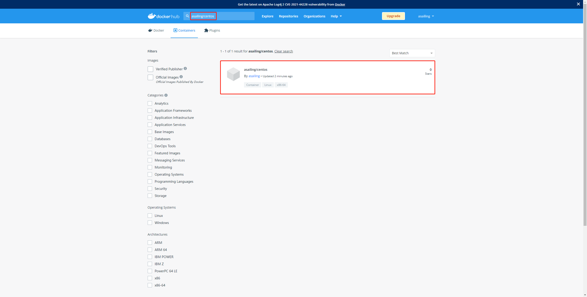

> 查看详情也可以镜像的具体信息。

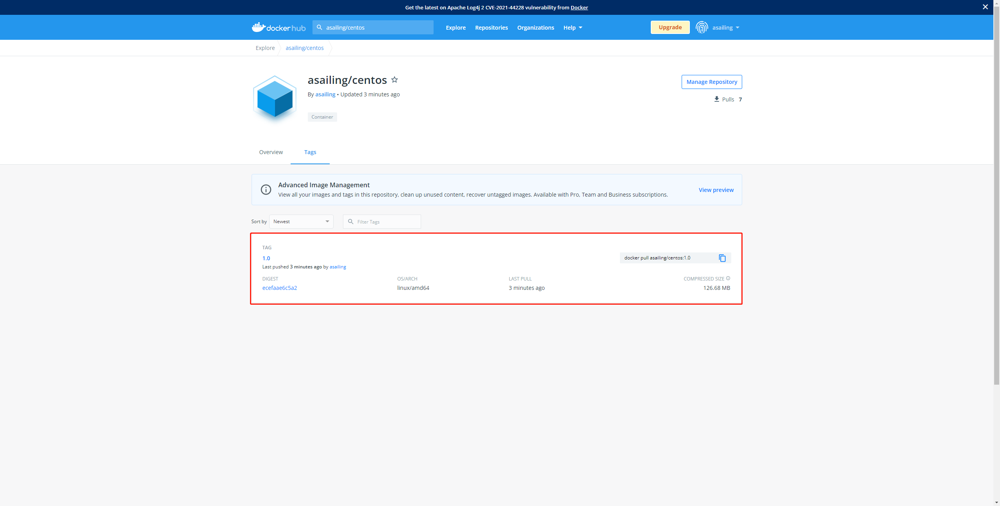

DIGEST 的值正是刚才发布后返回值 `ecefaae6c5a2cab84693175ea3b18d0d0a7aa0160e33a0bf3eb4ab626b10f0f1` 的缩写。

且镜像的大小是小于我们本地镜像的，说明**发布的过程中也会压缩镜像**。

> 拉取我们发布的镜像

```shell
[root@sail logs]# docker pull asailing/centos:1.0
1.0: Pulling from asailing/centos
Digest: sha256:ecefaae6c5a2cab84693175ea3b18d0d0a7aa0160e33a0bf3eb4ab626b10f0f1
Status: Image is up to date for asailing/centos:1.0
docker.io/asailing/centos:1.0
```

无法拉取。原因很简单，因为我们本地存在了同名镜像。

> 我们先删除这个镜像再拉取

```shell
[root@sail logs]# docker rmi -f d58be7785771
Untagged: asailing/centos:1.0
Untagged: asailing/centos@sha256:ecefaae6c5a2cab84693175ea3b18d0d0a7aa0160e33a0bf3eb4ab626b10f0f1
Untagged: centos-test:latest
Untagged: sail/centos:1.0
Deleted: sha256:d58be7785771bd95d8016fa5807a486d6c50e195879eddd88cb602172fc51ffe
Deleted: sha256:ad95558eb65801f5871215837558156c5e33ba351b3b52e0a50aac045abb46c1
Deleted: sha256:5c5def0bbb85d8779d02f115c3d072fe9adb1fd07556ee8c5a130823ecf6811d
Deleted: sha256:b5bd21416741daec348f417dbea1b73001e257f1e63a5d2abddabc8554fca611
Deleted: sha256:a9431f90fd3f23387c456ad5b925dbb9531beece3eab825848db99db29c6a1fa
Deleted: sha256:9f54f48660acb350921aefab74769e51fc7917a1e1e730d3df2edd1513517c42
Deleted: sha256:fb41ece5d944c667762945fdf7275a1d267acd92fe9dc56709fc3adaca6f087f
Deleted: sha256:be89377d4c2ccea11308d8196ba53f03985882db015e01ed8b54fc114f4ba058
Deleted: sha256:9616888f3b103230ed5f378af4afc11b7ce7ed3d96653e5bd918c49152bbdf8c

[root@sail logs]# docker pull asailing/centos:1.0
1.0: Pulling from asailing/centos
a1d0c7532777: Already exists 
0594d57f8468: Already exists 
9c13f720f33e: Already exists 
Digest: sha256:ecefaae6c5a2cab84693175ea3b18d0d0a7aa0160e33a0bf3eb4ab626b10f0f1
Status: Downloaded newer image for asailing/centos:1.0
docker.io/asailing/centos:1.0

[root@sail logs]# docker images
REPOSITORY        TAG       IMAGE ID       CREATED        SIZE
asailing/centos   1.0       d58be7785771   29 hours ago   323MB
```

拉取成功，且大小又恢复到了之前本地的镜像大小，说明**拉取的过程中也会解压镜像**。

> 启动拉取的镜像

```shell
[root@sail logs]# docker run -it asailing/centos:1.0 /bin/bash
[root@168c9e550886 local]# vim test.java
[root@168c9e550886 local]#
```

`vim` 命令也是可以使用的，镜像发布成功。

# 发布镜像到阿里云镜像仓库

> 登录阿里云，点击**我的阿里云**


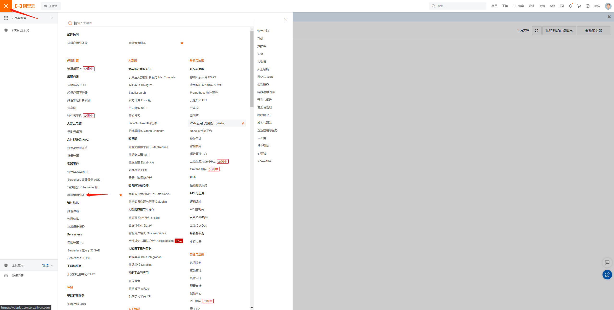

> 创建实例

这里以创建个人版实例为例。

我这里已经创建好了，如果没有创建点击创建即可。

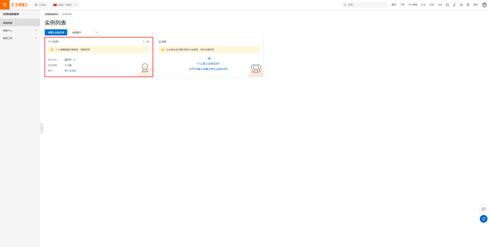

> 进入镜像仓库

创建好个人实例后，点击进入。

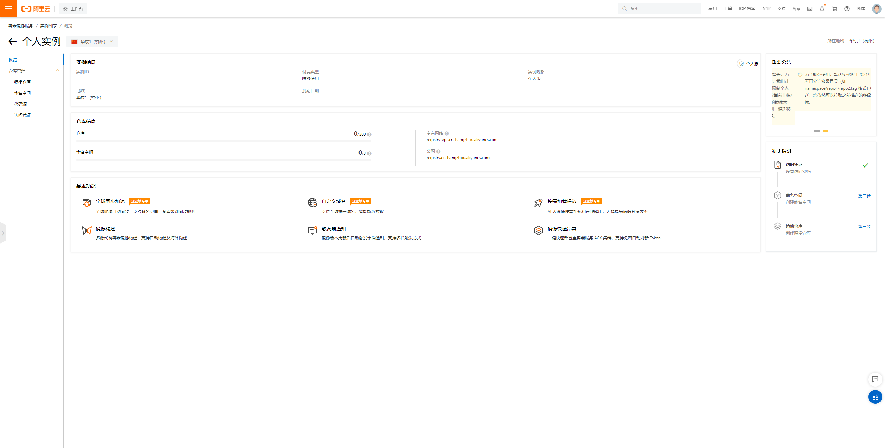

> 创建命名空间

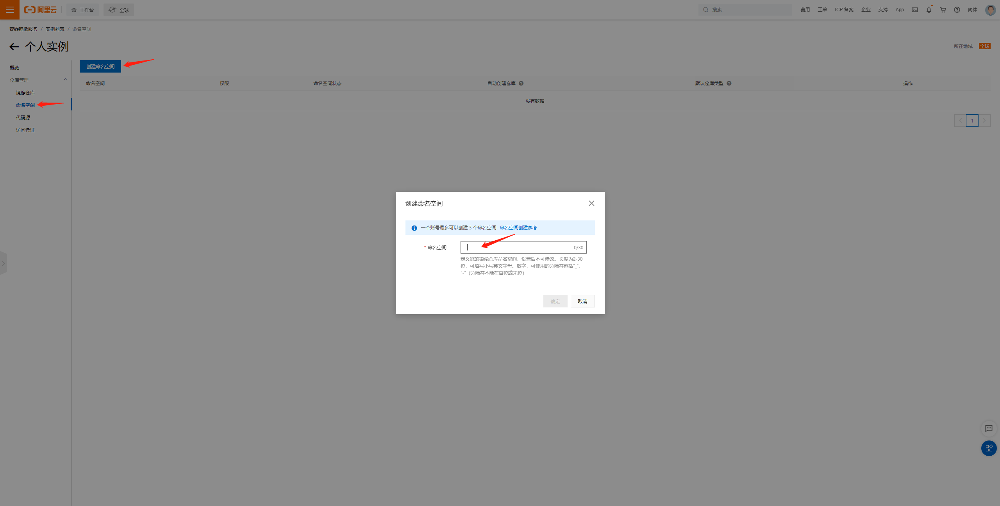

一个账号只能创建 3 个命名空间，需要谨慎创建。

创建好后就是这样。

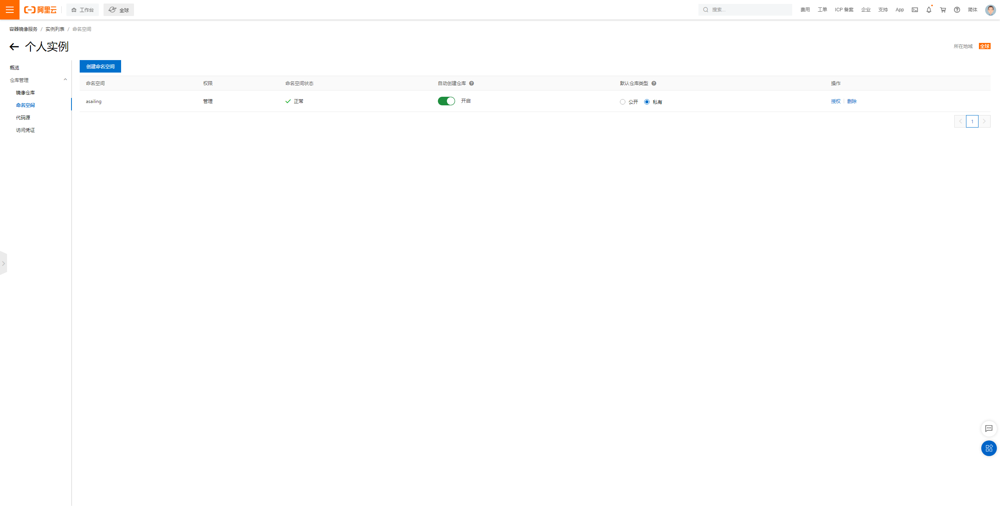

> 创建镜像仓库

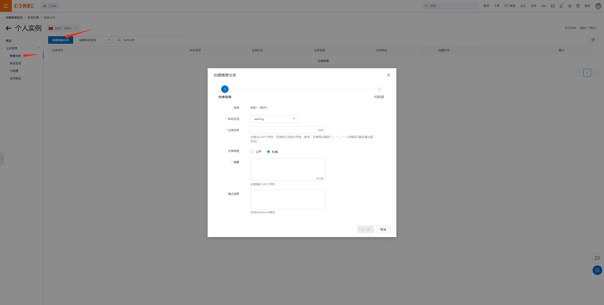

> 点击下一步，创建本地仓库

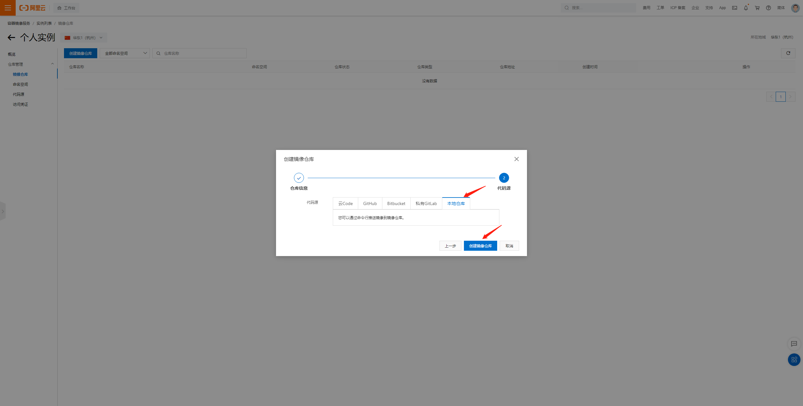

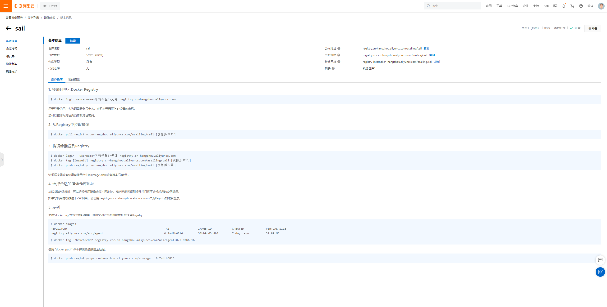

至此，我们就创建好了阿里云的镜像仓库，具体的操作步骤上图也写得非常清楚。

> 退出登录的账号

如果之前登录了 Docker Hub 账号或者其他阿里云账号，先退出账号。

```shell
[root@sail logs]# docker logout
Removing login credentials for https://index.docker.io/v1/
```

> 登录阿里云账号

```shell
[root@sail logs]# docker login --username=内有千丘外无锋 registry.cn-hangzhou.aliyuncs.com
Password: 
WARNING! Your password will be stored unencrypted in /root/.docker/config.json.
Configure a credential helper to remove this warning. See
https://docs.docker.com/engine/reference/commandline/login/#credentials-store
Login Succeeded
```

> 设置镜像标签

```shell
[root@sail logs]# docker tag d58be7785771 registry.cn-hangzhou.aliyuncs.com/asailing/sail:1.0
[root@sail logs]# docker images
REPOSITORY                                        TAG       IMAGE ID       CREATED        SIZE
asailing/centos                                   1.0       d58be7785771   32 hours ago   323MB
registry.cn-hangzhou.aliyuncs.com/asailing/sail   1.0       d58be7785771   32 hours ago   323MB
```

> 提交镜像

```shell
[root@sail logs]# docker push registry.cn-hangzhou.aliyuncs.com/asailing/sail:1.0
The push refers to repository [registry.cn-hangzhou.aliyuncs.com/asailing/sail]
de70c523870b: Pushed 
909db45c4bc4: Pushed 
74ddd0ec08fa: Pushed 
1.0: digest: sha256:ecefaae6c5a2cab84693175ea3b18d0d0a7aa0160e33a0bf3eb4ab626b10f0f1 size: 953
```

> 查看提交的镜像

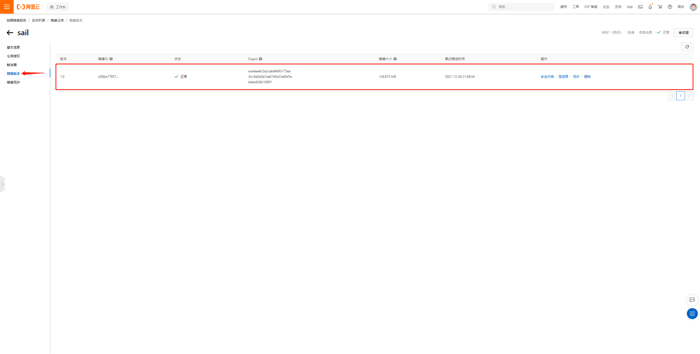

提交的镜像可以在这里查看。

> 拉取镜像

先删除本地镜像， 再拉取测试。

```shell
[root@sail logs]# docker rmi -f d58be7785771
Untagged: asailing/centos:1.0
Untagged: asailing/centos@sha256:ecefaae6c5a2cab84693175ea3b18d0d0a7aa0160e33a0bf3eb4ab626b10f0f1
Untagged: registry.cn-hangzhou.aliyuncs.com/asailing/sail/centos:1.0
Untagged: registry.cn-hangzhou.aliyuncs.com/asailing/sail:1.0
Untagged: registry.cn-hangzhou.aliyuncs.com/asailing/sail@sha256:ecefaae6c5a2cab84693175ea3b18d0d0a7aa0160e33a0bf3eb4ab626b10f0f1
Deleted: sha256:d58be7785771bd95d8016fa5807a486d6c50e195879eddd88cb602172fc51ffe

[root@sail logs]# docker pull registry.cn-hangzhou.aliyuncs.com/asailing/sail:1.0
1.0: Pulling from asailing/sail
a1d0c7532777: Already exists 
0594d57f8468: Already exists 
9c13f720f33e: Already exists 
Digest: sha256:ecefaae6c5a2cab84693175ea3b18d0d0a7aa0160e33a0bf3eb4ab626b10f0f1
Status: Downloaded newer image for registry.cn-hangzhou.aliyuncs.com/asailing/sail:1.0
registry.cn-hangzhou.aliyuncs.com/asailing/sail:1.0

[root@sail logs]# docker images
REPOSITORY                                        TAG       IMAGE ID       CREATED        SIZE
registry.cn-hangzhou.aliyuncs.com/asailing/sail   1.0       d58be7785771   32 hours ago   323MB
```

> 启动镜像

```shell
[root@sail logs]# docker run -it registry.cn-hangzhou.aliyuncs.com/asailing/sail:1.0
[root@c612099a94a2 local]# vim test.java
[root@c612099a94a2 local]#
```

`vim` 命令可以使用，说明提交镜像成功。