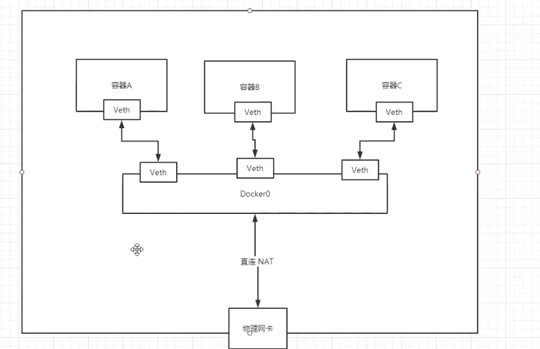
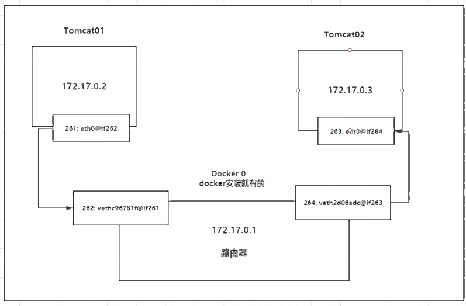
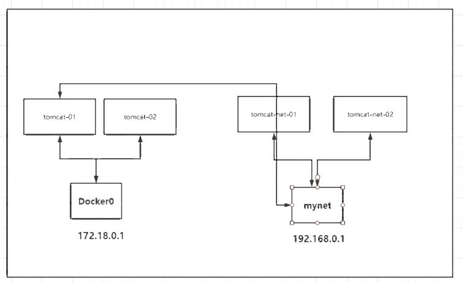
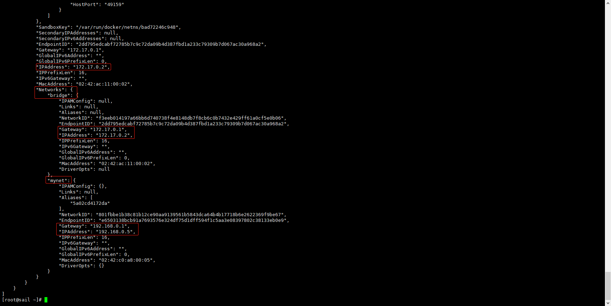

https://www.kuangstudy.com/bbs/1485182032115318785

> 参考源

https://www.bilibili.com/video/BV1og4y1q7M4?spm_id_from=333.999.0.0

https://www.bilibili.com/video/BV1kv411q7Qc?spm_id_from=333.999.0.0

> 版本

本文章基于 **Docker 20.10.11**

------

# Linux 网络

> 查看本地网络信息

```shell
[root@sail ~]# ip addr
1: lo: <LOOPBACK,UP,LOWER_UP> mtu 65536 qdisc noqueue state UNKNOWN group default qlen 1000
    link/loopback 00:00:00:00:00:00 brd 00:00:00:00:00:00
    inet 127.0.0.1/8 scope host lo
       valid_lft forever preferred_lft forever
2: eth0: <BROADCAST,MULTICAST,UP,LOWER_UP> mtu 1500 qdisc pfifo_fast state UP group default qlen 1000
    link/ether 00:16:3e:30:01:20 brd ff:ff:ff:ff:ff:ff
    inet 172.24.19.94/18 brd 172.24.63.255 scope global dynamic eth0
       valid_lft 310201059sec preferred_lft 310201059sec
3: docker0: <NO-CARRIER,BROADCAST,MULTICAST,UP> mtu 1500 qdisc noqueue state DOWN group default 
    link/ether 02:42:23:ae:ac:24 brd ff:ff:ff:ff:ff:ff
    inet 172.17.0.1/16 brd 172.17.255.255 scope global docker0
       valid_lft forever preferred_lft forever
```

有三个网卡信息：

- **lo**：本地。
- **ens**：虚拟机或阿里云服务器地址。
- **docker0**：Docker 网络地址。

> win

```shell
PS D:\docker\DockerNotebook\test\tomcat> ipconfig

Windows IP 配置


以太网适配器 以太网 3:

   媒体状态  . . . . . . . . . . . . : 媒体已断开连接
   连接特定的 DNS 后缀 . . . . . . . : www.tendawifi.com

无线局域网适配器 本地连接* 8:

   媒体状态  . . . . . . . . . . . . : 媒体已断开连接
   连接特定的 DNS 后缀 . . . . . . . :

无线局域网适配器 本地连接* 10:

   媒体状态  . . . . . . . . . . . . : 媒体已断开连接
   连接特定的 DNS 后缀 . . . . . . . :

无线局域网适配器 WLAN:

   连接特定的 DNS 后缀 . . . . . . . : lan
   本地链接 IPv6 地址. . . . . . . . : fe80::5862:444f:95f2:4a6d%18
   IPv4 地址 . . . . . . . . . . . . : 192.168.123.65
   子网掩码  . . . . . . . . . . . . : 255.255.255.0
   默认网关. . . . . . . . . . . . . : 192.168.123.1

以太网适配器 vEthernet (WSL):

   连接特定的 DNS 后缀 . . . . . . . :
   本地链接 IPv6 地址. . . . . . . . : fe80::3198:1418:c3b9:b35f%45
   IPv4 地址 . . . . . . . . . . . . : 192.168.96.1
   子网掩码  . . . . . . . . . . . . : 255.255.240.0
   默认网关. . . . . . . . . . . . . :
```

# Docker 网络

在 Docker 安装后，主机会为 Docker 分配一个网卡，名为 **docker0** 。

该网卡使用**桥接模式**，使用的是 **veth-pair** 技术。

> 启动两个容器

```shell
PS C:\Users\Frostbite> docker run -it --name ubuntu1 ubuntu
527dd38386b7f65e034ec1bf7df5b32fee5282c13680ba714081af1d4023e2d6

PS C:\Users\Frostbite> docker run -it --name ubuntu2 ubuntu
e7eccf32a9d39517e842a22e57913c1386ec1e7a7f0e49d3ccf88f89396725b7

PS C:\Users\Frostbite> docker ps
CONTAINER ID   IMAGE     COMMAND   CREATED         STATUS         PORTS     NAMES
16eff68d0665   ubuntu    "bash"    6 minutes ago   Up 6 minutes             ubuntu2
cd7d1e6fc8b3   ubuntu    "bash"    6 minutes ago   Up 6 minutes             ubuntu1
```

> 查看 Linux 网络
>
> docker0是docker的ip

```shell
[root@sail tomcat]# ip addr
1: lo: <LOOPBACK,UP,LOWER_UP> mtu 65536 qdisc noqueue state UNKNOWN group default qlen 1000
    link/loopback 00:00:00:00:00:00 brd 00:00:00:00:00:00
    inet 127.0.0.1/8 scope host lo
       valid_lft forever preferred_lft forever
2: eth0: <BROADCAST,MULTICAST,UP,LOWER_UP> mtu 1500 qdisc pfifo_fast state UP group default qlen 1000
    link/ether 00:16:3e:30:01:20 brd ff:ff:ff:ff:ff:ff
    inet 172.24.19.94/18 brd 172.24.63.255 scope global dynamic eth0
       valid_lft 310199524sec preferred_lft 310199524sec
3: docker0: <BROADCAST,MULTICAST,UP,LOWER_UP> mtu 1500 qdisc noqueue state UP group default 
    link/ether 02:42:23:ae:ac:24 brd ff:ff:ff:ff:ff:ff
    inet 172.17.0.1/16 brd 172.17.255.255 scope global docker0
       valid_lft forever preferred_lft forever
7: veth4a18f1b@if110: <BROADCAST,MULTICAST,UP,LOWER_UP> mtu 1500 qdisc noqueue master docker0 state UP group default 
    link/ether 52:69:3c:bc:83:4a brd ff:ff:ff:ff:ff:ff link-netnsid 0
9: veth296fd0d@if112: <BROADCAST,MULTICAST,UP,LOWER_UP> mtu 1500 qdisc noqueue master docker0 state UP group default 
    link/ether 76:3c:34:e8:c4:90 brd ff:ff:ff:ff:ff:ff link-netnsid 1
```

Docker 每启动一个容器，就会分配一个 IP。

> 查看容器的内部网络

> ubuntu1
>
> eth0@if49 172.17.0.2/16

```shell
root@cd7d1e6fc8b3:/# apt install network-manager
root@cd7d1e6fc8b3:/# ip addr
1: lo: <LOOPBACK,UP,LOWER_UP> mtu 65536 qdisc noqueue state UNKNOWN group default qlen 1000
    link/loopback 00:00:00:00:00:00 brd 00:00:00:00:00:00
    inet 127.0.0.1/8 scope host lo
       valid_lft forever preferred_lft forever
2: tunl0@NONE: <NOARP> mtu 1480 qdisc noop state DOWN group default qlen 1000
    link/ipip 0.0.0.0 brd 0.0.0.0
3: sit0@NONE: <NOARP> mtu 1480 qdisc noop state DOWN group default qlen 1000
    link/sit 0.0.0.0 brd 0.0.0.0
48: eth0@if49: <BROADCAST,MULTICAST,UP,LOWER_UP> mtu 1500 qdisc noqueue state UP group default
    link/ether 02:42:ac:11:00:02 brd ff:ff:ff:ff:ff:ff link-netnsid 0
    inet 172.17.0.2/16 brd 172.17.255.255 scope global eth0
       valid_lft forever preferred_lft forever
```

> ubuntu2
>
> eth0@if51 172.17.0.3/16

```shell
root@16eff68d0665:/# apt install network-manager
root@16eff68d0665:/# ip addr
1: lo: <LOOPBACK,UP,LOWER_UP> mtu 65536 qdisc noqueue state UNKNOWN group default qlen 1000
    link/loopback 00:00:00:00:00:00 brd 00:00:00:00:00:00
    inet 127.0.0.1/8 scope host lo
       valid_lft forever preferred_lft forever
2: tunl0@NONE: <NOARP> mtu 1480 qdisc noop state DOWN group default qlen 1000
    link/ipip 0.0.0.0 brd 0.0.0.0
3: sit0@NONE: <NOARP> mtu 1480 qdisc noop state DOWN group default qlen 1000
    link/sit 0.0.0.0 brd 0.0.0.0
50: eth0@if51: <BROADCAST,MULTICAST,UP,LOWER_UP> mtu 1500 qdisc noqueue state UP group default
    link/ether 02:42:ac:11:00:03 brd ff:ff:ff:ff:ff:ff link-netnsid 0
    inet 172.17.0.3/16 brd 172.17.255.255 scope global eth0
       valid_lft forever preferred_lft forever
```

> **可以看到容器内 IP 与本机 IP 成对出现，这就是 veth-pair 技术。**
>
> 如 `50: eth0@if51`
>
> evth-pair 就是一对虚拟设备接口，他们都是成对出现，一端连着协议，一端彼此相连
>
> veth-pair 充当桥梁，就是每新建一个容器，主机多出一个网络，容器内也有一个网络，两者成对出现，彼此连接

> ubunt1访问 docker0 测试
>
> 容器与 docker0 之间是可以访问的。

```shell
root@cd7d1e6fc8b3:/# apt install inetutils-ping
root@cd7d1e6fc8b3:/# ping 127.17.0.1
PING 127.17.0.1 (127.17.0.1): 56 data bytes
64 bytes from 127.17.0.1: icmp_seq=0 ttl=64 time=0.025 ms
64 bytes from 127.17.0.1: icmp_seq=1 ttl=64 time=0.028 ms
64 bytes from 127.17.0.1: icmp_seq=2 ttl=64 time=0.029 ms
64 bytes from 127.17.0.1: icmp_seq=3 ttl=64 time=0.028 ms
64 bytes from 127.17.0.1: icmp_seq=4 ttl=64 time=0.093 ms
64 bytes from 127.17.0.1: icmp_seq=5 ttl=64 time=0.031 ms
```

> ubuntu1 ping ubuntu2

```shell
root@cd7d1e6fc8b3:/# ip addr
1: lo: <LOOPBACK,UP,LOWER_UP> mtu 65536 qdisc noqueue state UNKNOWN group default qlen 1000
    link/loopback 00:00:00:00:00:00 brd 00:00:00:00:00:00
    inet 127.0.0.1/8 scope host lo
       valid_lft forever preferred_lft forever
2: tunl0@NONE: <NOARP> mtu 1480 qdisc noop state DOWN group default qlen 1000
    link/ipip 0.0.0.0 brd 0.0.0.0
3: sit0@NONE: <NOARP> mtu 1480 qdisc noop state DOWN group default qlen 1000
    link/sit 0.0.0.0 brd 0.0.0.0
48: eth0@if49: <BROADCAST,MULTICAST,UP,LOWER_UP> mtu 1500 qdisc noqueue state UP group default
    link/ether 02:42:ac:11:00:02 brd ff:ff:ff:ff:ff:ff link-netnsid 0
    inet 172.17.0.2/16 brd 172.17.255.255 scope global eth0
       valid_lft forever preferred_lft forever

root@cd7d1e6fc8b3:/# ping 172.17.0.3
PING 172.17.0.3 (172.17.0.3): 56 data bytes
64 bytes from 172.17.0.3: icmp_seq=0 ttl=64 time=0.057 ms
64 bytes from 172.17.0.3: icmp_seq=1 ttl=64 time=0.042 ms
64 bytes from 172.17.0.3: icmp_seq=2 ttl=64 time=0.043 ms
64 bytes from 172.17.0.3: icmp_seq=3 ttl=64 time=0.043 ms
64 bytes from 172.17.0.3: icmp_seq=4 ttl=64 time=0.044 ms
64 bytes from 172.17.0.3: icmp_seq=5 ttl=64 time=0.041 ms
```

> ubuntu2 ping ubuntu1

```shell
oot@16eff68d0665:/# ip addr
1: lo: <LOOPBACK,UP,LOWER_UP> mtu 65536 qdisc noqueue state UNKNOWN group default qlen 1000
    link/loopback 00:00:00:00:00:00 brd 00:00:00:00:00:00
    inet 127.0.0.1/8 scope host lo
       valid_lft forever preferred_lft forever
2: tunl0@NONE: <NOARP> mtu 1480 qdisc noop state DOWN group default qlen 1000
    link/ipip 0.0.0.0 brd 0.0.0.0
3: sit0@NONE: <NOARP> mtu 1480 qdisc noop state DOWN group default qlen 1000
    link/sit 0.0.0.0 brd 0.0.0.0
50: eth0@if51: <BROADCAST,MULTICAST,UP,LOWER_UP> mtu 1500 qdisc noqueue state UP group default
    link/ether 02:42:ac:11:00:03 brd ff:ff:ff:ff:ff:ff link-netnsid 0
    inet 172.17.0.3/16 brd 172.17.255.255 scope global eth0
       valid_lft forever preferred_lft forever
root@16eff68d0665:/# ping 127.17.0.2

PING 127.17.0.2 (127.17.0.2): 56 data bytes
64 bytes from 127.17.0.2: icmp_seq=0 ttl=64 time=0.025 ms
64 bytes from 127.17.0.2: icmp_seq=1 ttl=64 time=0.030 ms
64 bytes from 127.17.0.2: icmp_seq=2 ttl=64 time=0.028 ms
64 bytes from 127.17.0.2: icmp_seq=3 ttl=64 time=0.028 ms
64 bytes from 127.17.0.2: icmp_seq=4 ttl=64 time=0.028 ms
```


**docker0** 相当于一个路由器，各个容器都与 docker0 相连，容器之间的通信通过路由器来转发。



> veth-pair成对出现， 261-262 263-264
>
> **ip之间可以直接ping通**



Docker 中的所有网络接口都是虚拟的，相当于内网传递。

> 只要删除容器，对应网络就会删除。

## 容器间网络连接

### **docker run —link** 单向容器名连接

每次重启容器或 Linux，IP 就会变化，固定 IP 互联网络就会失效。

如果能使用服务名来连接，而不考虑 IP，就会方便很多。

> 测试使用容器名来 ping

```shell
PS C:\Users\Frostbite> docker exec -it ubuntu1 ping ubuntu2
ping: unknown host
```

系统中ping

```shell
root@cd7d1e6fc8b3:/# ping ubuntu2
ping: unknown host
```

容器之间无法通过容器名来连接。

> 使用 `--link` 启动测试，先启动 ubuntu1

> 使用 `–-link` 命令启动 ubuntu3

```shell
PS C:\Users\Frostbite> docker run -it --name ubuntu3 --link ubuntu1 ubuntu
```

**在 ubuntu3 访问 ubuntu1 OK。**

> ubuntu3 ping ubuntu1
>
> ubuntu3 能够通过容器名访问 ubuntu1 ，原理是 `--link` 通过 tomcat02 在自己容器 hosts 文件中配置了 tomcat01 IP 信息。

```shell
PS C:\Users\Frostbite> docker exec -it ubuntu3 ping ubuntu1
PING ubuntu1 (172.17.0.2): 56 data bytes
64 bytes from 172.17.0.2: icmp_seq=0 ttl=64 time=0.047 ms
64 bytes from 172.17.0.2: icmp_seq=1 ttl=64 time=0.041 ms
64 bytes from 172.17.0.2: icmp_seq=2 ttl=64 time=0.042 ms
```

系统中ping

```shell
root@34c8d5af3875:/# ping ubuntu1
PING ubuntu1 (172.17.0.2): 56 data bytes
64 bytes from 172.17.0.2: icmp_seq=0 ttl=64 time=0.128 ms
64 bytes from 172.17.0.2: icmp_seq=1 ttl=64 time=0.041 ms
64 bytes from 172.17.0.2: icmp_seq=2 ttl=64 time=0.043 ms
```

**在 ubuntu1 访问 ubuntu3 Not OK**

```shell
PS C:\Users\Frostbite> docker exec -it ubuntu1 ping ubuntu3
ping: unknown host
```

系统中ping

```
root@cd7d1e6fc8b3:/# ping ubuntu1
ping: unknown host
```

> ubuntu3 hosts

```shell
root@34c8d5af3875:/# cat /etc/hosts
127.0.0.1       localhost
::1     localhost ip6-localhost ip6-loopback
fe00::0 ip6-localnet
ff00::0 ip6-mcastprefix
ff02::1 ip6-allnodes
ff02::2 ip6-allrouters
172.17.0.2      ubuntu1 cd7d1e6fc8b3	# 通过host设定了ubuntu1的地址
172.17.0.4      34c8d5af3875
```

所以 `--link` 本质就是修改 host 映射。

> 这种方式已经不流行了，建议使用**自定义网络**实现。

## docker network

- `ls` 查看网络
- `inspect` 查看单个网络信息
- `create` 创建自定义网络
- `connect` 实现一个容器链接到另一个网段
- `disconnect` 实现从一个网段中删除容器
- `rm` 删除一个或多个自定义网络
- `prune` 删除全部未使用网络

```shell
PS C:\Users\Frostbite> docker network --help

Usage:  docker network COMMAND

Manage networks

Commands:
  connect     Connect a container to a network
  create      Create a network
  disconnect  Disconnect a container from a network
  inspect     Display detailed information on one or more networks
  ls          List networks
  prune       Remove all unused networks
  rm          Remove one or more networks

Run 'docker network COMMAND --help' for more information on a command.
```

## 查看Docker网络信息

### **docker network  ls**


```shell
PS C:\Users\Frostbite> docker network ls
NETWORK ID     NAME      DRIVER    SCOPE
d426ecd83790   bridge    bridge    local
905428145ba2   host      host      local
cac04e36af29   none      null      local
```

- **bridge**：桥接模式（默认）。自己创建也使用这种模式。
- **host**：和宿主即共享。
- **none**：不配置网络。
- container: 容器网络连通（用的少）

## 创建自定义网络

> 之前启动时的参数有一个默认参数 `--net bridge` 就是 docker0
>
> docker0的特点: 是默认的，域名不能访问，--link可以打通连接！

```shell
PS C:\Users\Frostbite> docker run -it --net bridge --name ubuntu1 ubuntu
root@a52a784bcef9:/#
```

在我们启动容器的时候默认会有一个网络设置。

### **docker network create -d bridge --subnet 172.18.0.0/16 --gateway 172.18.0.1 name**

> 参数
>
> 以下三个必须有

- `-d/--driver`：网络模式
- `--subnet`：子网
- `--gateway`：网关

```shell
PS C:\Users\Frostbite> docker network create --help

Usage:  docker network create [OPTIONS] NETWORK

Create a network

Options:
      --attachable           Enable manual container attachment
      --aux-address map      Auxiliary IPv4 or IPv6 addresses used by
                             Network driver (default map[])
      --config-from string   The network from which to copy the configuration
      --config-only          Create a configuration only network
  -d, --driver string        Driver to manage the Network (default "bridge")
      --gateway strings      IPv4 or IPv6 Gateway for the master subnet
      --ingress              Create swarm routing-mesh network
      --internal             Restrict external access to the network
      --ip-range strings     Allocate container ip from a sub-range
      --ipam-driver string   IP Address Management Driver (default "default")
      --ipam-opt map         Set IPAM driver specific options (default map[])
      --ipv6                 Enable IPv6 networking
      --label list           Set metadata on a network
  -o, --opt map              Set driver specific options (default map[])
      --scope string         Control the network's scope
      --subnet strings       Subnet in CIDR format that represents a
                             network segment
```

> 创建自定义网络
>
> `--subnet 192.168.0.0/16` 16位的子网掩码 大约65534个ip地址
>
> `--gateway 192.168.0.1` 网关

```shell
PS C:\Users\Frostbite> docker network create -d bridge --subnet 172.18.0.0/16 --gateway 172.18.0.1 archlinux
791b232fe3cfd16350fd4efcee2dad9eee3b3595de318d85f30f7054585cf4be
```

> 查看创建的网络

```shell
PS C:\Users\Frostbite> docker network ls
NETWORK ID     NAME        DRIVER    SCOPE
791b232fe3cf   archlinux   bridge    local
d426ecd83790   bridge      bridge    local
905428145ba2   host        host      local
cac04e36af29   none        null      local

PS C:\Users\Frostbite> docker network inspect archlinux
[
    {
        "Name": "archlinux",
        "Id": "791b232fe3cfd16350fd4efcee2dad9eee3b3595de318d85f30f7054585cf4be",
        "Created": "2022-06-11T13:24:27.789742Z",
        "Scope": "local",
        "Driver": "bridge",
        "EnableIPv6": false,
        "IPAM": {
            "Driver": "default",
            "Options": {},
            "Config": [
                {
                    "Subnet": "172.18.0.0/16",
                    "Gateway": "172.18.0.1"
                }
            ]
        },
        "Internal": false,
        "Attachable": false,
        "Ingress": false,
        "ConfigFrom": {
            "Network": ""
        },
        "ConfigOnly": false,
        "Containers": {},
        "Options": {},
        "Labels": {}
    }
]
```

> 以下配置可以看出，自定义网络创建完成。

```shell
"Config": [
    {
        "Subnet": "172.18.0.0/16",
        "Gateway": "172.18.0.1"
    }
]
```

#### **docker run --net=netname** 启动镜像

```shell
PS C:\Users\Frostbite> docker run -it --net archlinux --name archlinux1 archlinux
[root@6bde82c7a12f /]#

PS C:\Users\Frostbite> docker run -it --net archlinux --name archlinux2 archlinux
[root@70d3db787cd0 /]#
```

#### 双向连接测试

> 外部测试

```shell
PS C:\Users\Frostbite> docker exec -it archlinux1 ping archlinux2
PING archlinux2 (172.18.0.3) 56(84) bytes of data.
64 bytes from archlinux2.archlinux (172.18.0.3): icmp_seq=1 ttl=64 time=0.064 ms
64 bytes from archlinux2.archlinux (172.18.0.3): icmp_seq=2 ttl=64 time=0.045 ms

PS C:\Users\Frostbite> docker exec -it archlinux2 ping archlinux1
PING archlinux1 (172.18.0.2) 56(84) bytes of data.
64 bytes from archlinux1.archlinux (172.18.0.2): icmp_seq=1 ttl=64 time=0.042 ms
64 bytes from archlinux1.archlinux (172.18.0.2): icmp_seq=2 ttl=64 time=0.043 ms
```


**能够连通说明不同容器处于同一网络下**

> 查看inspect

```shell
PS C:\Users\Frostbite> docker inspect archlinux1
[
            "Networks": {
                "archlinux": {
                    "IPAMConfig": null,
                    "Links": null,
                    "Aliases": [
                        "6bde82c7a12f"
                    ],
                    "NetworkID": "791b232fe3cfd16350fd4efcee2dad9eee3b3595de318d85f30f7054585cf4be",
                    "EndpointID": "e30a5ca5a9ed067da01304f9a945e0c34f581becfe6f9b13c830d2c47bda21be",
                    "Gateway": "172.18.0.1",
                    "IPAddress": "172.18.0.2",
                    "IPPrefixLen": 16,
                    "IPv6Gateway": "",
                    "GlobalIPv6Address": "",
                    "GlobalIPv6PrefixLen": 0,
                    "MacAddress": "02:42:ac:12:00:02",
                    "DriverOpts": null
                }
            }
]

PS C:\Users\Frostbite> docker inspect archlinux2
[
            "Networks": {
                "archlinux": {
                    "IPAMConfig": null,
                    "Links": null,
                    "Aliases": [
                        "70d3db787cd0"
                    ],
                    "NetworkID": "791b232fe3cfd16350fd4efcee2dad9eee3b3595de318d85f30f7054585cf4be",
                    "EndpointID": "91d6e9f94514d438c6a234efc9851f130a1f318a595fda5451f28aa00caab386",
                    "Gateway": "172.18.0.1",
                    "IPAddress": "172.18.0.3",
                    "IPPrefixLen": 16,
                    "IPv6Gateway": "",
                    "GlobalIPv6Address": "",
                    "GlobalIPv6PrefixLen": 0,
                    "MacAddress": "02:42:ac:12:00:03",
                    "DriverOpts": null
                }
            }
]
```

> 这种方式可以实现不同集群使用不同的网络，保证集群网络的安全。
>
> 如 Redis 集群在 192.160.0.0/16 网段下，MySQL 集群在 192.161.0.0/16 网段下。

## 删除自定义网络

### **docker network rm netname**

```shell
PS C:\Users\Frostbite> docker network ls
NETWORK ID     NAME      DRIVER    SCOPE
d426ecd83790   bridge    bridge    local
905428145ba2   host      host      local
83fc3c2f9560   mynet     bridge    local
cac04e36af29   none      null      local

PS C:\Users\Frostbite> docker network rm mynet
mynet

PS C:\Users\Frostbite> docker network ls
NETWORK ID     NAME      DRIVER    SCOPE
d426ecd83790   bridge    bridge    local
905428145ba2   host      host      local
cac04e36af29   none      null      local
```

## 查看自定义网络

### **docker network inspect id/name**

> **注意:如果系统关机,这里看不到谁使用了这个自定义网络,所以删除网络时要小心**

```shell
PS C:\Users\Frostbite> docker network inspect archlinux
[
    {
        "Name": "archlinux",
        "Id": "791b232fe3cfd16350fd4efcee2dad9eee3b3595de318d85f30f7054585cf4be",
        "Created": "2022-06-11T13:24:27.789742Z",
        "Scope": "local",
        "Driver": "bridge",
        "EnableIPv6": false,
        "IPAM": {
            "Driver": "default",
            "Options": {},
            "Config": [
                {
                    "Subnet": "172.18.0.0/16",
                    "Gateway": "172.18.0.1"
                }
            ]
        },
        "Internal": false,
        "Attachable": false,
        "Ingress": false,
        "ConfigFrom": {
            "Network": ""
        },
        "ConfigOnly": false,
        "Containers": {
            "6bde82c7a12fdbcf1c2db7e0fab2c2fb62169f6384199615ad9b7b229794c37d": {
                "Name": "archlinux1",
                "EndpointID": "e30a5ca5a9ed067da01304f9a945e0c34f581becfe6f9b13c830d2c47bda21be",
                "MacAddress": "02:42:ac:12:00:02",
                "IPv4Address": "172.18.0.2/16",
                "IPv6Address": ""
            },
            "70d3db787cd0e6ce5a9bccced261740cf2d2b277a37bc98a6b61a51b156ba0df": {
                "Name": "archlinux2",
                "EndpointID": "91d6e9f94514d438c6a234efc9851f130a1f318a595fda5451f28aa00caab386",
                "MacAddress": "02:42:ac:12:00:03",
                "IPv4Address": "172.18.0.3/16",
                "IPv6Address": ""
            },
            "d24b504b294752319f5537a978369184513ec590f73c565e49c4266bd2985a78": {
                "Name": "arch1",
                "EndpointID": "f149b3106ab3c94d32ac193d731f0cec82739e4b5a7427d78a7bc4b0fe89cea1",
                "MacAddress": "02:42:ac:12:00:04",
                "IPv4Address": "172.18.0.4/16",
                "IPv6Address": ""
            }
        },
        "Options": {},
        "Labels": {}
    }
]
```


## 网络连通(不同网段)

### **docker network connect netname name**

使用`docker network connect`实现一个容器链接到另一个网段

> 建立连接

```shell
# 创建2个新网络，默认network是docker0
PS C:\Users\Frostbite> docker run -it --name archlinux3 archlinux
[root@f6cc4658f5c2 /]#
PS C:\Users\Frostbite> docker run -it --name archlinux4 archlinux
[root@52ff1b6547bd /]#

CONTAINER ID   IMAGE       COMMAND           CREATED          STATUS          PORTS     NAMES
52ff1b6547bd   archlinux   "/usr/bin/bash"   2 minutes ago    Up 2 minutes              archlinux4
f6cc4658f5c2   archlinux   "/usr/bin/bash"   3 minutes ago    Up 3 minutes              archlinux3
7377397fc068   archlinux   "/usr/bin/bash"   24 minutes ago   Up 24 minutes             archlinux2
11e21df7ebfb   archlinux   "/usr/bin/bash"   24 minutes ago   Up 24 minutes             archlinux1

# 1和2用name可以ping通，因为他们使用了自定义网络
PS C:\Users\Frostbite> docker exec -it archlinux1 ping archlinux2
PING archlinux2 (192.168.0.3) 56(84) bytes of data.
64 bytes from archlinux2.mynet (192.168.0.3): icmp_seq=1 ttl=64 time=0.036 ms
64 bytes from archlinux2.mynet (192.168.0.3): icmp_seq=2 ttl=64 time=0.037 ms

PS C:\Users\Frostbite> docker exec -it archlinux2 ping archlinux1
PING archlinux1 (192.168.0.2) 56(84) bytes of data.
64 bytes from archlinux1.mynet (192.168.0.2): icmp_seq=1 ttl=64 time=0.045 ms
64 bytes from archlinux1.mynet (192.168.0.2): icmp_seq=2 ttl=64 time=0.035 ms

# 3和4用名字ping不通，因为使用的docker0
PS C:\Users\Frostbite> docker exec -it archlinux3 ping archlinux4
ping: archlinux4: Name or service not known
PS C:\Users\Frostbite> docker exec -it archlinux4 ping archlinux3
ping: archlinux3: Name or service not known

# 1无法ping通3
PS C:\Users\Frostbite> docker exec -it archlinux1 ping archlinux3
ping: archlinux3: Temporary failure in name resolution
```

> 不能让网卡打通，要让一个网络的容器连接到另一个网卡



```shell
[root@sail ~]# docker network connect mynet archlinux3	# archlinux3 连接到mynet
[root@sail ~]#

PS C:\Users\Frostbite> docker network ls
NETWORK ID     NAME      DRIVER    SCOPE
d426ecd83790   bridge    bridge    local
905428145ba2   host      host      local
83fc3c2f9560   mynet     bridge    local
cac04e36af29   none      null      local

# 查看mynet可以看到archlinux3
PS C:\Users\Frostbite> docker network inspect mynet
[
    {
        "Name": "mynet",
        "Id": "83fc3c2f95607a1fe563b0dc83f51f046eff76116561e658773a33465c407c80",
        "Created": "2022-06-11T12:07:04.1312824Z",
        "Scope": "local",
        "Driver": "bridge",
        "EnableIPv6": false,
        "IPAM": {
            "Driver": "default",
            "Options": {},
            "Config": [
                {
                    "Subnet": "192.168.0.0/16",
                    "Gateway": "192.168.0.1"
                }
            ]
        },
        "Internal": false,
        "Attachable": false,
        "Ingress": false,
        "ConfigFrom": {
            "Network": ""
        },
        "ConfigOnly": false,
        "Containers": {
            "11e21df7ebfb2c98725d52a1ec2c37f514d199f0e16c70b0e6afaaa0249aca8f": {
                "Name": "archlinux1",
                "EndpointID": "fe58ba78c1e0c5fd87743a164f34f7c3b08134d7fe9b30e800d32ca8b786e77b",
                "MacAddress": "02:42:c0:a8:00:02",
                "IPv4Address": "192.168.0.2/16",
                "IPv6Address": ""
            },
            "7377397fc068655a9e226006ff25487443578e936b7af171851fe9c56023cdbf": {
                "Name": "archlinux2",
                "EndpointID": "abcd7380d248447eee0a3bce357961bb6844246dafaf84dfb4ca96b3dc07819a",
                "MacAddress": "02:42:c0:a8:00:03",
                "IPv4Address": "192.168.0.3/16",
                "IPv6Address": ""
            },
            "f6cc4658f5c2a9b09dc895a3f16ea10e931f6148ddc92821ac1b9cb99301028d": {
                "Name": "archlinux3",
                "EndpointID": "c8f5004cfa958abfcb5f244cc15d917b252370bfda81e7d168ac8d21e08f3445",
                "MacAddress": "02:42:c0:a8:00:04",
                "IPv4Address": "192.168.0.4/16",
                "IPv6Address": ""
            }
        },
        "Options": {},
        "Labels": {}
    }
]
```

> 1ping3 OK

```shell
PS C:\Users\Frostbite> docker exec -it archlinux1 ping archlinux3
PING archlinux3 (192.168.0.4) 56(84) bytes of data.
64 bytes from archlinux3.mynet (192.168.0.4): icmp_seq=1 ttl=64 time=0.087 ms
64 bytes from archlinux3.mynet (192.168.0.4): icmp_seq=2 ttl=64 time=0.041 ms
64 bytes from archlinux3.mynet (192.168.0.4): icmp_seq=3 ttl=64 time=0.039 ms
64 bytes from archlinux3.mynet (192.168.0.4): icmp_seq=4 ttl=64 time=0.037 ms

# 1ping4开始不行，不过后来添加进去也行了
PS C:\Users\Frostbite> docker exec -it archlinux1 ping archlinux4
ping: archlinux4: Temporary failure in name resolution
PS C:\Users\Frostbite> docker network connect mynet archlinux4
PS C:\Users\Frostbite> docker exec -it archlinux1 ping archlinux4
PING archlinux4 (192.168.0.5) 56(84) bytes of data.
64 bytes from archlinux4.mynet (192.168.0.5): icmp_seq=1 ttl=64 time=0.058 ms
64 bytes from archlinux4.mynet (192.168.0.5): icmp_seq=2 ttl=64 time=0.049 ms
64 bytes from archlinux4.mynet (192.168.0.5): icmp_seq=3 ttl=64 time=0.037 ms
```

> archlinux3中有两个ip地址了，一个原来的，一个新添加的
>
> 172.17.0.2/16 和 192.168.0.4/16

```shell
PS C:\Users\Frostbite> docker run -it --name archlinux3 archlinux
[root@f6cc4658f5c2 /]# ip addr
1: lo: <LOOPBACK,UP,LOWER_UP> mtu 65536 qdisc noqueue state UNKNOWN group default qlen 1000
    link/loopback 00:00:00:00:00:00 brd 00:00:00:00:00:00
    inet 127.0.0.1/8 scope host lo
       valid_lft forever preferred_lft forever
2: tunl0@NONE: <NOARP> mtu 1480 qdisc noop state DOWN group default qlen 1000
    link/ipip 0.0.0.0 brd 0.0.0.0
3: sit0@NONE: <NOARP> mtu 1480 qdisc noop state DOWN group default qlen 1000
    link/sit 0.0.0.0 brd 0.0.0.0
73: eth0@if74: <BROADCAST,MULTICAST,UP,LOWER_UP> mtu 1500 qdisc noqueue state UP group default
    link/ether 02:42:ac:11:00:02 brd ff:ff:ff:ff:ff:ff link-netnsid 0
    inet 172.17.0.2/16 brd 172.17.255.255 scope global eth0
       valid_lft forever preferred_lft forever
77: eth1@if78: <BROADCAST,MULTICAST,UP,LOWER_UP> mtu 1500 qdisc noqueue state UP group default
    link/ether 02:42:c0:a8:00:04 brd ff:ff:ff:ff:ff:ff link-netnsid 0
    inet 192.168.0.4/16 brd 192.168.255.255 scope global eth1
       valid_lft forever preferred_lft forever
```

这样也可以实现容器链接到自定义网络。

> 查看容器详情

```shell
[root@sail ~]# docker ps
CONTAINER ID   IMAGE     COMMAND             CREATED             STATUS             PORTS                     NAMES
5a02cd4172da   tomcat    "catalina.sh run"   5 minutes ago       Up 5 minutes       0.0.0.0:49159->8080/tcp   tomcat02-net

[root@sail ~]# docker inspect 5a02cd4172da
```



这里也可以发现容器 tomcat02-net 已经与 mynet 建立了连接。

> 测试连接

```shell
[root@sail ~]# docker exec -it tomcat02 ping tomcat02-net
PING tomcat02-net (192.168.0.2) 56(84) bytes of data.
64 bytes from tomcat02-net.mynet (192.168.0.2): icmp_seq=1 ttl=64 time=0.121 ms
64 bytes from tomcat02-net.mynet (192.168.0.2): icmp_seq=2 ttl=64 time=0.064 ms
^C
--- tomcat02-net ping statistics ---
```

网络连通成功。


### **docker network disconnect  netname name**

使用`docker network disconnect`实现从一个网段中删除容器。

```shell
PS C:\Users\Frostbite> docker exec -it archlinux1 ping archlinux4
PING archlinux4 (192.168.0.5) 56(84) bytes of data.
64 bytes from archlinux4.mynet (192.168.0.5): icmp_seq=1 ttl=64 time=0.058 ms
64 bytes from archlinux4.mynet (192.168.0.5): icmp_seq=2 ttl=64 time=0.049 ms
64 bytes from archlinux4.mynet (192.168.0.5): icmp_seq=3 ttl=64 time=0.037 ms
^C
--- archlinux4 ping statistics ---
3 packets transmitted, 3 received, 0% packet loss, time 2074ms
rtt min/avg/max/mdev = 0.037/0.048/0.058/0.008 ms
PS C:\Users\Frostbite> docker network disconnect mynet archlinux4
PS C:\Users\Frostbite> docker exec -it archlinux1 ping archlinux4
ping: archlinux4: Temporary failure in name resolution

# 里面没有4了
PS C:\Users\Frostbite> docker network inspect mynet
[
    {
        "Name": "mynet",
        "Id": "83fc3c2f95607a1fe563b0dc83f51f046eff76116561e658773a33465c407c80",
        "Created": "2022-06-11T12:07:04.1312824Z",
        "Scope": "local",
        "Driver": "bridge",
        "EnableIPv6": false,
        "IPAM": {
            "Driver": "default",
            "Options": {},
            "Config": [
                {
                    "Subnet": "192.168.0.0/16",
                    "Gateway": "192.168.0.1"
                }
            ]
        },
        "Internal": false,
        "Attachable": false,
        "Ingress": false,
        "ConfigFrom": {
            "Network": ""
        },
        "ConfigOnly": false,
        "Containers": {
            "11e21df7ebfb2c98725d52a1ec2c37f514d199f0e16c70b0e6afaaa0249aca8f": {
                "Name": "archlinux1",
                "EndpointID": "fe58ba78c1e0c5fd87743a164f34f7c3b08134d7fe9b30e800d32ca8b786e77b",
                "MacAddress": "02:42:c0:a8:00:02",
                "IPv4Address": "192.168.0.2/16",
                "IPv6Address": ""
            },
            "7377397fc068655a9e226006ff25487443578e936b7af171851fe9c56023cdbf": {
                "Name": "archlinux2",
                "EndpointID": "abcd7380d248447eee0a3bce357961bb6844246dafaf84dfb4ca96b3dc07819a",
                "MacAddress": "02:42:c0:a8:00:03",
                "IPv4Address": "192.168.0.3/16",
                "IPv6Address": ""
            },
            "f6cc4658f5c2a9b09dc895a3f16ea10e931f6148ddc92821ac1b9cb99301028d": {
                "Name": "archlinux3",
                "EndpointID": "c8f5004cfa958abfcb5f244cc15d917b252370bfda81e7d168ac8d21e08f3445",
                "MacAddress": "02:42:c0:a8:00:04",
                "IPv4Address": "192.168.0.4/16",
                "IPv6Address": ""
            }
        },
        "Options": {},
        "Labels": {}
    }
]
```

## **注意:删除网络时要断开所有系统,不然系统无法开机(附解决办法)**

> 解决办法: 创建一个和原来相同的网络,然后将不能开机的container从这个网络断开,断开时要使用network名字而不是id

```shell
# 创建一个同名网络,地址可以不同
PS C:\Users\Frostbite> docker network create --subnet 192.168.1.0/24 --gateway 192.168.1.1 alpinenet

# 断开网络
PS C:\Users\Frostbite> docker network disconnect alpinenet myalpine2
# 或者连上这个网络
PS C:\Users\Frostbite> docker network connect alpinenet myalpine2

# 就可以开机了
PS C:\Users\Frostbite> docker start myalpine2
myalpine2
PS C:\Users\Frostbite> docker attach myalpine2
/ # ls
bin    etc    lib    mnt    proc   run    srv    tmp    var
dev    home   media  opt    root   sbin   sys    usr
```

