[docs](https://docs.docker.com/)

[hub](https://hub.docker.com/search?q=)

[视频](https://www.bilibili.com/video/BV1og4y1q7M4)

[笔记](https://blog.csdn.net/huangjhai/article/details/118854733)

## 1. [Docker](https://so.csdn.net/so/search?q=Docker&spm=1001.2101.3001.7020)概述

**(1)基本介绍**

Docker 是一个开源的应用容器引擎，基于 Go 语言 并遵从 Apache2.0 协议开源。

Docker 是一个开源的应用容器引擎，基于 Go 语言 并遵从 Apache2.0 协议开源。

Docker 可以让开发者打包他们的应用以及依赖包到一个轻量级、可移植的容器中，然后发布到任何流行的 Linux 机器上，也可以实现虚拟化。

容器是完全使用沙箱机制，相互之间不会有任何接口（类似 iPhone 的 app）,更重要的是容器性能开销极低。

Docker 从 17.03 版本之后分为 CE（Community Edition: 社区版） 和 EE（Enterprise Edition: 企业版），我们用社区版就可以了。官网：https://docs.docker.com/

**(2)应用场景**

- Web 应用的自动化打包和发布。
- 自动化测试和持续集成、发布。
- 在服务型环境中部署和调整数据库或其他的后台应用。
- 从头编译或者扩展现有的 OpenShift 或 Cloud Foundry 平台来搭建自己的 PaaS 环境。

**(3)Docker 的优势**

Docker 是一个用于开发，交付和运行应用程序的开放平台。Docker 使您能够将应用程序与基础架构分开，从而可以快速交付软件。借助 Docker，您可以与管理应用程序相同的方式来管理基础架构。通过利用 Docker 的方法来快速交付，测试和部署代码，您可以大大减少编写代码和在生产环境中运行代码之间的延迟。

1、快速，一致地交付您的应用程序。Docker 允许开发人员使用您提供的应用程序或服务的本地容器在标准化环境中工作，从而简化了开发的生命周期。

容器非常适合持续集成和持续交付（CI / CD）工作流程，请考虑以下示例方案：

您的开发人员在本地编写代码，并使用 Docker 容器与同事共享他们的工作。

他们使用 Docker 将其应用程序推送到测试环境中，并执行自动或手动测试。

当开发人员发现错误时，他们可以在开发环境中对其进行修复，然后将其重新部署到测试环境中，以进行测试和验证。

测试完成后，将修补程序推送给生产环境，就像将更新的镜像推送到生产环境一样简单。

2、响应式部署和扩展

Docker 是基于容器的平台，允许高度可移植的工作负载。Docker 容器可以在开发人员的本机上，数据中心的物理或虚拟机上，云服务上或混合环境中运行。

Docker 的可移植性和轻量级的特性，还可以使您轻松地完成动态管理的工作负担，并根据业务需求指示，实时扩展或拆除应用程序和服务。

3、在同一硬件上运行更多工作负载

Docker 轻巧快速。它为基于虚拟机管理程序的虚拟机提供了可行、经济、高效的替代方案，因此您可以利用更多的计算能力来实现业务目标。Docker 非常适合于高密度环境以及中小型部署，而您可以用更少的资源做更多的事情。

## 2. 虚拟化技术和容器化技术

虚拟化技术特点：1.资源占用多 2.冗余步骤多 3.启动很慢

容器化技术：容器化技术不是模拟的一个完整的操作系统

比较Docker和虚拟机的不同：

1. 传统虚拟机，虚拟出硬件，运行一个完整的操作系统，然后在这个系统上安装和运行软件。

2. Docker容器内的应用直接运行在宿主机的内容，容器是没有自己的内核的，也没有虚拟硬件。

3. 每个容器都是相互隔离的，每个容器都有属于自己的文件系统，互不影响。

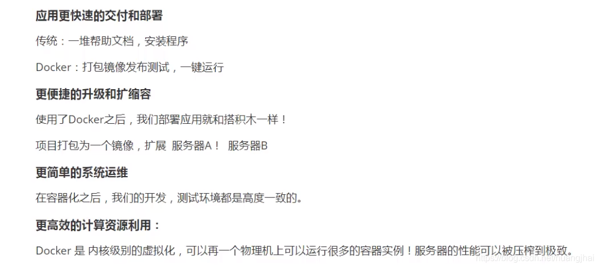

## 3. Docker的基本组成

Docker的基本组成图如下：


说明：

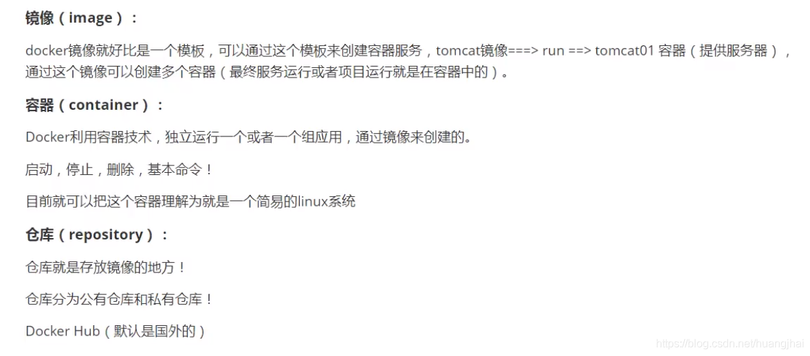

## 4. Docker的安装

### 4.1 **WIndows**

> 直接下载windows-desktop版本即可

> vmmen进程是虚拟机进程
>
> wsl2版本查看命令

```shell
wsl -l -v

# test
PS C:\Users\Frostbite> wsl -l -v
  NAME                   STATE           VERSION
* docker-desktop         Running         2
  docker-desktop-data    Running         2
```

> docker 版本

```shell
docker version
```

> 镜像
>
> Docker Engine中的

```json
  "registry-mirrors": 
    ["https://registry.docker-cn.com",
     "https://docker.mirrors.ustc.edu.cn",
     "http://hub-mirror.c.163.com"
    ]
```

> docker默认文件位置
>
> `"C:\Users\Frostbite\AppData\Local\Docker\wsl\data\ext4.vhdx"`
>
> [修改位置方法](https://blog.csdn.net/u013948858/article/details/111464534)

### 4.2 Linux

查看系统的内核：

uname -r

lsb_release -a

系统内核版本为3.10.0

```sh
[root@iZwz99sm8v95sckz8bd2c4Z ~]# uname -r
3.10.0-957.21.3.el7.x86_64
```

查看系统配置

cat /etc/os-release

```shell
[root@iZwz99sm8v95sckz8bd2c4Z ~]# cat /etc/os-release
NAME="CentOS Linux"
VERSION="7 (Core)"
ID="centos"
ID_LIKE="rhel fedora"
VERSION_ID="7"
PRETTY_NAME="CentOS Linux 7 (Core)"
ANSI_COLOR="0;31"
CPE_NAME="cpe:/o:centos:centos:7"
HOME_URL="https://www.centos.org/"
BUG_REPORT_URL="https://bugs.centos.org/"

CENTOS_MANTISBT_PROJECT="CentOS-7"
CENTOS_MANTISBT_PROJECT_VERSION="7"
REDHAT_SUPPORT_PRODUCT="centos"
REDHAT_SUPPORT_PRODUCT_VERSION="7"
```

Docker的安装步骤：

**（1）卸载旧的版本**

```shell
yum remove docker \
                  docker-client \
                  docker-client-latest \
                  docker-common \
                  docker-latest \
                  docker-latest-logrotate \
                  docker-logrotate \
                  docker-engine
```

**（2）下载需要的安装包**

```shell
yum install -y yum-utils
```

（3）设置镜像的仓库

```shell
yum-config-manager \
    --add-repo \
    https://download.docker.com/linux/centos/docker-ce.repo  # 国外的地址
    
# 设置阿里云的Docker镜像仓库
yum-config-manager \
    --add-repo \
    https://mirrors.aliyun.com/docker-ce/linux/centos/docker-ce.repo  # 国内的地址
```

**（4）更新yum软件包索引**

```bash
yum makecache fast
```

**（5）安装docker相关的配置**

docker-ce 是社区版，docker-ee 企业版

```shell
 yum install docker-ce docker-ce-cli containerd.io
```

出现了completed即安装成功。

**（6）启动Docker**

```bash
systemctl start docker
# 查看当前版本号，是否启动成功
docker version
# 设置开机自启动
systemctl enable docker
```

结果：

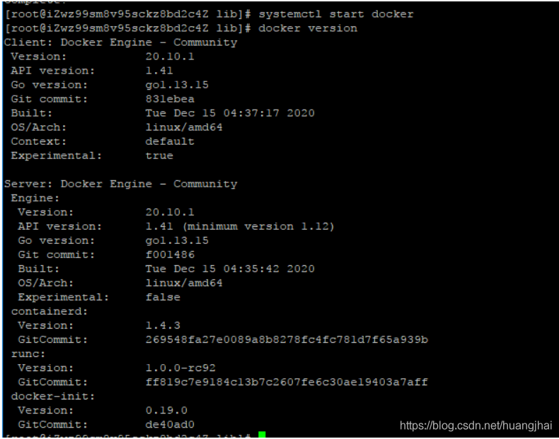

下载hello-world镜像进行测试

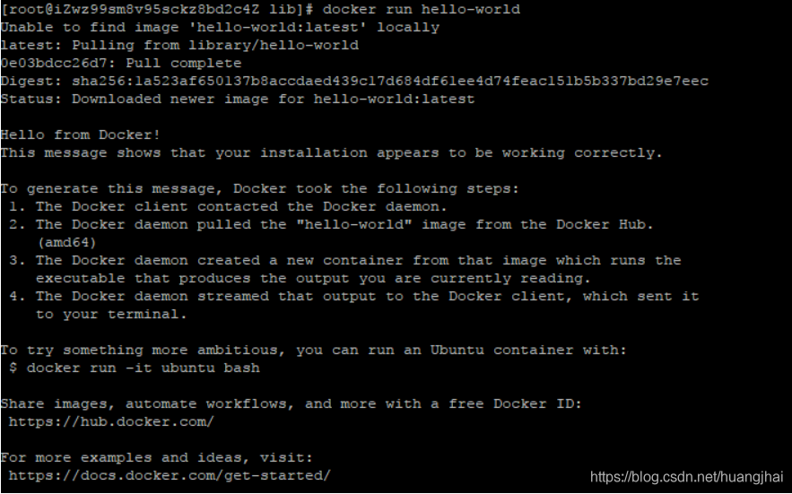

查看下载的hello world镜像

```shell
[root@iZwz99sm8v95sckz8bd2c4Z lib]# docker images
REPOSITORY    TAG       IMAGE ID       CREATED         SIZE
hello-world   latest    bf756fb1ae65   11 months ago   13.3kB
```

## 5. Docker的卸载

```bash
# 1. 卸载依赖
yum remove docker-ce docker-ce-cli containerd.io
# 2. 删除资源  . /var/lib/docker是docker的默认工作路径
rm -rf /var/lib/docker
```

## 6. 配置阿里云镜像加速

**（1）进入阿里云官网，搜索容器镜像服务**

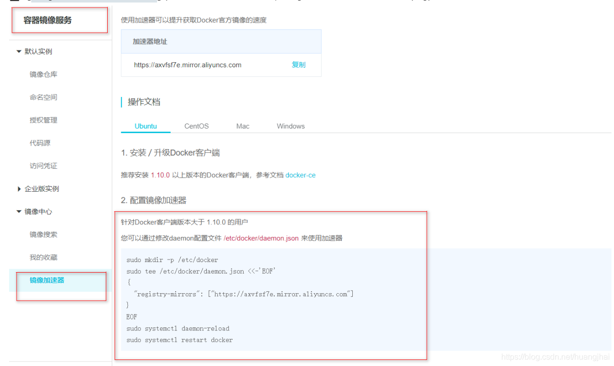

**（2）依次执行官方的这四条命令**

```shell
sudo mkdir -p /etc/docker
sudo tee /etc/docker/daemon.json <<-'EOF'
{
  "registry-mirrors": ["https://axvfsf7e.mirror.aliyuncs.com"]
}
EOF
sudo systemctl daemon-reload
sudo systemctl restart docker
```

## 8. **Docker容器运行流程**

启动一个容器，Docker的运行流程如下图：


## 9. 底层原理

Docker是一个Client-Server结构的系统，Docker的守护进程运行在主机上，通过Socket从客户端访问！Docker Server接收到Docker-Client的指令，就会执行这个指令！

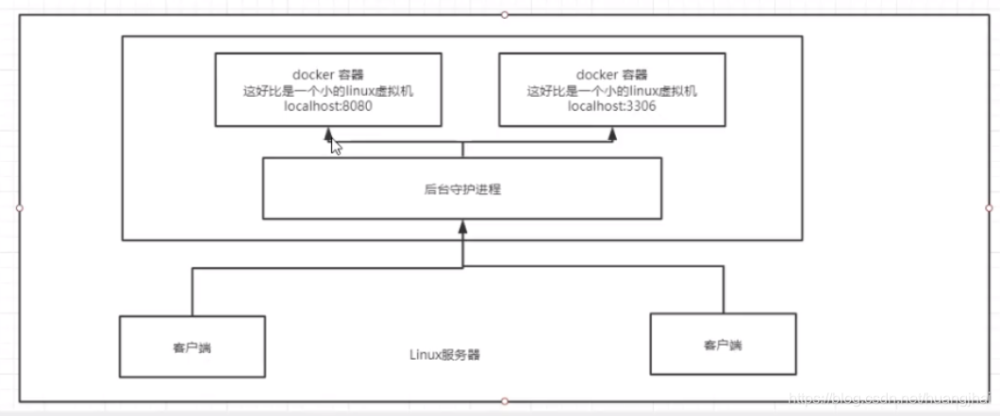

Docker为什么比VM Ware快？

1、Docker比虚拟机更少的抽象层

2、docker利用宿主机的内核，VM需要的是Guest OS

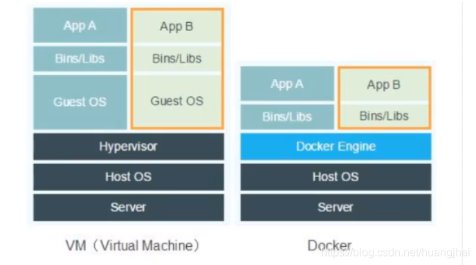

Docker新建一个容器的时候，不需要像虚拟机一样重新加载一个操作系统内核，直接利用宿主机的操作系统，而虚拟机是需要加载Guest OS。Docker和VM的对比如下：

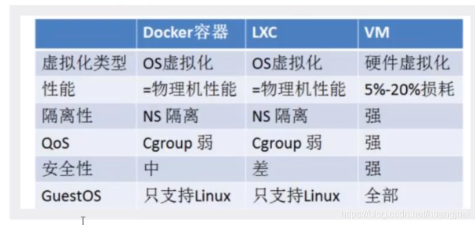

## 10. **Docker常用命令**

### 10.1 **基础命令**

```shell
docker version          #查看docker的版本信息
docker info             #查看docker的系统信息,包括镜像和容器的数量
docker 命令 --help       #帮助命令(可查看可选的参数)
docker COMMAND --help
```

命令的帮助文档地址:https://docs.docker.com/engine/reference/commandline/docker/

### 10.2 **镜像命令**

#### **images -aq** 查看本地主机的所有镜像

```shell
[root@iZwz99sm8v95sckz8bd2c4Z ~]# docker images
REPOSITORY    TAG       IMAGE ID       CREATED         SIZE
hello-world   latest    bf756fb1ae65   11 months ago   13.3kB

# 解释:
1.REPOSITORY  	镜像的仓库源

2.TAG  			镜像的标签

3.IMAGE ID 		镜像的id

4.CREATED 		镜像的创建时间

5.SIZE 			镜像的大小


# 可选参数
-a/--all 		列出所有镜像
-q/--quiet 		只显示镜像的id

docker search -aq 找到全部镜像的id
```

#### **search** 搜索镜像

```shell
[root@iZwz99sm8v95sckz8bd2c4Z ~]# docker search mysql
NAME                              DESCRIPTION                                     STARS     OFFICIAL   AUTOMATED
mysql                             MySQL is a widely used, open-source relation…   10308     [OK]
mariadb                           MariaDB is a community-developed fork of MyS…   3819      [OK]
mysql/mysql-server                Optimized MySQL Server Docker images. Create…   754                  [OK]
percona                           Percona Server is a fork of the MySQL relati…   517       [OK]
centos/mysql-57-centos7           MySQL 5.7 SQL database server                   86
mysql/mysql-cluster               Experimental MySQL Cluster Docker images. Cr…   79
centurylink/mysql                 Image containing mysql. Optimized to be link…   60                   [OK]


# 可选参数
-f, --filter filter   Filter output based on conditions provided
    --format string   Pretty-print search using a Go template
    --limit int       Max number of search results (default 25)
    --no-trunc        Don't truncate output


# 搜索收藏数大于3000的镜像											注意用的是等号,没有大于号
[root@iZwz99sm8v95sckz8bd2c4Z ~]# docker search mysql --filter=STARS=3000
NAME      DESCRIPTION                                     STARS     OFFICIAL   AUTOMATED
mysql     MySQL is a widely used, open-source relation…   10308     [OK]
mariadb   MariaDB is a community-developed fordockerk of MyS…   3819      [OK]
```

#### **pull 镜像名[:tag]** 下载镜像

```shell
[root@iZwz99sm8v95sckz8bd2c4Z ~]# docker pull mysql
Using default tag: latest            	# 如果不写tag默认就是latest
latest: Pulling from library/mysql
6ec7b7d162b2: Pull complete          	# 分层下载,docker image的核心-联合文件系统
fedd960d3481: Pull complete
7ab947313861: Pull complete
64f92f19e638: Pull complete
3e80b17bff96: Pull complete
014e976799f9: Pull complete
59ae84fee1b3: Pull complete
ffe10de703ea: Pull complete
657af6d90c83: Pull complete
98bfb480322c: Pull complete
6aa3859c4789: Pull complete
1ed875d851ef: Pull complete
Digest: sha256:78800e6d3f1b230e35275145e657b82c3fb02a27b2d8e76aac2f5e90c1c30873 #签名
Status: Downloaded newer image for mysql:latest
docker.io/library/mysql:latest  		# 下载来源的真实地址 docker pull mysql等价于 docker pull docker.io/library/mysql:latest
```

指定版本下载

```shell
[root@iZwz99sm8v95sckz8bd2c4Z ~]# docker pull mysql:5.7
5.7: Pulling from library/mysql
6ec7b7d162b2: Already exists
fedd960d3481: Already exists
7ab947313861: Already exists
64f92f19e638: Already exists
3e80b17bff96: Already exists
014e976799f9: Already exists
59ae84fee1b3: Already exists
7d1da2a18e2e: Pull complete
301a28b700b9: Pull complete
529dc8dbeaf3: Pull complete
bc9d021dc13f: Pull complete
Digest: sha256:c3a567d3e3ad8b05dfce401ed08f0f6bf3f3b64cc17694979d5f2e5d78e10173
Status: Downloaded newer image for mysql:5.7
docker.io/library/mysql:5.7
```

#### **rmi -f name/id** 删除镜像

```shell
# 1.删除指定的镜像id
[root@iZwz99sm8v95sckz8bd2c4Z ~]# docker rmi -f  镜像id

# 2.删除多个镜像id
[root@iZwz99sm8v95sckz8bd2c4Z ~]# docker rmi -f  镜像id 镜像id 镜像id

# 3.删除全部的镜像id docker images -aq 找到全部id
[root@iZwz99sm8v95sckz8bd2c4Z ~]# docker rmi -f  $(docker images -aq)
```

### 10.3 容器命令

有了镜像才能有容器

#### **pull** 如拉取一个镜像

```bash
docker pull centos
```

#### **run  -it image --name="名字" image -p 主机端口:容器端口** 运行并进入容器

运行容器的命令说明：

```shell
docker run [可选参数] image

#参数说明
--name="名字"           指定容器名字
-d                     后台方式运行
-it                    使用交互方式运行,进入容器查看内容 -i -t 是两个
-p                     指定容器的端口
    (
    -p ip:主机端口:容器端口  配置主机端口映射到容器端口
    -p 主机端口:容器端口	 最常使用
    -p 容器端口
    )
-P                     随机指定端口(大写的P)
```

```shell
[root@iZwz99sm8v95sckz8bd2c4Z ~]# docker run -it centos /bin/bash   # 后面的 /bin/bash 指的是使用的命令

# 进入linux之后 bd1b8900c547指的是容器id
[root@ bd1b8900c547 /]# ls      
bin  dev  etc  home  lib  lib64  lost+found  media  mnt  opt  proc  root  run  sbin  srv  sys  tmp  usr  var
```

#### **exit Ctrl+P+Q** 退出容器命令

```shell
# exit 		停止并退出容器（后台方式运行则仅退出）
# Ctrl+P+Q  不停止容器退出

[root@bd1b8900c547 /]# exit
exit
[root@iZwz99sm8v95sckz8bd2c4Z ~]#
```

#### **ps -aq** 列出运行过的容器命令：

```shell
#docker ps 
     # 列出当前正在运行的容器(无参数)
-a   # 列出所有容器的运行记录
-n=? # 显示最近创建的n个容器
-q   # 只显示容器的编号


[root@iZwz99sm8v95sckz8bd2c4Z ~]# docker ps
CONTAINER ID   IMAGE     COMMAND   CREATED   STATUS    PORTS     NAMES
[root@iZwz99sm8v95sckz8bd2c4Z ~]# docker ps -a
CONTAINER ID   IMAGE          COMMAND       CREATED         STATUS                     PORTS     NAMES
bca129320bb5   centos         "/bin/bash"   4 minutes ago   Exited (0) 3 minutes ago             optimistic_shtern
bd1b8900c547   centos         "/bin/bash"   6 minutes ago   Exited (0) 5 minutes ago             cool_tesla
cf6adbf1b506   bf756fb1ae65   "/hello"      5 hours ago     Exited (0) 5 hours ago               optimistic_darwin
```

#### **rm id/name** 删除容器命令：

```shell
docker rm 容器id                 # 删除指定的容器,不能删除正在运行的容器,强制删除使用 rm -f
docker rm -f $(docker ps -aq)   # 删除所有的容器
docker ps -aq|xargs docker rm   # 删除所有的容器(管道符)
```

#### **start restart stop kill id/name** 启动和停止容器命令：

```shell
docker start 容器id          # 启动容器
	docker start $(docker ps -aq)
docker restart 容器id        # 重启容器
	docker restart $(docker ps -aq)
docker stop 容器id           # 停止当前运行的容器
	docker stop $(docker ps -aq)
docker kill 容器id           # 强制停止当前容器
	docker kill $(docker ps -aq)
```

### 10.4 其他常用命令

#### 10.4.1 后台启动

```shell
docker -d 镜像名

# 问题: docker ps 时发现停止运行了
# 常见的坑: 容器使用后台运行,就必须要有一个前台进程,docker发现没有应用就会自动停止
# nginx 容器启动后没有服务就会立刻停止,没有程序了
```

#### 10.4.2 **logs -tf --tail number 容器id/name** 日志的查看

```shell
[root@iZwz99sm8v95sckz8bd2c4Z ~]# docker logs --help

Usage:  docker logs [OPTIONS] CONTAINER

Fetch the logs of a container

Options:
      --details        Show extra details provided to logs
  -f, --follow         Follow log output
      --since string   Show logs since timestamp (e.g. 2013-01-02T13:23:37Z) or relative (e.g. 42m for 42 minutes)
  -n, --tail string    Number of lines to show from the end of the logs (default "all")
  -t, --timestamps     Show timestamps
      --until string   Show logs before a timestamp (e.g. 2013-01-02T13:23:37Z) or relative (e.g. 42m for 42 minutes)

# 常用：
docker logs -tf 容器id
docker logs --tail number 容器id # num为要显示的日志条数
docker logs -tf --tail number 容器id


# docker容器后台运行，必须要有一个前台的进程，否则会自动停止
# 编写shell脚本循环执行，使得centos容器保持运行状态
[root@iZwz99sm8v95sckz8bd2c4Z ~]# docker run -d centos /bin/sh -c "while true;do echo hi;sleep 5;done"
c703b5b1911ff84d584390263a35707b6024816e1f46542b61918a6327a570dc
[root@iZwz99sm8v95sckz8bd2c4Z ~]# docker ps
CONTAINER ID   IMAGE     COMMAND                  CREATED          STATUS          PORTS     NAMES
c703b5b1911f   centos    "/bin/sh -c 'while t…"   13 seconds ago   Up 10 seconds             pedantic_banach
[root@iZwz99sm8v95sckz8bd2c4Z ~]# docker logs -tf --tail 10 c703b5b1911f
2020-12-27T03:34:07.255599560Z hi
2020-12-27T03:34:12.257641517Z hi
2020-12-27T03:34:17.259706294Z hi
2020-12-27T03:34:22.261693707Z hi
2020-12-27T03:34:27.262609289Z hi
2020-12-27T03:34:32.267862677Z hi
2020-12-27T03:34:37.270382873Z hi
2020-12-27T03:34:42.272414182Z hi
2020-12-27T03:34:47.274823243Z hi
2020-12-27T03:34:52.277419274Z hi
```

#### 10.4.3 **top id/name** 查看容器中进程信息

```shell
[root@iZwz99sm8v95sckz8bd2c4Z ~]# docker top c703b5b1911f
UID                 PID                 PPID                C                   STIME               TTY                 TIME                CMD
root                11156               11135               0                   11:31               ?                   00:00:00            /bin/sh -c while true;do echo hi;sleep 5;done
root                11886               11156               0                   11:43               ?                   00:00:00            /usr/bin/coreutils --coreutils-prog-shebang=sleep /usr/bin/sleep 5
```

#### 10.4.4 **inspect id/name** 查看image/container的元数据

```shell
PS D:\Docker\test> docker inspect 0f6
[
    {
        "Id": "0f6deb9de6661d7efdc51a005ba700e7bd4bf9a053ad79a9da0a4c9b592ea632",
        "Created": "2022-06-06T13:47:16.0960194Z",
        "Path": "/bin/sh",
        "Args": [
            "-c",
            "while true;do echo hhh; sleep 1; done"
        ],
        "State": {
            "Status": "running",
            "Running": true,
            "Paused": false,
            "Restarting": false,
            "OOMKilled": false,
            "Dead": false,
            "Pid": 3229,
            "ExitCode": 0,
            "Error": "",
            "StartedAt": "2022-06-06T13:51:13.5368437Z",
            "FinishedAt": "2022-06-06T13:50:54.408797Z"
        },
        "Image": "sha256:5d0da3dc976460b72c77d94c8a1ad043720b0416bfc16c52c45d4847e53fadb6",
        "ResolvConfPath": "/var/lib/docker/containers/0f6deb9de6661d7efdc51a005ba700e7bd4bf9a053ad79a9da0a4c9b592ea632/resolv.conf",
        "HostnamePath": "/var/lib/docker/containers/0f6deb9de6661d7efdc51a005ba700e7bd4bf9a053ad79a9da0a4c9b592ea632/hostname",
        "HostsPath": "/var/lib/docker/containers/0f6deb9de6661d7efdc51a005ba700e7bd4bf9a053ad79a9da0a4c9b592ea632/hosts",
        "LogPath": "/var/lib/docker/containers/0f6deb9de6661d7efdc51a005ba700e7bd4bf9a053ad79a9da0a4c9b592ea632/0f6deb9de6661d7efdc51a005ba700e7bd4bf9a053ad79a9da0a4c9b592ea632-json.log",
        "Name": "/determined_solomon",
        "RestartCount": 0,
        "Driver": "overlay2",
        "Platform": "linux",
        "MountLabel": "",
        "ProcessLabel": "",
        "AppArmorProfile": "",
        "ExecIDs": null,
        "HostConfig": {
            "Binds": null,
            "ContainerIDFile": "",
            "LogConfig": {
                "Type": "json-file",
                "Config": {}
            },
            "NetworkMode": "default",
            "PortBindings": {},
            "RestartPolicy": {
                "Name": "no",
                "MaximumRetryCount": 0
            },
            "AutoRemove": false,
            "VolumeDriver": "",
            "VolumesFrom": null,
            "CapAdd": null,
            "CapDrop": null,
            "CgroupnsMode": "host",
            "Dns": [],
            "DnsOptions": [],
            "DnsSearch": [],
            "ExtraHosts": null,
            "GroupAdd": null,
            "IpcMode": "private",
            "Cgroup": "",
            "Links": null,
            "OomScoreAdj": 0,
            "PidMode": "",
            "Privileged": false,
            "PublishAllPorts": false,
            "ReadonlyRootfs": false,
            "SecurityOpt": null,
            "UTSMode": "",
            "UsernsMode": "",
            "ShmSize": 67108864,
            "Runtime": "runc",
            "ConsoleSize": [
                48,
                120
            ],
            "Isolation": "",
            "CpuShares": 0,
            "Memory": 0,
            "NanoCpus": 0,
            "CgroupParent": "",
            "BlkioWeight": 0,
            "BlkioWeightDevice": [],
            "BlkioDeviceReadBps": null,
            "BlkioDeviceWriteBps": null,
            "BlkioDeviceReadIOps": null,
            "BlkioDeviceWriteIOps": null,
            "CpuPeriod": 0,
            "CpuQuota": 0,
            "CpuRealtimePeriod": 0,
            "CpuRealtimeRuntime": 0,
            "CpusetCpus": "",
            "CpusetMems": "",
            "Devices": [],
            "DeviceCgroupRules": null,
            "DeviceRequests": null,
            "KernelMemory": 0,
            "KernelMemoryTCP": 0,
            "MemoryReservation": 0,
            "MemorySwap": 0,
            "MemorySwappiness": null,
            "OomKillDisable": false,
            "PidsLimit": null,
            "Ulimits": null,
            "CpuCount": 0,
            "CpuPercent": 0,
            "IOMaximumIOps": 0,
            "IOMaximumBandwidth": 0,
            "MaskedPaths": [
                "/proc/asound",
                "/proc/acpi",
                "/proc/kcore",
                "/proc/keys",
                "/proc/latency_stats",
                "/proc/timer_list",
                "/proc/timer_stats",
                "/proc/sched_debug",
                "/proc/scsi",
                "/sys/firmware"
            ],
            "ReadonlyPaths": [
                "/proc/bus",
                "/proc/fs",
                "/proc/irq",
                "/proc/sys",
                "/proc/sysrq-trigger"
            ]
        },
        "GraphDriver": {
            "Data": {
                "LowerDir": "/var/lib/docker/overlay2/f7e1fbd77a36ce7e569ee3f91d306c627282cff185967b92c7f90cb91236ea99-init/diff:/var/lib/docker/overlay2/94fff4840be2249f5d536392e67a68250838026d3dca8aae5846c3cddb8d9ba3/diff",
                "MergedDir": "/var/lib/docker/overlay2/f7e1fbd77a36ce7e569ee3f91d306c627282cff185967b92c7f90cb91236ea99/merged",
                "UpperDir": "/var/lib/docker/overlay2/f7e1fbd77a36ce7e569ee3f91d306c627282cff185967b92c7f90cb91236ea99/diff",
                "WorkDir": "/var/lib/docker/overlay2/f7e1fbd77a36ce7e569ee3f91d306c627282cff185967b92c7f90cb91236ea99/work"
            },
            "Name": "overlay2"
        },
        "Mounts": [],
        "Config": {
            "Hostname": "0f6deb9de666",
            "Domainname": "",
            "User": "",
            "AttachStdin": false,
            "AttachStdout": false,
            "AttachStderr": false,
            "Tty": false,
            "OpenStdin": false,
            "StdinOnce": false,
            "Env": [
                "PATH=/usr/local/sbin:/usr/local/bin:/usr/sbin:/usr/bin:/sbin:/bin"
            ],
            "Cmd": [
                "/bin/sh",
                "-c",
                "while true;do echo hhh; sleep 1; done"
            ],
            "Image": "centos",
            "Volumes": null,
            "WorkingDir": "",
            "Entrypoint": null,
            "OnBuild": null,
            "Labels": {
                "org.label-schema.build-date": "20210915",
                "org.label-schema.license": "GPLv2",
                "org.label-schema.name": "CentOS Base Image",
                "org.label-schema.schema-version": "1.0",
                "org.label-schema.vendor": "CentOS"
            }
        },
        "NetworkSettings": {
            "Bridge": "",
            "SandboxID": "2783957116a57614ca312c76c99aa2ae78c2b76146dedb612ac6630f5eb1ddd8",
            "HairpinMode": false,
            "LinkLocalIPv6Address": "",
            "LinkLocalIPv6PrefixLen": 0,
            "Ports": {},
            "SandboxKey": "/var/run/docker/netns/2783957116a5",
            "SecondaryIPAddresses": null,
            "SecondaryIPv6Addresses": null,
            "EndpointID": "59d2f3786a7678e392aac34e53674d75b38ca42c56023a81b6b5bd68908bc67e",
            "Gateway": "172.17.0.1",
            "GlobalIPv6Address": "",
            "GlobalIPv6PrefixLen": 0,
            "IPAddress": "172.17.0.2",
            "IPPrefixLen": 16,
            "IPv6Gateway": "",
            "MacAddress": "02:42:ac:11:00:02",
            "Networks": {
                "bridge": {
                    "IPAMConfig": null,
                    "Links": null,
                    "Aliases": null,
                    "NetworkID": "200ad83d4d8f81e3ca1297681a49f61b7ef97491426c57c5080ec5bd4aaa4d66",
                    "EndpointID": "59d2f3786a7678e392aac34e53674d75b38ca42c56023a81b6b5bd68908bc67e",
                    "Gateway": "172.17.0.1",
                    "IPAddress": "172.17.0.2",
                    "IPPrefixLen": 16,
                    "IPv6Gateway": "",
                    "GlobalIPv6Address": "",
                    "GlobalIPv6PrefixLen": 0,
                    "MacAddress": "02:42:ac:11:00:02",
                    "DriverOpts": null
                }
            }
        }
    }
]
```

#### 10.4.5 **attach exec id/name** 进入当前正在运行的容器

因为通常我们的容器都是使用后台方式来运行的，有时需要进入容器修改配置

- `docker attach` 进入容器正在执行的终端，不会启动新的进程
- `docker exec` 进入容器后开启一个新的终端，可以在里面操作’

方式一：

```shell
[root@iZwz99sm8v95sckz8bd2c4Z ~]# docker attach c703b5b1911f
```

方式二：

```shell
[root@iZwz99sm8v95sckz8bd2c4Z ~]# docker exec -it c703b5b1911f /bin/bash
[root@c703b5b1911f /]# ls
bin  dev  etc  home  lib  lib64  lost+found  media  mnt  opt  proc  root  run  sbin  srv  sys  tmp  usr  var
[root@c703b5b1911f /]# ps -ef      
UID        PID  PPID  C STIME TTY          TIME CMD
root         1     0  0 03:31 ?        00:00:00 /bin/sh -c while true;do echo hi;sleep 5;done
root       279     0  0 03:54 pts/0    00:00:00 /bin/bash
root       315     1  0 03:56 ?        00:00:00 /usr/bin/coreutils --coreutils-prog-shebang=sleep /usr/bin/sleep 5
root       316   279  0 03:56 pts/0    00:00:00 ps -ef
```

#### 10.4.5 **cp 容器id(name):容器内路径  目的主机路径(路径可交换)** 拷贝操作

拷贝操作的命令如下：

```shell
#拷贝容器的文件到主机中
docker cp 容器id(name):容器内路径  目的主机路径

#拷贝宿主机的文件到容器中
docker cp 目的主机路径 容器id:容器内路径
```

```shell
[root@c703b5b1911f /]# cd home
[root@c703b5b1911f home]# ls

# touch 新建文件
[root@c703b5b1911f home]# touch test.java
[root@c703b5b1911f home]# ls
test.java
[root@c703b5b1911f home]# exit
exit

[root@iZwz99sm8v95sckz8bd2c4Z ~]# docker ps
CONTAINER ID   IMAGE     COMMAND                  CREATED          STATUS          PORTS     NAMES
c703b5b1911f   centos    "/bin/sh -c 'while t…"   35 minutes ago   Up 35 minutes             centos1
[root@iZwz99sm8v95sckz8bd2c4Z ~]# docker cp centos1:/home/test.java /home
[root@iZwz99sm8v95sckz8bd2c4Z ~]# ls /home
hai  pan  test.java
```

命令小节的图解如下：


#### 10.4.6 **stats** 查看资源占用情况

```shell
$ docker stats
```

## 11. 图形化管理工具Portaniner安装

Portaniner是Docker的图形化管理工具，类似的工具还有Rancher(CI/CD再用)

下载运行Portaniner镜像并运行，设置本机映射端口为8088

```shell
[root@localhost conf]# docker run -d -p 8088:9000 --restart=always -v /var/run/docker.sock:/var/run/docker.sock --privileged=true portainer/portainer
Unable to find image 'portainer/portainer:latest' locally
latest: Pulling from portainer/portainer
94cfa856b2b1: Pull complete
49d59ee0881a: Pull complete
a2300fd28637: Pull complete
Digest: sha256:fb45b43738646048a0a0cc74fcee2865b69efde857e710126084ee5de9be0f3f
Status: Downloaded newer image for portainer/portainer:latest
8c525a0137be22965bd1e3944da622a2c4248f8ad20883f4b3ea4f8a6b11e163

[root@iZwz99sm8v95sckz8bd2c4Z ~]# docker ps
CONTAINER ID   IMAGE                 COMMAND        CREATED         STATUS         PORTS                    NAMES
7789d4505a00   portainer/portainer   "/portainer"   6 seconds ago   Up 5 seconds   0.0.0.0:8088->9000/tcp   quirky_sinoussi
```

第一次登录设置admin用户的密码

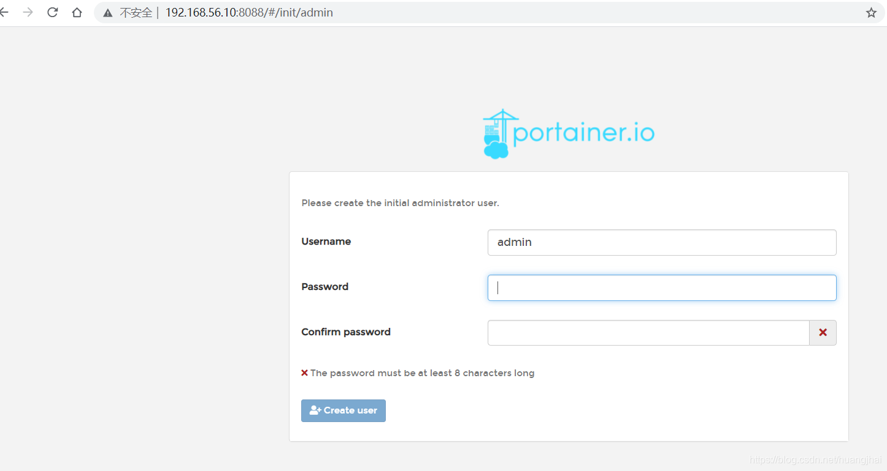

如果是阿里云服务器记得设置安全组，选择连接本地的Docker,整体界面预览如下图：

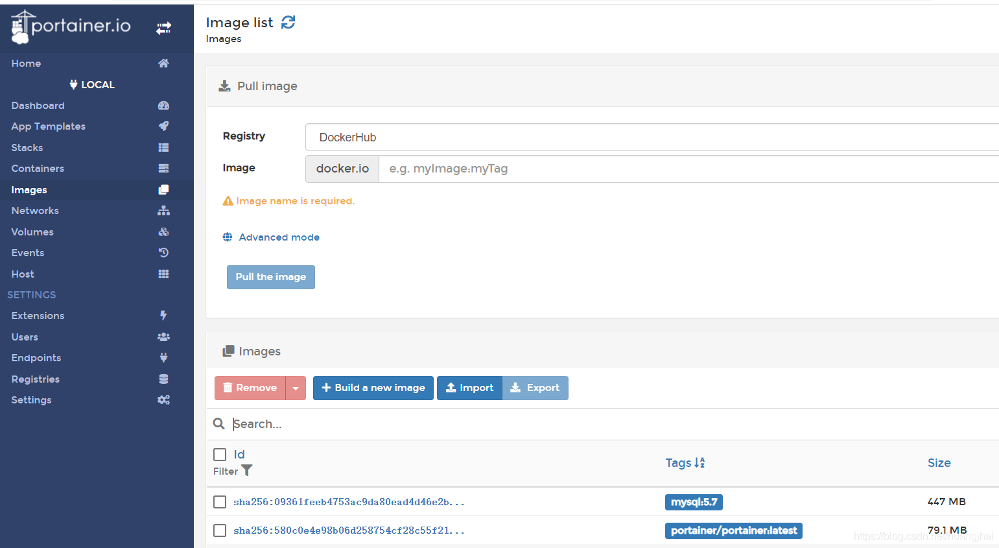

## 12. Docker镜像详解

### 12.1 什么是镜像

镜像是一种轻量级、可执行的独立软件包，用来打包软件运行环境和基于运行环境开发的软件，它包含运行某个软件所需要的所有内容，包括代码，运行时（一个程序在运行或者在被执行的依赖）、库，环境变量和配置文件。

### 12.2 Docker镜像加载原理

Docker的镜像实际上由一层一层的文件系统组成，这种层级的文件系统是UnionFS联合文件系统。

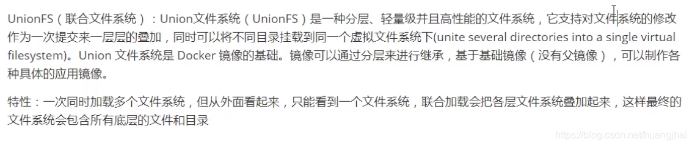

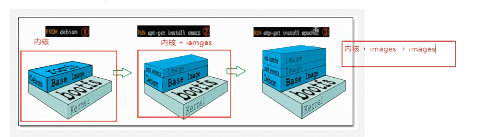

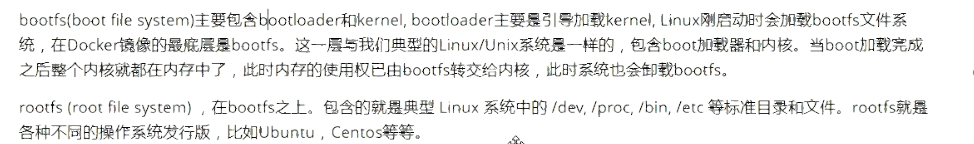

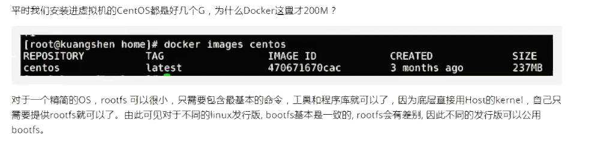

### 12.3 分层理解

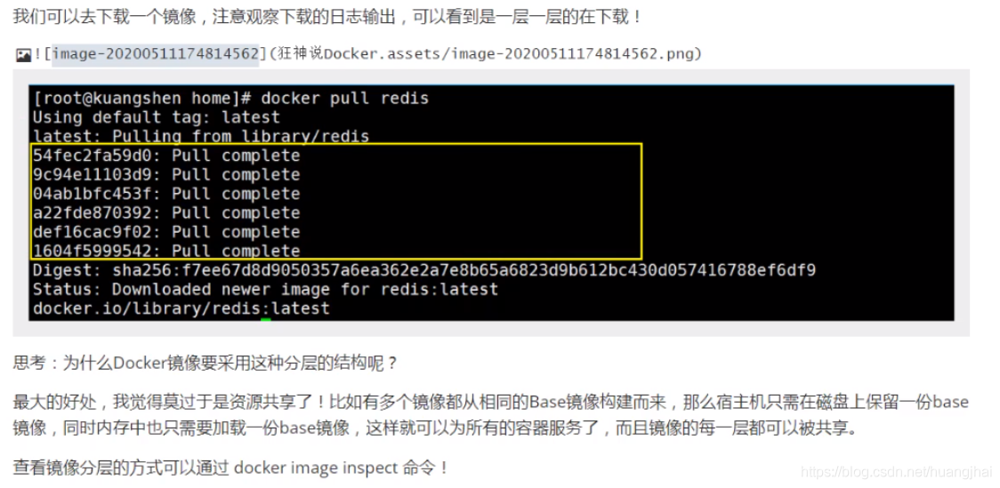

```shell
PS D:\Docker\test> docker inspect archlinux
[
    {
        "Id": "sha256:0a6134a84991baaaa2bea6eec1acb5034e68a9cee9e793671a386757bfafa4d1",
        "RepoTags": [
            "archlinux:latest"
        ],
        "RepoDigests": [
            "archlinux@sha256:7f6e183877431dd4707f058f9769ecfbfed015cb64c542b17a169f7691f58e65"
        ],
        "Parent": "",
        "Comment": "",
        "Created": "2022-06-01T16:19:58.050910881Z",
        "Container": "8b13e3e11a7f80fabc12c7343fe5b9c201bf53fdead7df66d21fbd7ebcbd6337",
        "ContainerConfig": {
            "Hostname": "8b13e3e11a7f",
            "Domainname": "",
            "User": "",
            "AttachStdin": false,
            "AttachStdout": false,
            "AttachStderr": false,
            "Tty": false,
            "OpenStdin": false,
            "StdinOnce": false,
            "Env": [
                "PATH=/usr/local/sbin:/usr/local/bin:/usr/sbin:/usr/bin:/sbin:/bin",
                "LANG=en_US.UTF-8"
            ],
            "Cmd": [
                "/bin/sh",
                "-c",
                "#(nop) ",
                "CMD [\"/usr/bin/bash\"]"
            ],
            "Image": "sha256:862bc4e1d6555ec6eaeeb6648847f7c87eeb92e1c8aa7ab48b7889d070c49d5f",
            "Volumes": null,
            "WorkingDir": "",
            "Entrypoint": null,
            "OnBuild": null,
            "Labels": {}
        },
        "DockerVersion": "20.10.12",
        "Author": "",
        "Config": {
            "Hostname": "",
            "Domainname": "",
            "User": "",
            "AttachStdin": false,
            "AttachStdout": false,
            "AttachStderr": false,
            "Tty": false,
            "OpenStdin": false,
            "StdinOnce": false,
            "Env": [
                "PATH=/usr/local/sbin:/usr/local/bin:/usr/sbin:/usr/bin:/sbin:/bin",
                "LANG=en_US.UTF-8"
            ],
            "Cmd": [
                "/usr/bin/bash"
            ],
            "Image": "sha256:862bc4e1d6555ec6eaeeb6648847f7c87eeb92e1c8aa7ab48b7889d070c49d5f",
            "Volumes": null,
            "WorkingDir": "",
            "Entrypoint": null,
            "OnBuild": null,
            "Labels": null
        },
        "Architecture": "amd64",
        "Os": "linux",
        "Size": 369831019,
        "VirtualSize": 369831019,
        "GraphDriver": {
            "Data": {
                "LowerDir": "/var/lib/docker/overlay2/89bd4c2421c34a3869b8700c18821a492c3614513435080f1668bb488b904d6d/diff",
                "MergedDir": "/var/lib/docker/overlay2/3e1699de79bd949f7d8ddeaa817bfd280da7576819f2250e21476e9c0627ab2e/merged",
                "UpperDir": "/var/lib/docker/overlay2/3e1699de79bd949f7d8ddeaa817bfd280da7576819f2250e21476e9c0627ab2e/diff",
                "WorkDir": "/var/lib/docker/overlay2/3e1699de79bd949f7d8ddeaa817bfd280da7576819f2250e21476e9c0627ab2e/work"
            },
            "Name": "overlay2"
        },
        
        # 这里就时文件层
        "RootFS": {
            "Type": "layers",
            "Layers": [
                "sha256:1f87d59d60a8696e6a2724d4d104e767bb5a3817bbaf06b8a6a2249d775b90a6",
                "sha256:b26387dfd99339e1747d92c57ffbcf376f436c318d63dfe117f94b795fd28bff"
            ]
        },
        "Metadata": {
            "LastTagTime": "0001-01-01T00:00:00Z"
        }
    }
]
```

这里指示了分层信息：

```shell
        "RootFS": {
            "Type": "layers",
            "Layers": [
                "sha256:87c8a1d8f54f3aa4e05569e8919397b65056aa71cdf48b7f061432c98475eee9",
                "sha256:5c4e5adc71a82a96f02632433de31c998c5a9e2fccdcbaee780ae83158fac4fa",
                "sha256:7d2b207c26790f693ab1942bbe26af8e2b6a14248969e542416155a912fec30d",
                "sha256:2c7498eef94aef8c40d106f3e42f7da62b3eee8fd36012bf7379becc4cd639a2",
                "sha256:4eaf0ea085df254fd5d2beba4e2c11db70a620dfa411a8ad44149e26428caee4"
            ]
        },
```

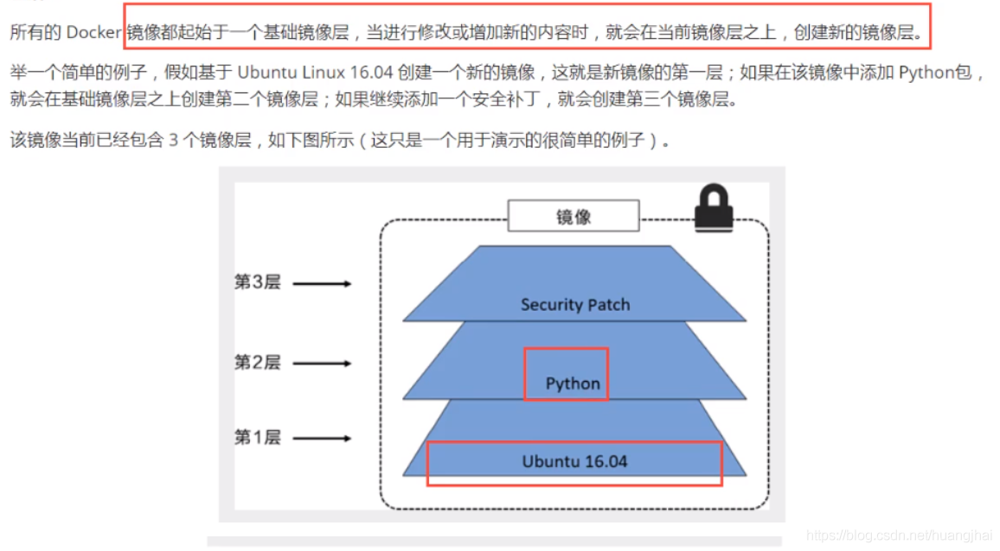

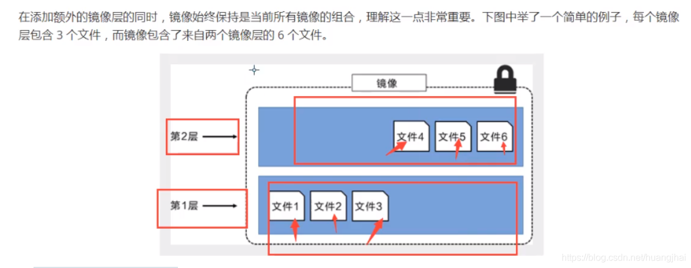

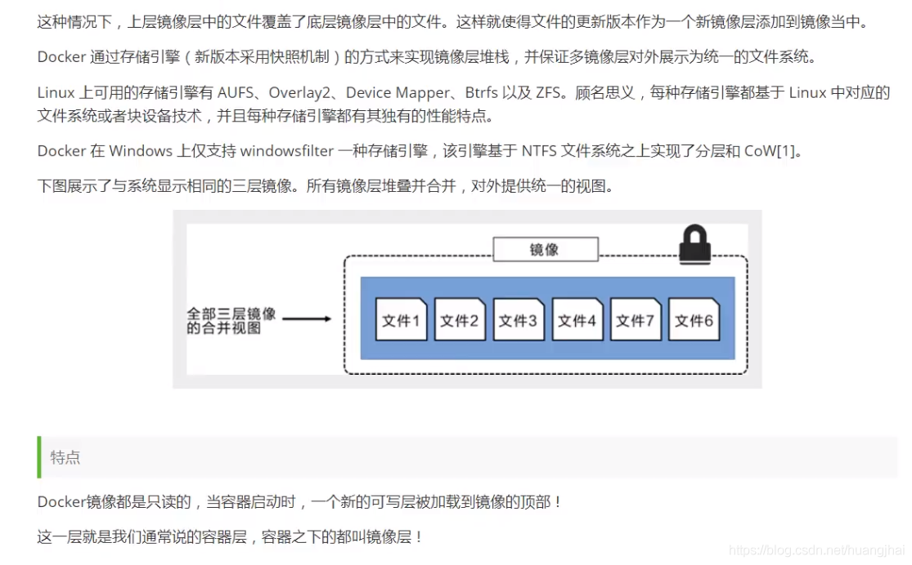

所有的操作都在最新的一层,只有这一层是新的

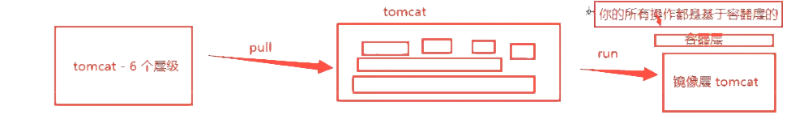

### 12.4 **docker commit -m=“提交的描述信息”  -a="作者" 容器id 目标镜像名:[TAG] ** 提交镜像

```shell
使用docker commit 命令提交容器成为一个新的版本

docker commit -m=“提交的描述信息”  -a="作者" 容器id 目标镜像名:[TAG] 
```

由于默认的Tomcat镜像的webapps文件夹中没有任何内容，需要从webapps.dist中拷贝文件到webapps文件夹。下面自行制作镜像：就是从webapps.dist中拷贝文件到webapps文件夹下，并提交该镜像作为一个新的镜像。使得该镜像默认的webapps文件夹下就有文件。具体命令如下：

```shell
#1.复制文件夹
$ [root@iZwz99sm8v95sckz8bd2c4Z ~]# docker run -it tomcat /bin/bash
$ root@2a3bf3eaa2e4:/usr/local/tomcat# cd webapps
$ root@2a3bf3eaa2e4:/usr/local/tomcat/webapps# ls
$ root@2a3bf3eaa2e4:/usr/local/tomcat/webapps# cd ../
$ root@2a3bf3eaa2e4:/usr/local/tomcat# cp -r webapps.dist/* webapps
$ root@2a3bf3eaa2e4:/usr/local/tomcat# cd webapps
$ root@2a3bf3eaa2e4:/usr/local/tomcat/webapps# ls
ROOT  docs  examples  host-manager  manager
$ [root@iZwz99sm8v95sckz8bd2c4Z ~]# docker ps
CONTAINER ID   IMAGE                 COMMAND        CREATED         STATUS         PORTS                    NAMES
2a3bf3eaa2e4   tomcat                "/bin/bash"    4 minutes ago   Up 4 minutes   8080/tcp                 competent_torvalds
7789d4505a00   portainer/portainer   "/portainer"   24 hours ago    Up 24 hours    0.0.0.0:8088->9000/tcp   quirky_sinoussi
$ [root@iZwz99sm8v95sckz8bd2c4Z ~]# docker exec -it 2a3bf3eaa2e4 /bin/bash
$ root@2a3bf3eaa2e4:/usr/local/tomcat# cd webapps
$ root@2a3bf3eaa2e4:/usr/local/tomcat/webapps# ls
ROOT  docs  examples  host-manager  manager
$ root@2a3bf3eaa2e4:/usr/local/tomcat/webapps# cd ../
$ root@2a3bf3eaa2e4:/usr/local/tomcat# read escape sequence
$ [root@iZwz99sm8v95sckz8bd2c4Z ~]# docker ps
CONTAINER ID   IMAGE                 COMMAND        CREATED         STATUS         PORTS                    NAMES
2a3bf3eaa2e4   tomcat                "/bin/bash"    8 minutes ago   Up 8 minutes   8080/tcp                 competent_torvalds
7789d4505a00   portainer/portainer   "/portainer"   24 hours ago    Up 24 hours    0.0.0.0:8088->9000/tcp   quirky_sinoussi
#2.提交镜像作为一个新的镜像

$ [root@iZwz99sm8v95sckz8bd2c4Z ~]# docker commit -m="add webapps" -a="Ethan" 2a3bf3eaa2e4 mytomcat:1.0
sha256:f189aac861de51087af5bc88a5f1de02d9574e7ee2d163c647dd7503a2d3982b
$ [root@iZwz99sm8v95sckz8bd2c4Z ~]# docker images
REPOSITORY            TAG       IMAGE ID       CREATED         SIZE
mytomcat              1.0       f189aac861de   7 seconds ago   653MB
mysql                 5.7       f07dfa83b528   6 days ago      448MB
tomcat                latest    feba8d001e3f   10 days ago     649MB
nginx                 latest    ae2feff98a0c   12 days ago     133MB
centos                latest    300e315adb2f   2 weeks ago     209MB
portainer/portainer   latest    62771b0b9b09   5 months ago    79.1MB
elasticsearch         7.6.2     f29a1ee41030   9 months ago    791MB

#3.运行容器

$ [root@iZwz99sm8v95sckz8bd2c4Z ~]# docker run -it mytomcat:1.0 /bin/bash
$ root@1645774d4605:/usr/local/tomcat# cd webapps
$ root@1645774d4605:/usr/local/tomcat/webapps# ls
ROOT  docs  examples  host-manager  manager
$ wz99sm8v95sckz8bd2c4Z ~]# docker images
REPOSITORY            TAG       IMAGE ID       CREATED         SIZE
mytomcat              1.0       f189aac861de   7 seconds ago   653MB
mysql                 5.7       f07dfa83b528   6 days ago      448MB
tomcat                latest    feba8d001e3f   10 days ago     649MB
nginx                 latest    ae2feff98a0c   12 days ago     133MB
centos                latest    300e315adb2f   2 weeks ago     209MB
portainer/portainer   latest    62771b0b9b09   5 months ago    79.1MB
elasticsearch         7.6.2     f29a1ee41030   9 months ago    791MB
```

## 13. 常用容器部署

### 13.1 Nginx部署

**（1）搜索并下载镜像**

```shell
$ PS D:\Docker\test> docker search nginx
NAME                                              DESCRIPTION                                     STARS     OFFICIAL   AUTOMATED
nginx                                             Official build of Nginx.                        16919     [OK]
linuxserver/nginx                                 An Nginx container, brought to you by LinuxS…   168
bitnami/nginx                                     Bitnami nginx Docker Image                      131                  [OK]
ubuntu/nginx                                      Nginx, a high-performance reverse proxy & we…   50
bitnami/nginx-ingress-controller                  Bitnami Docker Image for NGINX Ingress Contr…   18                   [OK]
rancher/nginx-ingress-controller                                                                  10
clearlinux/nginx                                  Nginx reverse proxy server with the benefits…   4
ibmcom/nginx-ingress-controller                   Docker Image for IBM Cloud Private-CE (Commu…   4
bitnami/nginx-ldap-auth-daemon                                                                    3
vmware/nginx                                                                                      2
circleci/nginx                                    This image is for internal use                  2
bitnami/nginx-exporter                                                                            2
rancher/nginx-ingress-controller-defaultbackend                                                   2
bitnami/nginx-intel                                                                               1
vmware/nginx-photon                                                                               1
rancher/nginx                                                                                     1
kasmweb/nginx                                     An Nginx image based off nginx:alpine and in…   1
rapidfort/nginx                                   RapidFort optimized, hardened image for NGINX   1
wallarm/nginx-ingress-controller                  Kubernetes Ingress Controller with Wallarm e…   1
continuumio/nginx-ingress-ws                                                                      0
rancher/nginx-ssl                                                                                 0
rancher/nginx-ingress-controller-amd64                                                            0
rancher/nginx-conf                                                                                0
ibmcom/nginx-ingress-controller-ppc64le           Docker Image for IBM Cloud Private-CE (Commu…   0
ibmcom/nginx-ppc64le                              Docker image for nginx-ppc64le                  0

$ PS D:\Docker\test> docker pull nginx
Using default tag: latest
latest: Pulling from library/nginx
a2abf6c4d29d: Pull complete
a9edb18cadd1: Pull complete
589b7251471a: Pull complete
186b1aaa4aa6: Pull complete
b4df32aa5a72: Pull complete
a0bcbecc962e: Pull complete
Digest: sha256:0d17b565c37bcbd895e9d92315a05c1c3c9a29f762b011a10c54a66cd53c9b31
Status: Downloaded newer image for nginx:latest
docker.io/library/nginx:latest

$ PS D:\Docker\test> docker images
REPOSITORY   TAG       IMAGE ID       CREATED        SIZE
archlinux    latest    0a6134a84991   5 days ago     370MB
nginx        latest    605c77e624dd   5 months ago   141MB
```

可以到dockerhub官网查看Nginx的详细版本信息 ：https://hub.docker.com/_/nginx

**（2）运行测试**

```shell
$ docker run -d --name nginx1 -p 3334:80 nginx

-d 			后台运行
--name 		给容器命名
-p 3334:80 	将宿主机的端口3334映射到该容器的80端口
```

运行结果：

```shell
# run
$ PS D:\Docker\test> docker run -d --name nginx1 -p 3334:80 nginx
74efad86ea128db0ee39ece38fe4804b150593e26a2e086d806b0bbba45206c0

# 查看container
$ PS D:\Docker\test> docker ps
CONTAINER ID   IMAGE     COMMAND                  CREATED          STATUS          PORTS                  NAMES
74efad86ea12   nginx     "/docker-entrypoint.…"   39 seconds ago   Up 38 seconds   0.0.0.0:3334->80/tcp   nginx1

# 运行测试 浏览器http://localhost:3334也能直接运行
$ PS D:\Docker\test> curl http://localhost:3334也能直接运行
StatusCode        : 200
StatusDescription : OK
Content           : <!DOCTYPE html>
                    <html>
                    <head>
                    <title>Welcome to nginx!</title>
                    <style>
                    html { color-scheme: light dark; }
                    body { width: 35em; margin: 0 auto;
                    font-family: Tahoma, Verdana, Arial, sans-serif; }
                    </style...
RawContent        : HTTP/1.1 200 OK
                    Connection: keep-alive
                    Accept-Ranges: bytes
                    Content-Length: 615
                    Content-Type: text/html
                    Date: Tue, 07 Jun 2022 13:03:00 GMT
                    ETag: "61cb2d26-267"
                    Last-Modified: Tue, 28 Dec 2021 ...
Forms             : {}
Headers           : {[Connection, keep-alive], [Accept-Ranges, bytes], [Content-Length, 615], [Content-Type, text/html]...}
Images            : {}
InputFields       : {}
Links             : {@{innerHTML=nginx.org; innerText=nginx.org; outerHTML=<A href="http://nginx.org/">nginx.org</A>; outerText=nginx.org; tagName=A; href=http://nginx.org/}, @{innerHTML=
                    nginx.com; innerText=nginx.com; outerHTML=<A href="http://nginx.com/">nginx.com</A>; outerText=nginx.com; tagName=A; href=http://nginx.com/}}
ParsedHtml        : mshtml.HTMLDocumentClass
RawContentLength  : 615
```

端口暴露的概念：

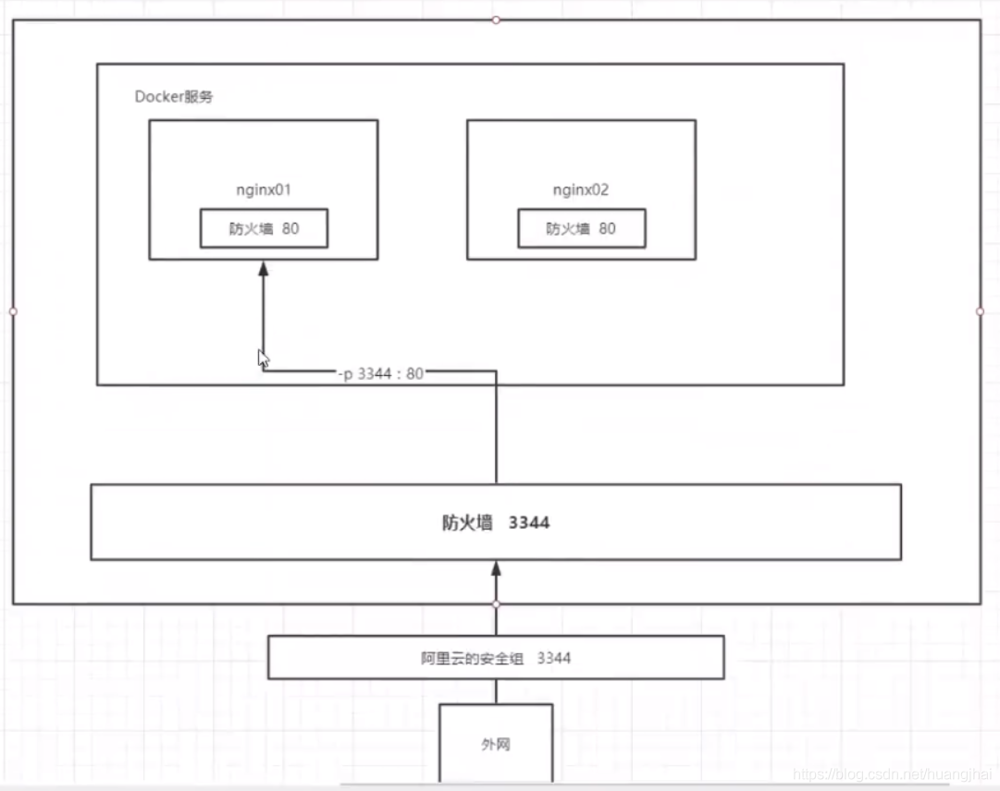

**（3）配置文件**

 进入容器，自定义配置文件

```shell
$ [root@iZwz99sm8v95sckz8bd2c4Z ~]# docker exec -it nginx01 /bin/bash
$ root@20c896637ff5:/# whereis nginx
nginx: /usr/sbin/nginx /usr/lib/nginx /etc/nginx /usr/share/nginx
$ root@20c896637ff5:/# cd /etc/nginx
$ root@20c896637ff5:/etc/nginx# ls
conf.d	fastcgi_params	koi-utf  koi-win  mime.types  modules  nginx.conf  scgi_params	uwsgi_params  win-utf
$ root@20c896637ff5:/# cd /etc/nginx
$ root@20c896637ff5:/etc/nginx# ls
conf.d	fastcgi_params	koi-utf  koi-win  mime.types  modules  nginx.conf  scgi_params	uwsgi_params  win-utf
```

**（4）访问测试**

 本地主机访问测试，curl命令发起请求，如果使用阿里云服务器需要设置安全组。

```shell
$ [root@iZwz99sm8v95sckz8bd2c4Z ~]# docker ps
CONTAINER ID   IMAGE     COMMAND                  CREATED         STATUS         PORTS                  NAMES
20c896637ff5   nginx     "/docker-entrypoint.…"   7 minutes ago   Up 7 minutes   0.0.0.0:3334->80/tcp   nginx01
$ [root@iZwz99sm8v95sckz8bd2c4Z ~]# curl localhost:3334
<!DOCTYPE html>
<html>
<head>
<title>Welcome to nginx!</title>
<style>
    body {
        width: 35em;
        margin: 0 auto;
        font-family: Tahoma, Verdana, Arial, sans-serif;
    }
</style>
</head>
<body>
<h1>Welcome to nginx!</h1>
<p>If you see this page, the nginx web server is successfully installed and
working. Further configuration is required.</p>

<p>For online documentation and support please refer to
<a href="http://nginx.org/">nginx.org</a>.<br/>
Commercial support is available at
<a href="http://nginx.com/">nginx.com</a>.</p>

<p><em>Thank you for using nginx.</em></p>
</body>
</html>
```

**（5）安装vim**

我们使用Nginx往往需要编写配置文件，但是Nginx官方镜像没有安装vim，需要我们手动进行安装。使用以下命令进行安装：

```shell
$ apt-get install vim
```

如果执行上述命令出现提示：

```shell
        Reading package lists... Done
        Building dependency tree       
        Reading state information... Done
        E: Unable to locate package vim
```

则需要先同步 /etc/apt/sources.list 和 /etc/apt/sources.list.d 中列出的源的索引，这样才能获取到最新的软件包。执行以下命令来更新：

```shell
$ apt-get update
```

更新完毕再安装即可。我们修改了配置文件，只要重新启动容器`docker restart 容器id`，改动就可以生效了。

解决vim在终端不能复制的问题：在vim 中输入 :set mouse=r。

拓展：启动项目并设置数据卷，为避免nginx因为修改配置文件导致的错误而无法启动容器，我们可以通过cp命令覆盖配置文件，但是设置数据卷会更为方便。启动Nginx容器的同时设置数据卷的命令：

```shell
$ docker run 
--name my_nginx
-d -p 80:80  
-v /data/nginx/conf/nginx.conf:/etc/nginx/nginx.conf 
-v /data/nginx/log:/var/log/nginx 
-v /data/nginx/html:/usr/share/nginx/html
nginx
```

参数说明：

```shell
第一个-v：挂载nginx的主配置文件，以方便在宿主机上直接修改容器的配置文件
第二个-v：挂载容器内nginx的日志，容器运行起来之后，可以直接在宿主机的这个目录中查看nginx日志
第三个-v：挂载静态页面目录
```

### 13.2 Tomcat部署

> 官方示例

```shell
$ docker run -it --rm tomcat:9.0

--rm 用完自动删除 一般用完删除
```


**（1）下载并运行**

```shell
$ PS D:\Docker\test> docker pull tomcat
Using default tag: latest
latest: Pulling from library/tomcat
0e29546d541c: Pull complete
9b829c73b52b: Pull complete
cb5b7ae36172: Pull complete
6494e4811622: Pull complete
668f6fcc5fa5: Pull complete
dc120c3e0290: Pull complete
8f7c0eebb7b1: Pull complete
77b694f83996: Pull complete
0f611256ec3a: Pull complete
4f25def12f23: Pull complete
Digest: sha256:9dee185c3b161cdfede1f5e35e8b56ebc9de88ed3a79526939701f3537a52324
Status: Downloaded newer image for tomcat:latest
docker.io/library/tomcat:latest

$ PS D:\Docker\test> docker images
REPOSITORY   TAG       IMAGE ID       CREATED        SIZE
archlinux    latest    0a6134a84991   5 days ago     370MB
nginx        latest    605c77e624dd   5 months ago   141MB
tomcat       latest    fb5657adc892   5 months ago   680MB

$ PS D:\Docker\test> docker run -d -p 3335:8080 --name tomcat1 tomcat
9b1920dee59a0735e95566d0c8ff59d6a54932d97ceb9b395786a4fd0a87a192

$ PS D:\Docker\test> curl 127.0.0.1:3335
curl : HTTP Status 404 – Not Found
Type Status Report
Description The origin server did not find a current representation for the target resource or is not willing to disclose that one exists.
Apache Tomcat/10.0.14
所在位置 行:1 字符: 1
+ curl 127.0.0.1:3335
+ ~~~~~~~~~~~~~~~~~~~
    + CategoryInfo          : InvalidOperation: (System.Net.HttpWebRequest:HttpWebRequest) [Invoke-WebRequest]，WebException
    + FullyQualifiedErrorId : WebCmdletWebResponseException,Microsoft.PowerShell.Commands.InvokeWebRequestCommand
```

**（2）进入容器**

```shell
$ PS D:\Docker\test> docker exec -it tomcat1 /bin/bash

root@9b1920dee59a:/usr/local/tomcat# ls
BUILDING.txt  CONTRIBUTING.md  LICENSE  NOTICE  README.md  RELEASE-NOTES  RUNNING.txt  bin  conf  lib  logs  native-jni-lib  temp  webapps  webapps.dist  work

$ root@9b1920dee59a:/usr/local/tomcat# ls -alhF
total 176K
drwxr-xr-x 1 root root 4.0K Dec 22 17:07 ./
drwxr-xr-x 1 root root 4.0K Dec 22 17:00 ../
-rw-r--r-- 1 root root  19K Dec  2  2021 BUILDING.txt
-rw-r--r-- 1 root root 6.1K Dec  2  2021 CONTRIBUTING.md
-rw-r--r-- 1 root root  59K Dec  2  2021 LICENSE
-rw-r--r-- 1 root root 2.3K Dec  2  2021 NOTICE
-rw-r--r-- 1 root root 3.3K Dec  2  2021 README.md
-rw-r--r-- 1 root root 6.8K Dec  2  2021 RELEASE-NOTES
-rw-r--r-- 1 root root  17K Dec  2  2021 RUNNING.txt
drwxr-xr-x 2 root root 4.0K Dec 22 17:07 bin/
drwxr-xr-x 1 root root 4.0K Jun  7 13:32 conf/
drwxr-xr-x 2 root root 4.0K Dec 22 17:06 lib/
drwxrwxrwx 1 root root 4.0K Jun  7 13:32 logs/
drwxr-xr-x 2 root root 4.0K Dec 22 17:07 native-jni-lib/
drwxrwxrwx 2 root root 4.0K Dec 22 17:06 temp/
drwxr-xr-x 2 root root 4.0K Dec 22 17:06 webapps/
drwxr-xr-x 7 root root 4.0K Dec  2  2021 webapps.dist/
drwxrwxrwx 2 root root 4.0K Dec  2  2021 work/

# ls没有内容,说明网站不全
$ root@9b1920dee59a:/usr/local/tomcat# ls webapps

# 查看 webapps.dist 下的文件
$ root@9b1920dee59a:/usr/local/tomcat# cd webapps.dist/
$ root@9b1920dee59a:/usr/local/tomcat/webapps.dist# ls
ROOT  docs  examples  host-manager  manager
$ root@7136295a6082:/usr/local/tomcat/webapps.dist# cd ROOT
$ root@9b1920dee59a:/usr/local/tomcat/webapps.dist/ROOT# ls
RELEASE-NOTES.txt  WEB-INF  asf-logo-wide.svg  bg-button.png  bg-middle.png  bg-nav.png  bg-upper.png  favicon.ico  index.jsp  tomcat.css  tomcat.svg

# 将 webapps.dist/ 下的文件复制到 webapps/ 下面,网站就能正常访问了
$ root@9b1920dee59a:/usr/local/tomcat/webapps.dist/ROOT# cp -r /usr/local/tomcat/webapps.dist/* /usr/local/tomcat/webapps/
$ root@9b1920dee59a:/usr/local/tomcat/webapps.dist/ROOT# cd /usr/local/tomcat/webapps
$ root@9b1920dee59a:/usr/local/tomcat/webapps# ls
ROOT  docs  examples  host-manager  manager

# 退出服务器
root@7136295a6082:/usr/local/tomcat/webapps# exit
exit
```

**（3）访问测试**

```shell
$ curl http://localhost:3335

StatusCode        : 200
StatusDescription :
Content           :

                    <!DOCTYPE html>
                    <html lang="en">
                        <head>
                            <meta charset="UTF-8" />
                            <title>Apache Tomcat/10.0.14</title>
                            <link href="favicon.ico" rel="icon" type="image/x-icon" />
                            ...
RawContent        : HTTP/1.1 200
                    Transfer-Encoding: chunked
                    Keep-Alive: timeout=20
                    Connection: keep-alive
                    Content-Type: text/html;charset=UTF-8
                    Date: Tue, 07 Jun 2022 13:40:34 GMT

                    <!DOCTYPE html>
                    <html lang="...
Forms             : {}
Headers           : {[Transfer-Encoding, chunked], [Keep-Alive, timeout=20], [Connection, keep-alive], [Content-Type, text/html;charset=UTF-8]...}
Images            : {@{innerHTML=; innerText=; outerHTML=; outerText=; tagName=IMG; id=tomca
                    t-logo; alt=[tomcat logo]; src=tomcat.svg}}
InputFields       : {}
Links             : {@{innerHTML=Home; innerText=Home; outerHTML=<A href="https://tomcat.apache.org/">Home</A>; outerText=Home; tagName=A; href=https
                    ://tomcat.apache.org/}, @{innerHTML=Documentation; innerText=Documentation; outerHTML=<A href="/docs/">Documentation</A>; outerTe
                    xt=Documentation; tagName=A; href=/docs/}, @{innerHTML=Configuration; innerText=Configuration; outerHTML=<A href="/docs/config/">
                    Configuration</A>; outerText=Configuration; tagName=A; href=/docs/config/}, @{innerHTML=Examples; innerText=Examples; outerHTML=<
                    A href="/examples/">Examples</A>; outerText=Examples; tagName=A; href=/examples/}...}
ParsedHtml        : mshtml.HTMLDocumentClass
RawContentLength  : 11145
```

### 13.3 ElasticSearch部署

> 官方示例

```shell
# es 暴露的端口多
# es 十分耗内存
# es 数据需要安全目录,要挂载
# --net somenetwork 网络配置
# "discovery.type=single-node" 单节点部署

docker run -d --name elasticsearch --net somenetwork -p 9200:9200 -p 9300:9300 -e "discovery.type=single-node" elasticsearch
```

> 添加 ’-e ES_JAVA_OPTS=“-Xms128m -Xmx512m” ‘ 配置ElasticSearch的虚拟机占用的内存大小

```shell
$ PS D:\Docker\test> docker pull elasticsearch:7.17.4
7.17.4: Pulling from library/elasticsearch
d5fd17ec1767: Downloading
3aceae0816c1: Download complete
6f282e391d7d: Download complete
e0d1c86ab271: Download complete
1c2d02571b2b: Download complete
25fb4b01f643: Download complete
606786004049: Download complete
28ec7712324b: Download complete
7d5976c54116: Download complete
7.17.4: Pulling from library/elasticsearch
d5fd17ec1767: Pull complete
3aceae0816c1: Pull complete
6f282e391d7d: Pull complete
e0d1c86ab271: Pull complete
1c2d02571b2b: Pull complete
25fb4b01f643: Pull complete
606786004049: Pull complete
28ec7712324b: Pull complete
7d5976c54116: Pull complete
Digest: sha256:529b3cfec4354beda158c6c7f2f8015cbdc9432a48c1d63e824d6fd728f30db2
Status: Downloaded newer image for elasticsearch:7.17.4
docker.io/library/elasticsearch:7.17.4


$ PS D:\Docker\test> docker run -d --name es1 -p 9200:9200 -p 9300:9300 -e "discovery.type=single-node" -e ES_JAVA_OPTS="-Xms128m -Xmx512m" elasticsearch:7.17.4
6db4ee307c2e0f4841027d1dd332261a412caa8943f795dc37ad4c63c4797496

$ PS D:\Docker\test> docker ps
CONTAINER ID   IMAGE                  COMMAND                  CREATED          STATUS          PORTS                                            NAMES
6db4ee307c2e   elasticsearch:7.17.4   "/bin/tini -- /usr/l…"   13 seconds ago   Up 11 seconds   0.0.0.0:9200->9200/tcp, 0.0.0.0:9300->9300/tcp   es1

$ PS D:\Docker\test> docker stats
CONTAINER ID   NAME      CPU %     MEM USAGE / LIMIT     MEM %     NET I/O        BLOCK I/O   PIDS
6db4ee307c2e   es1       0.44%     543.8MiB / 12.44GiB   4.27%     42MB / 485kB   0B / 0B     79
```

### 13.4 MySQL部署

**（1）下载并运行**

```shell
# 拉取并运行容器
docker run -d --name mysq1 -p 3306:3306 -e MYSQL_ROOT_PASSWORD=root mysql
```

参数说明：

```shell
-p 3306:3306 ：映射容器服务的 3306 端口到宿主机的 3306 端口，外部主机可以直接通过 宿主机ip:3306 访问到 MySQL 的服务。
MYSQL_ROOT_PASSWORD=123456：设置 MySQL 服务 默认账号root 用户的密码。
```

**（2）进入容器查看MySQL服务**

进入容器，并通过账号root查看MySQL服务能否正常连接。

```shell
docker exec -it 9b3aad6819ff /bin/bash
mysql -h localhost -u root -p
```

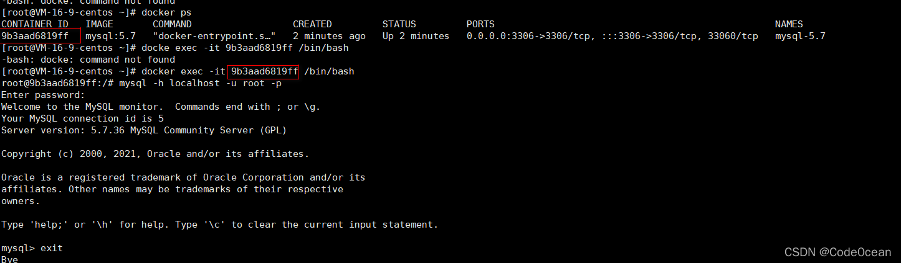