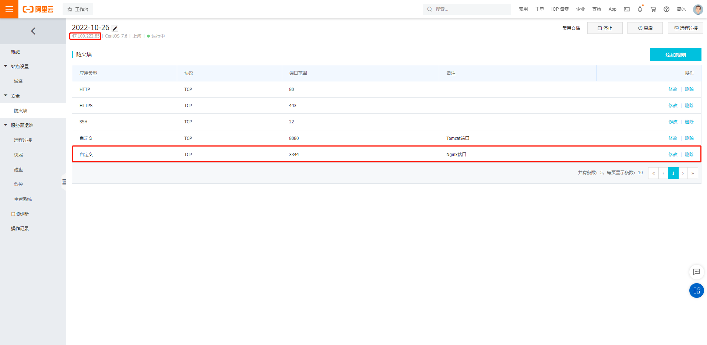
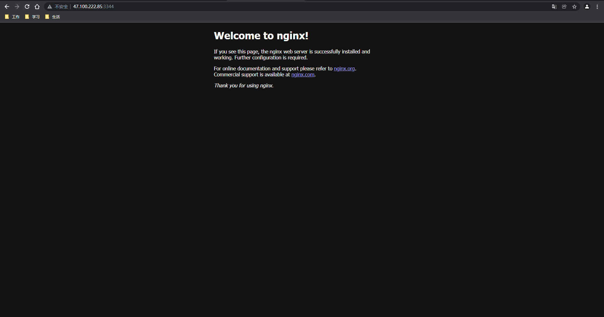
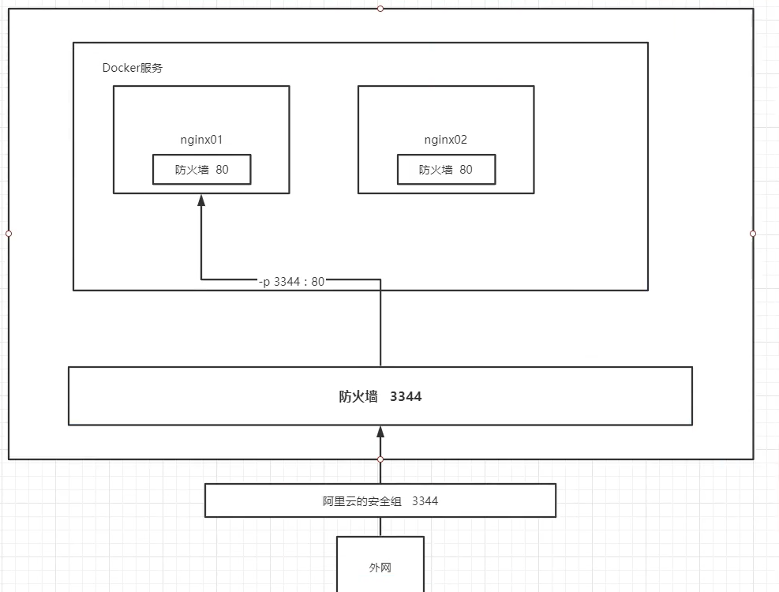

https://www.kuangstudy.com/bbs/1480354404699189249

> 参考源

https://www.bilibili.com/video/BV1og4y1q7M4?spm_id_from=333.999.0.0

https://www.bilibili.com/video/BV1kv411q7Qc?spm_id_from=333.999.0.0

> 版本

本文章基于 **Docker 20.10.11**

------

部署 Nginx 可以参考 Docker Hub 官方文档：https://hub.docker.com/_/nginx

# 下载镜像

```shell
[root@sail home]# docker pull nginx
Using default tag: latest
latest: Pulling from library/nginx
e5ae68f74026: Pull complete 
21e0df283cd6: Pull complete 
ed835de16acd: Pull complete 
881ff011f1c9: Pull complete 
77700c52c969: Pull complete 
44be98c0fab6: Pull complete 
Digest: sha256:9522864dd661dcadfd9958f9e0de192a1fdda2c162a35668ab6ac42b465f0603
Status: Downloaded newer image for nginx:latest
docker.io/library/nginx:latest
```

# 查看镜像

```shell
[root@sail home]# docker images
REPOSITORY   TAG       IMAGE ID       CREATED        SIZE
nginx        latest    f652ca386ed1   7 days ago     141MB
```

# 运行镜像

```shell
[root@sail home]# docker run -d --name=nginx01 -p 3344:80 nginx
f58fb3ed8c5587d2c28567c865759438e449f2fd65889f2910286b9cd74debec

[root@sail home]# docker ps
CONTAINER ID   IMAGE     COMMAND                  CREATED          STATUS          PORTS                  NAMES
f58fb3ed8c55   nginx     "/docker-entrypoint.…"   23 seconds ago   Up 22 seconds   0.0.0.0:3344->80/tcp   nginx01
```

# 测试验证

使用 `curl` 命令可以模拟网页访问，以此来测试 Nginx 启动情况。

```shell
[root@sail home]# curl localhost:3344
<!DOCTYPE html>
<html>
<head>
<title>Welcome to nginx!</title>
<style>
html { color-scheme: light dark; }
body { width: 35em; margin: 0 auto;
font-family: Tahoma, Verdana, Arial, sans-serif; }
</style>
</head>
<body>
<h1>Welcome to nginx!</h1>
<p>If you see this page, the nginx web server is successfully installed and
working. Further configuration is required.</p>
<p>For online documentation and support please refer to
<a href="http://nginx.org/">nginx.org</a>.<br/>
Commercial support is available at
<a href="http://nginx.com/">nginx.com</a>.</p>
<p><em>Thank you for using nginx.</em></p>
</body>
</html>
```

# 外网访问测试

如果是使用**阿里云服务器**，需要先开启端口。



使用阿里云的公网 IP 即可进行访问。



出现此页面，即代表 Nginx 部署成功。

> 查看启动的容器

```shell
[root@sail home]# docker ps
CONTAINER ID   IMAGE     COMMAND                  CREATED          STATUS          PORTS                  NAMES
f58fb3ed8c55   nginx     "/docker-entrypoint.…"   12 minutes ago   Up 12 minutes   0.0.0.0:3344->80/tcp   nginx01
```

> 查看容器中 Nginx 目录

```shell
[root@sail home]# docker exec -it nginx01 /bin/bash
root@f58fb3ed8c55:/# whereis nginx
nginx: /usr/sbin/nginx /usr/lib/nginx /etc/nginx /usr/share/nginx
root@f58fb3ed8c55:/# cd /etc/nginx
root@f58fb3ed8c55:/etc/nginx# ls
conf.d    fastcgi_params    mime.types  modules  nginx.conf  scgi_params  uwsgi_params
```

如此，如果需要修改 Nginx 的配置即可修改 **nginx.conf** 文件实现。

不过如果每次修改都要进入容器后再进行操作，是很繁琐的事，还是更推荐使用**容器卷技术**。

详情见：[Docker 12 数据卷](https://www.kuangstudy.com/bbs/1484782140666593282)

# 部署原理



​      